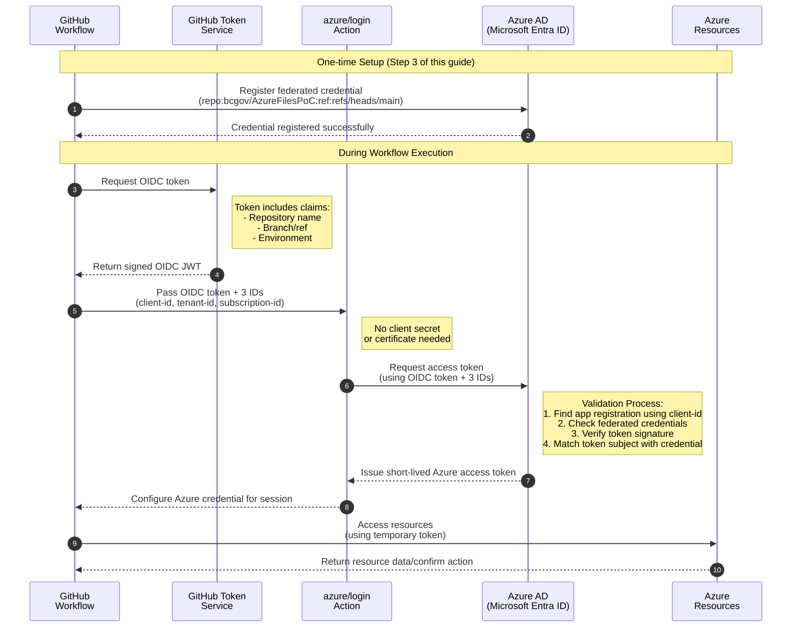

# Register Azure Application & Configure OIDC for GitHub Actions

## Purpose

This document provides a step-by-step guide for registering an Azure application (service principal) specifically for use with GitHub Actions in the Azure Files Proof of Concept (PoC) project. The registration process establishes the authentication foundation and prerequisites required for secure, automated deployments using Terraform, GitHub Actions with an Azure CI/CD pipeline for infrastructure-as-code (IaC). By following this guide, you will ensure that all automation workflows have the necessary Azure identity, permissions, and security best practices in place before any infrastructure as code (IaC) implementation begins.

⚠️ **CRITICAL**: This application registration process is a **PREREQUISITE** that must be completed BEFORE implementing any Terraform automation with GitHub Actions.

After completing this registration process, refer to the [Validation Process](../ValidationProcess.md) guide that provides a structured approach to verify the end-to-end Terraform, GitHub Actions, and Azure integration. This validation process serves as a pattern to follow for all subsequent resource creation in the PoC.

### Process Design

This document is designed to be executed sequentially, with verification steps after each operation:
1. Execute only the commands in the current active step
2. Complete all verification points for that step
3. Document progress and any issues encountered
4. Proceed to the next step only after successful verification

### Why This Registration is Critical

1. **Authentication Foundation**: 
   - The service principal provides the identity that GitHub Actions uses to authenticate to Azure
   - All subsequent automation work depends on this identity

2. **Required for Automation**: 
   - Terraform running in GitHub Actions cannot create its own service principal
   - It needs this pre-existing identity to function

3. **Implementation Sequence**:
   - First: Complete this application registration process (manual, one-time setup)
   - Then: Develop and test Terraform code locally
   - Finally: Configure GitHub Actions and/or runners to use this identity

4. **Credential Usage**:
   - Generated credentials (client ID, tenant ID, subscription ID) are stored as GitHub secrets
   - These secrets are referenced in GitHub Actions workflows
   - No long-lived secrets when using OIDC federation
   - All Terraform CI/CD pipelines use these credentials

## Prerequisites

- Azure account with appropriate permissions in Azure AD to:
  - Create application registrations
  - Create service principals
  - Assign roles
- Access to the GitHub repository where actions will be configured
- Development environment requirements:
  - Azure CLI installed
  - PowerShell (for Windows) or Bash/Zsh (for macOS/Linux)
  - Git configured with access to the repository

### Finding Your App Registration in Azure Portal

⚠️ **Important**: Make sure you're viewing the App Registration, not the Enterprise Application:

1. Go to Microsoft Entra ID (Azure AD)
2. Click on "App registrations" in the left menu
3. Select "All applications" if you don't see your app
4. Find "ag-pssg-azure-files-poc-ServicePrincipal" in the list

Direct Link Pattern:
```
https://portal.azure.com/#view/Microsoft_AAD_RegisteredApps/ApplicationMenuBlade/~/Overview/appId/<your-client-id>
```

The App Registration view will show different menu items than the Enterprise Application view:
- Overview
- Authentication
- Certificates & secrets
- API permissions
- Expose an API
- And more...

If you only see items like "Deployment Plan" and "Security" in the menu, you're in the Enterprise Application view instead of the App Registration view.

## Directory Structure

```
RegisterApplicationInAzureAndOIDC/
├── README.md                 # This file
└── scripts/
    ├── unix/                 # Scripts for macOS and Linux
    │   ├── step1_register_app.sh
    │   ├── step2_grant_permissions.sh
    │   ├── step3_configure_oidc.sh
    │   └── step4_prepare_github_secrets.sh
    └── windows/              # Scripts for Windows
        ├── step1_register_app.ps1
        ├── step2_grant_permissions.ps1
        ├── step3_configure_oidc.ps1
        └── step4_prepare_github_secrets.ps1
```

## BC Government OIDC Requirements

As per BC Government guidelines:
- OpenID Connect (OIDC) is the recommended authentication method
- Eliminates need for storing long-lived credentials
- Self-hosted runners required for Azure data storage access
- Stores only identity information (NOT secrets) as GitHub secrets:
  - AZURE_CLIENT_ID (application ID)
  - AZURE_TENANT_ID (tenant ID)
  - AZURE_SUBSCRIPTION_ID (subscription ID)

### OIDC Authentication Flow and Best Practices

As per BC Government guidelines:
- OpenID Connect (OIDC) federation enables secure, passwordless authentication between GitHub Actions and Azure
- Instead of storing long-lived secrets, you create a federated credential that establishes a trust relationship with GitHub
- This credential specifies which GitHub repository, branch, or environment is allowed to request tokens
- For accessing Azure data storage, self-hosted runners on Azure are required as public access is not supported

#### Authentication Process:
1. GitHub workflow requests OIDC token from GitHub
2. Token sent to Azure AD
3. Azure AD verifies token came from the trusted repository
4. If verified, Azure AD issues short-lived access token

#### How Authentication Works Without Traditional Secrets

> **Note: This is counter-intuitive but important to understand**

A common point of confusion is how this authentication works without requiring a traditional client secret or certificate. Here's a simplified explanation:

1. **Trust Relationship**: During the OIDC configuration (Step 3 of this guide), you establish a trust relationship between Azure AD and GitHub for a specific repository. This relationship is the "secret sauce" that replaces traditional secrets.

2. **GitHub's Role**: When a workflow runs, GitHub acts as an identity provider (IDP) and automatically generates a cryptographically-signed token that proves "this workflow is running in repository X, branch Y, environment Z."

3. **Using the Three IDs**: Your workflow passes the three GitHub secrets (`AZURE_CLIENT_ID`, `AZURE_TENANT_ID`, `AZURE_SUBSCRIPTION_ID`) to Azure AD, along with the GitHub-generated token.

4. **Azure AD Validation**: Azure AD uses these IDs to:
   - Find the correct app registration (`AZURE_CLIENT_ID`)
   - Look up its federated credentials
   - Verify the GitHub token matches one of these credentials
   - Confirm it's from the expected repository, branch, or environment

5. **No Traditional Secret Needed**: The security comes from GitHub's ability to cryptographically prove the workflow's origin, combined with the pre-configured federated credentials in Azure AD that specify exactly which GitHub repositories and branches to trust.

This approach is more secure than traditional client secrets because:
- No long-lived secrets that can be leaked or need rotation
- Authentication is tied to the specific GitHub repository
- Immediate revocation by removing federated credentials in Azure AD

#### OIDC Authentication Flow Diagram



For an in-depth understanding, refer to [Introduction to Azure DevOps workload identity federation (OIDC) with Terraform](https://devblogs.microsoft.com/devops/introduction-to-azure-devops-workload-identity-federation-oidc-with-terraform/).

Reference: [BC Government IaC and CI/CD Best Practices](https://developer.gov.bc.ca/docs/default/component/public-cloud-techdocs/azure/best-practices/iac-and-ci-cd/#github-actions)

## Overview

For GitHub Actions to authenticate with Azure, we need to register an application in Azure Active Directory. This creates a service principal that GitHub Actions can use to securely access Azure resources. The process includes:

1. Creating an app registration in Azure AD
2. Creating a service principal for the application
3. Granting appropriate permissions to the service principal
4. Configuring federated credentials for OIDC authentication
5. Storing necessary credentials as GitHub secrets
6. Verifying the setup with a test workflow

## Implementation Steps

### 1. Register Application in Azure

Unix/macOS:
```bash
./scripts/unix/step1_register_app.sh
```

Windows:
```powershell
.\scripts\windows\step1_register_app.ps1
```

- Checks for existing app registration
- Creates new one if needed
- Saves credentials to `.env/azure-credentials.json`

### 2. Grant Required Permissions to the service principal


Unix/macOS:
```bash
./scripts/unix/step2_grant_permissions.sh
```

Windows:
```powershell
.\scripts\windows\step2_grant_permissions.ps1
```

- Verifies existing role assignments
- Lists missing required roles
- Grants permissions with confirmation

### 3. Configure Federated Credentials (OIDC)
Federated credentials allow GitHub Actions to authenticate to Azure without storing secrets. This follows BC Government best practices for secure CI/CD implementation.

#### OIDC Federated Credentials Overview
OpenID Connect (OIDC) federation enables secure, passwordless authentication between GitHub Actions and Azure. Instead of storing long-lived secrets, you create a federated credential in your Azure AD application that establishes a trust relationship with GitHub. This credential specifies which GitHub repository, branch, or environment is allowed to request tokens for your Azure app.

When a GitHub Actions workflow runs, it requests a special OIDC token from GitHub. Azure validates this token against the federated credential configuration. If the request matches the allowed repository and branch/environment, Azure issues a short-lived access token to the workflow. This allows GitHub Actions to authenticate to Azure securely, following best practices and reducing the risk of credential leaks.

For an in-depth understanding of workload identity federation with OIDC, refer to [Introduction to Azure DevOps workload identity federation (OIDC) with Terraform](https://devblogs.microsoft.com/devops/introduction-to-azure-devops-workload-identity-federation-oidc-with-terraform/).

#### Key points:

- Federated credentials are configured in Azure AD for your app registration
- Each credential references your GitHub organization, repository, and optionally branch or environment
- No secrets are stored in GitHub; authentication is handled dynamically via OIDC tokens
- This approach is recommended for secure CI/CD pipelines and aligns with BC Government best practices

#### BC Government OIDC Best Practices and Guidelines

- OpenID Connect (OIDC) is the recommended authentication method for GitHub Actions to securely access Azure subscriptions
- This method eliminates the need for storing long-lived credentials as GitHub secrets
- For accessing Azure data storage and databases, self-hosted runners on Azure are required as public access is not supported
- Microsoft provides sample Terraform code for deploying these runners in the `azure-lz-samples` repository
- You store identity information (NOT secrets) as GitHub secrets
- The secrets include:
  - `AZURE_CLIENT_ID` (the application/client ID) 
  - `AZURE_TENANT_ID` (your Azure tenant ID) 
  - `AZURE_SUBSCRIPTION_ID` (your subscription ID)

#### Authentication Process:

- When a GitHub workflow runs, it requests a special OIDC token from GitHub
- This token is sent to Azure AD
- Azure AD verifies the token came from the trusted GitHub repository
- If verified, Azure AD issues a short-lived access token for Azure resources

Reference: [BC Government IaC and CI/CD Best Practices](https://developer.gov.bc.ca/docs/default/component/public-cloud-techdocs/azure/best-practices/iac-and-ci-cd/#github-actions)

#### Scripts
Unix/macOS:
```bash
./scripts/unix/step3_configure_oidc.sh
```

Windows:
```powershell
.\scripts\windows\step3_configure_oidc.ps1
```

- Sets up federated credentials
- Configures main branch, PR, and environment access
- Verifies configuration

### 4. Prepare and Store GitHub Secrets
In this step, you will store the necessary credentials as GitHub secrets. These secrets will be used by GitHub Actions to authenticate to Azure.

Unix/macOS:
```bash
./scripts/unix/step4_prepare_github_secrets.sh
```

Windows:
```powershell
.\scripts\windows\step4_prepare_github_secrets.ps1
```

The script will:
- Read values from your `.env/azure-credentials.json`
- Display the exact values needed for GitHub secrets
- Guide you through the process of adding them to your repository
- Update your credentials file with tracking information

> **⚠️ IMPORTANT**: These secrets provide access to your Azure resources. Never share or expose these values.

#### Required GitHub Repository Secrets

1. First, obtain the secret values from your credentials file. The easiest place to find them is in the `github` section at the bottom of your `.env/azure-credentials.json` file:

```json
"github": {
  "clientId": "YOUR-CLIENT-ID-HERE",
  "tenantId": "YOUR-TENANT-ID-HERE", 
  "subscriptionId": "YOUR-SUBSCRIPTION-ID-HERE"
}
```

2. Go to your GitHub repository's Settings > Secrets and variables > Actions
   - Direct URL: https://github.com/bcgov/AzureFilesPoC/settings/secrets/actions

3. Add the following repository secrets by clicking "New repository secret" for each:
   - Name: `AZURE_CLIENT_ID`
     Value: The `clientId` from the github section of your credentials file
   - Name: `AZURE_TENANT_ID`
     Value: The `tenantId` from the github section of your credentials file
   - Name: `AZURE_SUBSCRIPTION_ID`
     Value: The `subscriptionId` from the github section of your credentials file

4. Verify all three secrets appear in the "Repository secrets" section

#### Understanding the GitHub Secrets Tracking in Credentials File

When you run the step4_prepare_github_secrets.sh script, it updates your credentials file with a section that tracks which secrets should be configured in GitHub:

```json
"github": {
  "secrets": {
    "configured": [
      "AZURE_CLIENT_ID",
      "AZURE_TENANT_ID",
      "AZURE_SUBSCRIPTION_ID"
    ],
    "configuredOn": "YYYY-MM-DD HH:MM:SS",
    "available": [
      "AZURE_CLIENT_ID",
      "AZURE_TENANT_ID",
      "AZURE_SUBSCRIPTION_ID"
    ]
  }
}
```

- The `configured` array tracks which secrets the script has processed
- The `available` array lists the secrets that should be present and usable by your GitHub Actions workflows. This refers to the repository secrets you manually created in GitHub (i.e., `AZURE_CLIENT_ID`, `AZURE_TENANT_ID`, and `AZURE_SUBSCRIPTION_ID`). If you have added these secrets in your GitHub repository, they are considered "available" for use by workflows.
- `configuredOn` shows when the script last ran

Important: There is NO automatic connection between your credentials file and GitHub. The script just records what values you should manually add to GitHub. When you manually add secrets to GitHub, nothing gets updated in your local credentials file.

After adding the secrets:
1. Verify they appear in your repository's Actions secrets
2. Update the Progress Tracking table below

### 5. Setup repo secrets in GitHub

Before proceeding with Azure authentication, you need to add the required GitHub repository secrets:

#### Alternative A:  Add GitHub Repo Secrets via git CLI

You can use the provided script to automatically add the secrets:

Unix/macOS:
```bash
./scripts/unix/step5_add_github_secrets_cli.sh
```

Windows:
```powershell
.\scripts\windows\step5_add_github_secrets_cli.ps1
```

This script will:
- Check if you're authenticated with the GitHub CLI (and prompt you to login if not)
- Extract values from your credentials file
- Add the required secrets to your repository
- Update your credentials file with tracking information

If you prefer to do it manually with the GitHub CLI:

   - First, ensure you're authenticated with GitHub CLI:
     ```bash
     gh auth login
     ```
   - Create each secret with the following commands:
     ```bash
     # Create AZURE_CLIENT_ID secret
     gh secret set AZURE_CLIENT_ID --body "$(jq -r '.github.clientId' .env/azure-credentials.json)" --repo bcgov/AzureFilesPoC
     
     # Create AZURE_TENANT_ID secret
     gh secret set AZURE_TENANT_ID --body "$(jq -r '.github.tenantId' .env/azure-credentials.json)" --repo bcgov/AzureFilesPoC
     
     # Create AZURE_SUBSCRIPTION_ID secret
     gh secret set AZURE_SUBSCRIPTION_ID --body "$(jq -r '.github.subscriptionId' .env/azure-credentials.json)" --repo bcgov/AzureFilesPoC
     ```

#### Alternative B: Add GitHub Repo Secrets (Manually)

1. First, obtain the secret values using one of these methods:
   - Run the script: `./OneTimeActivities/RegisterApplicationInAzureAndOIDC/scripts/unix/step4_prepare_github_secrets.sh`
   - OR check the `github` section at the bottom of your `.env/azure-credentials.json` file:
     ```json
     "github": {
       "clientId": "YOUR-CLIENT-ID-HERE",
       "tenantId": "YOUR-TENANT-ID-HERE",
       "subscriptionId": "YOUR-SUBSCRIPTION-ID-HERE"
     }
     ```
   - Alternatively, you can find these values in other parts of the credentials file:
     ```json
     {
       "azure": {
         "ad": {
           "application": {
             "clientId": "YOUR-CLIENT-ID-HERE"
           }
         },
         "tenantId": "YOUR-TENANT-ID-HERE",
         "subscription": {
           "id": "YOUR-SUBSCRIPTION-ID-HERE"
         }
       }
     }
     ```

2. Go to your GitHub repository's Settings > Secrets and variables > Actions
   - Direct URL: https://github.com/bcgov/AzureFilesPoC/settings/secrets/actions

3. Add the following repository secrets using either the GitHub web interface:

  **Using GitHub Web Interface**
   - Click "New repository secret" for each:
     - Name: `AZURE_CLIENT_ID`
       Value: The `clientId` from the github section of your credentials file
     - Name: `AZURE_TENANT_ID`
       Value: The `tenantId` from the github section of your credentials file
     - Name: `AZURE_SUBSCRIPTION_ID`
       Value: The `subscriptionId` from the github section of your credentials file
   
#### Verification both approaches

After adding the secrets:

1. open : https://github.com/bcgov/AzureFilesPoC/settings/secrets/actions
2. Verify all three secrets appear in the "Repository secrets" section:
   - `AZURE_CLIENT_ID`
   - `AZURE_TENANT_ID`
   - `AZURE_SUBSCRIPTION_ID`

**IMPORTANT NOTE:**  Never share or expose these secret values

These secrets are critical for GitHub Actions to authenticate with Azure using OIDC. The secret configuration is part of the [RegisterApplicationInAzureAndOIDC](/OneTimeActivities/RegisterApplicationInAzureAndOIDC/README.md) process, specifically in step 4.

### 6. Validate Your Setup

Now that you have completed the one-time registration and configuration process, proceed to the validation phase:

1. Go to [ValidationProcess.md](../ValidationProcess.md)
2. Start with **Step 1: Verify GitHub Secrets Configuration**
3. Follow the validation process to ensure everything is working correctly

The validation process will confirm that:
- Your GitHub secrets are properly configured
- The service principal can authenticate to Azure using OIDC
- GitHub Actions workflows can successfully deploy resources
- The entire end-to-end pipeline functions as expected


## Security Considerations

1. **Credential Management**:
   - Uses OIDC federation instead of client secrets
   - Credentials stored in `.env/azure-credentials.json` (git-ignored)
   - No long-lived secrets in GitHub
   - Consider using shorter-lived credentials for enhanced security
   - Regular credential rotation schedule should be established

2. **Access Control**:
   
   ### Azure Roles for Azure Files PoC Architecture

   The following roles are mapped to specific components from our PoC architecture as detailed in [ArchitectureOverview.md](../ArchitectureOverview.md):

   | **Role** | **Applies To Architecture Components** | **Why It's Needed** |
   |----------|----------------------------------|---------------------|
   | **Reader** | All Azure resources | Base role for viewing resources and their configurations |
   | **Storage Account Contributor** | - Azure Files (Premium/Standard)<br>- Azure Storage Account<br>- Azure Blob Storage | Core role for creating and managing storage accounts |
   | **[BCGOV-MANAGED-LZ-LIVE] Network-Subnet-Contributor** | - Azure Virtual Network Subnets<br>- Subnet-level configurations | BC Gov landing zone custom role for managing Virtual Network subnets |
   | **Private DNS Zone Contributor** | - Private DNS Zone | For configuring name resolution for private endpoints |
   | **Monitoring Contributor** | - Azure Monitor<br>- Log Analytics | For setting up diagnostic settings, metrics, and alerts |
   | **Storage Account Backup Contributor** | - Azure Storage Account<br>- Azure Backup | For performing backup and restore operations |
   | **Storage Blob Data Owner** | - Blob containers<br>- Blob data | Full access to blob data including POSIX ACL management |
   | **Storage File Data Privileged Contributor** | - File shares<br>- NTFS permissions | Advanced file share access with NTFS permission management |
   | **Storage File Data SMB Share Elevated Contributor** | - SMB shares<br>- NTFS permissions | Enhanced SMB share operations with permission modifications |
   | **Storage Blob Delegator** | - SAS tokens<br>- Blob access | For generating user delegation keys for blob access |
   | **Storage File Delegator** | - SAS tokens<br>- File access | For generating user delegation keys for file access |
   | **Storage Queue Data Contributor** | - Storage queues | For complete queue operations functionality |
   | **Storage Table Data Contributor** | - Storage tables | For complete table operations functionality |
   | **DNS Resolver Contributor** | - DNS resolution | For configuring DNS resolution in hybrid scenarios |
   | **Azure Container Storage Contributor** | - Container operations | For potential container-based solutions |

   ### Role Priority and Implementation

   - Role assignments currently at subscription level
   - For production: Consider restricting roles to specific resource groups
   - Regular review of assigned permissions recommended
   - For minimal permissions implementations:
     - The **Storage Account Contributor** and **[BCGOV-MANAGED-LZ-LIVE] Network-Subnet-Contributor** roles are essential
     - Storage data plane roles (SMB Share, Queue, Table) provide granular access control
     - BC Gov landing zone custom roles should be preferred over generic equivalents
     - Additional roles can be added incrementally as needed
     - Follow the principle of least privilege
   
   #### BC Government Landing Zone Specifics
   - The **[BCGOV-MANAGED-LZ-LIVE] Network-Subnet-Contributor** role is a custom role specific to BC Gov's landing zone
   - It provides focused permissions for subnet management without broader network access
   - For broader network management (UDRs, NSGs, VPN, ExpressRoute), work with the Platform team
   - Resource group creation may require Platform team assistance or additional permissions

   ### Role Verification Process
   
   **Via Azure Portal**:
   1. Navigate to Subscriptions > [Your Subscription]
   2. Access control (IAM) > Role assignments tab
   3. Verify all four role assignments for the service principal
   
   **Via Azure CLI**:
   ```bash
   az role assignment list --assignee $appRegistration --output table
   ```
   Verify output shows all roles with correct scope

3. **Monitoring and Auditing**:
   - Monitor service principal activity through Azure Activity Logs
   - Enable and review diagnostic settings for:
     - Authentication attempts
     - Role assignment changes
     - Resource access patterns
   - Set up alerts for suspicious activities
   - Regular security audit of service principal actions


## Progress Tracking

Use this section to track your progress through the steps. Update this as you complete each step.

| Step | Description | Status | Completed By | Date |
|------|-------------|--------|--------------|------|
| 1 | Register Application in Azure AD | Not Started | | |
| 2 | Grant Permissions to Service Principal | Not Started | | |
| 3a | Configure OIDC - Main Branch | Not Started | | |
| 3b | Configure OIDC - Pull Requests | Not Started | | |
| 3c | Configure OIDC - Environments | Not Started | | |
| 4 | Prepare GitHub Secrets | Not Started | | |
| 5 | Add GitHub Secrets (CLI or Manual) | Not Started | | |
| 6 | Go to ValidationProcess.md for validation | Not Started | | |

### OIDC Configuration Status

| Substep | Description | Status |
|---------|-------------|---------|
| 3a | Configure main branch federated credential | Not Started |
| 3b | Configure pull requests federated credential | Not Started |
| 3c | Configure environment deployments credential | Not Started |

### Completion Tracking
- Registration started: [DATE]
- Registration completed: [DATE]

## Troubleshooting

### Common Issues

1. **InteractionRequired Error**:
   - Clear Azure CLI cache: `az account clear`
   - Re-authenticate: `az login`
   - Check conditional access policies

2. **Permission Issues**:
   - Verify Azure AD roles
   - Check subscription access
   - Validate service principal permissions

3. **OIDC Configuration**:
   - Verify federated credential format
   - Check repository name/path
   - Validate audience configuration

## Next Steps

### Store GitHub Secrets

After completing the registration process:
1. Navigate to your GitHub repository
2. Go to Settings > Secrets and variables > Actions
3. Click on "New repository secret" for each:
   - `AZURE_CLIENT_ID`: Application (client) ID from registration
   - `AZURE_TENANT_ID`: Azure tenant ID
   - `AZURE_SUBSCRIPTION_ID`: Azure subscription ID

> **IMPORTANT**: Never share or expose these secret values.

### Verify Setup

1. Run the Azure Login Test:
   - Navigate to GitHub Actions tab
   - Run the "Azure Login Test" workflow
   - Verify successful authentication

2. Validate End-to-End Pipeline:
   - Run the "Terraform Validation Workflow"
   - Use the `dev` environment
   - Enable cleanup to remove test resources
   - Verify successful:
     - Azure authentication via OIDC
     - Terraform initialization
     - Resource creation and cleanup

3. Begin Implementation:
   - Review the [Validation Process](../ValidationProcess.md)
   - Configure GitHub repository secrets
   - Begin Terraform automation implementation
   - Follow BC Government IaC best practices

## Additional notes
- For security reasons, we're using OIDC federation rather than client secrets.
- This service principal is dedicated to the Azure Files PoC project only.
- The credentials from this registration process are used in multiple places:
- GitHub Actions workflows for direct Azure operations
- Terraform running in GitHub Actions for infrastructure deployment
- Any CI/CD pipelines that need to interact with Azure resources

## References

- [BC Government IaC and CI/CD Best Practices](https://developer.gov.bc.ca/docs/default/component/public-cloud-techdocs/azure/best-practices/iac-and-ci-cd/)
- [Azure DevOps OIDC Federation](https://devblogs.microsoft.com/devops/introduction-to-azure-devops-workload-identity-federation-oidc-with-terraform/)
- [Microsoft Identity Platform](https://docs.microsoft.com/en-us/azure/active-directory/develop/)

## Credentials File Format

The scripts maintain a credentials file at `.env/azure-credentials.json` that stores all configuration details. This file is automatically created and updated by the scripts. Here's the structure:

```json
{
  "metadata": {
    "dateCreated": "YYYY-MM-DD HH:MM"
  },
  "azure": {
    "ad": {
      "tenantId": "your-tenant-id",
      "application": {
        "name": "app-name",
        "clientId": "your-client-id",
        "servicePrincipalObjectId": "object-id",
        "oidcConfiguration": {
          "federatedCredentials": [
          {
            "name": "credential-name",
            "subject": "repo:org/repo:ref:refs/heads/main",
            "issuer": "https://token.actions.githubusercontent.com",
            "audiences": ["api://AzureADTokenExchange"],
            "configuredOn": "YYYY-MM-DD HH:MM:SS"
          }
        ],
        "configuredOn": "YYYY-MM-DD HH:MM:SS"
      }
    }
  },
  "subscription": {
    "id": "your-subscription-id",
    "roleAssignments": [
      {
        "roleName": "role-name",
        "id": "role-assignment-id",
        "principalId": "principal-id",
        "scope": "/subscriptions/subscription-id",
        "assignedOn": "YYYY-MM-DD HH:MM:SS"
      }
    ]
  }
  },
  "github": {
    "org": "bcgov",
    "repo": "AzureFilesPoC",
    "secrets": {
      "configured": ["AZURE_CLIENT_ID", "AZURE_TENANT_ID", "AZURE_SUBSCRIPTION_ID"],
      "configuredOn": "YYYY-MM-DD HH:MM:SS",
      "available": ["AZURE_CLIENT_ID", "AZURE_TENANT_ID", "AZURE_SUBSCRIPTION_ID"]
    }
  }
}
```

### Script Outputs

Each script updates different sections of the credentials file:

1. **step1_register_app** updates:
   - `metadata.dateCreated`
   - `azure.ad.tenantId`
   - `azure.subscription.id`
   - `azure.ad.application.name`
   - `azure.ad.application.clientId`
   - `azure.ad.application.servicePrincipalObjectId`

2. **step2_grant_permissions** updates:
   - `azure.subscription.roleAssignments` with details of each role:
     - Storage Account Contributor
     - [BCGOV-MANAGED-LZ-LIVE] Network-Subnet-Contributor
     - Private DNS Zone Contributor
     - Monitoring Contributor
     - Storage File Data SMB Share Contributor
     - Storage File Data SMB Share Elevated Contributor
     - Storage Queue Data Contributor
     - Storage Table Data Contributor
     - DNS Resolver Contributor
     - Azure Container Storage Contributor

3. **step3_configure_oidc** updates:
   - `azure.ad.application.oidcConfiguration` with:
     - Main branch federated credential
     - Pull requests federated credential
     - Environment-specific credentials (dev, etc.)
     - Configuration timestamps

4. **step4_prepare_github_secrets** updates:
   - `github.secrets.configured` with list of configured secrets
   - `github.secrets.configuredOn` with timestamp
   - Helps track which GitHub secrets have been set up

### Important Notes

- The credentials file is automatically created from a template if it doesn't exist
- The template file should be located at `.env/azure-credentials.template.json` in the project root
- Scripts will dynamically resolve paths regardless of where they're executed from
- Each script checks for existing configurations before making changes
- All timestamps are in UTC and use the format "YYYY-MM-DD HH:MM:SS"
- The file should be git-ignored to prevent credential leakage
- Scripts are idempotent - running them multiple times won't duplicate entries
- The scripts maintain a structured JSON format with:
  - Application details under `azure.ad.application`
  - Role assignments under `azure.subscription.roleAssignments`
  - OIDC configuration under `azure.ad.application.oidcConfiguration`
