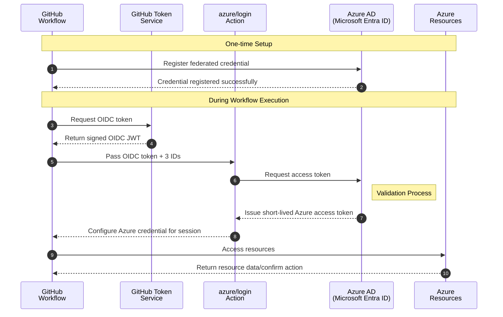
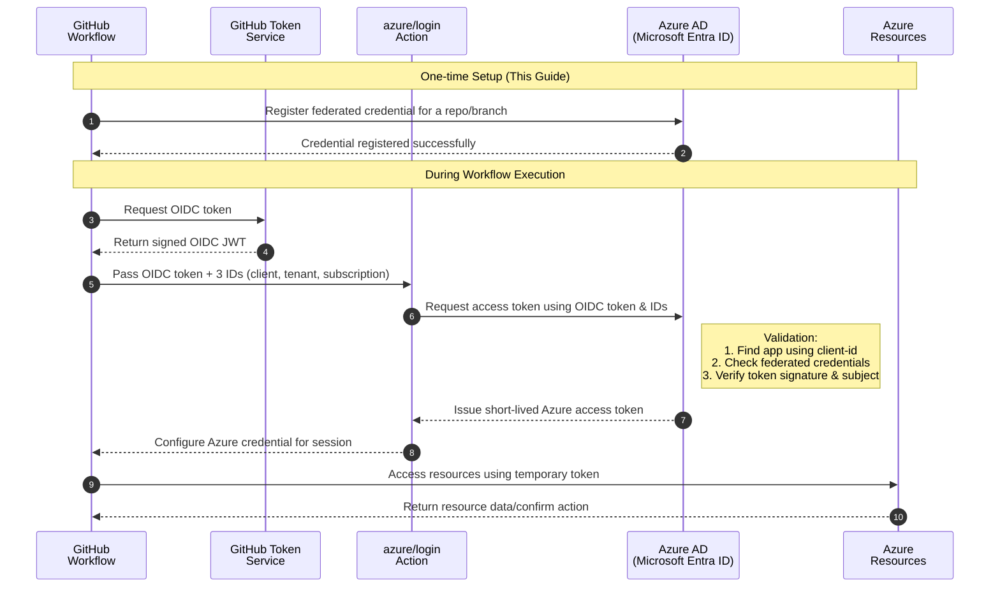

# Register Azure Application & Configure OIDC for GitHub Actions

## ⚠️ Security Model: Two Identities, Two Phases

- **Your User Identity (High Privilege):** Used for one-time setup (registering app, creating resource group). Has Contributor/Owner rights.
- **Pipeline Service Principal (Low Privilege):** Used by GitHub Actions. Can only create resources inside existing resource groups. Cannot create resource groups.

This separation enforces the Principle of Least Privilege and aligns with BC Gov security standards.

---

## Onboarding Steps (What To Do)

1. **Register Application in Azure**  
   _User Identity_  
   - `./scripts/unix/step1_register_app.sh` or `./scripts/windows/step1_register_app.ps1`
2. **Grant Required Permissions**  
   _User Identity_  
   - `./scripts/unix/step2_grant_permissions.sh` or `./scripts/windows/step2_grant_permissions.ps1`
3. **Configure OIDC Federated Credentials**  
   _User Identity_  
   - `./scripts/unix/step3_configure_oidc.sh` or `./scripts/windows/step3_configure_oidc.ps1`
4. **Prepare GitHub Secrets**  
   _User Identity_  
   - `./scripts/unix/step4_prepare_github_secrets.sh` or `./scripts/windows/step4_prepare_github_secrets.ps1`
5. **Add GitHub Secrets (Automated or Manual)**  
   _User Identity_  
   - `./scripts/unix/step5_add_github_secrets_cli.sh` or `./scripts/windows/step5_add_github_secrets_cli.ps1`
6. **Create Permanent Resource Group**  
   _User Identity_  
   - `./scripts/unix/step6_create_resource_group.sh <resource-group-name> [location]`
   - `./scripts/windows/step6_create_resource_group.ps1 -rgname <resource-group-name> [-location <location>]`
   - **Note:** Resource group tags are set in Azure only. Tags are not written to the credentials JSON.
   - Update your GitHub secret `DEV_RESOURCE_GROUP_NAME` to match.
7. **Create Terraform State Storage Account and Container**  
   _User Identity_  
   - `./scripts/unix/step7_create_tfstate_storage_account.sh --rgname <resource-group-name> --saname <storage-account-name> --containername <container-name> [--location <location>]`
   - This step is required before running any Terraform CI/CD pipeline that uses a remote backend in Azure.
   - The resource group, storage account, and blob container must all exist before `terraform init` can succeed with a remote backend.
   - See script comments for required arguments and Azure Policy compliance (e.g., minimum TLS version).
8. **Run Validation Workflow**  
   - See `ValidationProcess.md` for instructions.

---

## ⚠️ Important: Pre-create All Terraform Backend Resources

Before running any Terraform pipeline, you must create these three resources and set the corresponding GitHub variables:

1. **Resource Group**
   - **Script:**
     ```sh
     ./scripts/unix/step6_create_resource_group.sh <resource-group-name> [location]
     ```
   - **Example:**
     ```sh
     ./scripts/unix/step6_create_resource_group.sh rg-ag-pssg-tfstate-dev canadacentral
     ```
   - **GitHub Variable:**
     `DEV_TFSTATE_RG` (e.g., `rg-ag-pssg-tfstate-dev`)

2. **Storage Account**
   - **Script:**
     ```sh
     ./scripts/unix/step7_create_tfstate_storage_account.sh --rgname <resource-group-name> --saname <storage-account-name> [--location <location>]
     ```
   - **Example:**
     ```sh
     ./scripts/unix/step7_create_tfstate_storage_account.sh --rgname rg-ag-pssg-tfstate-dev --saname stagpssgtfstatedev01 --location canadacentral
     ```
   - **GitHub Variable:**
     `DEV_TFSTATE_SA` (e.g., `stagpssgtfstatedev01`)

3. **Blob Container**
   - **Script:**
     The step7 script attempts to create the container, but if it does not exist, create it manually:
     ```sh
     az storage container create \
       --name <container-name> \
       --account-name <storage-account-name> \
       --auth-mode login
     ```
   - **Example:**
     ```sh
     az storage container create \
       --name sc-ag-pssg-tfstate-dev \
       --account-name stagpssgtfstatedev01 \
       --auth-mode login
     ```
   - **GitHub Variable:**
     `DEV_TFSTATE_CONTAINER` (e.g., `sc-ag-pssg-tfstate-dev`)

   - **Verification Note:**
     > Blob containers do not appear as top-level Azure resources in the Azure Portal. To verify creation, navigate to your resource group, open the storage account (e.g., `stagpssgtfstatedev01`), and select the **Containers** blade. Your container (e.g., `sc-ag-pssg-tfstate-dev`) should be listed there.

**Summary Table:**

| Resource         | Script/Command                                                                 | GitHub Variable         | Example Value                |
|------------------|-------------------------------------------------------------------------------|-------------------------|------------------------------|
| Resource Group   | `step6_create_resource_group.sh`                                              | `DEV_TFSTATE_RG`        | `rg-ag-pssg-tfstate-dev`     |
| Storage Account  | `step7_create_tfstate_storage_account.sh`                                     | `DEV_TFSTATE_SA`        | `stagpssgtfstatedev01`       |
| Blob Container   | `az storage container create ...` (if not created by script 7)                | `DEV_TFSTATE_CONTAINER` | `sc-ag-pssg-tfstate-dev`     |

> **All three must exist and be referenced by the correct GitHub variables before `terraform init` or any pipeline run.**

---

## Key Changes & Automation Notes

- **Resource group tags** are set in Azure at creation time (via CLI/PowerShell), but are no longer written to `.env/azure-credentials.json`.
- **All onboarding scripts** (Unix and Windows) have been updated for robust, idempotent automation and to align with the new security and RBAC model.
- **Windows step 6 script** (`step6_create_resource_group.ps1`) is now available and matches the Unix version in logic and output.
- **Credentials JSON** is only used for identity and role assignment tracking, not for resource group tags.
- **Manual edits** to the credentials JSON are supported, but tags are not required or tracked there.
- **Variable and secret handling** is secure and consistent for both local and CI/CD runs.
- **No secrets or sensitive variables** are ever written to documentation or tracked in version control.

---

## Directory Structure

```
RegisterApplicationInAzureAndOIDC/
├── README.md
└── scripts/
    ├── unix/
    │   ├── step1_register_app.sh
    │   ├── step2_grant_permissions.sh
    │   ├── step3_configure_oidc.sh
    │   ├── step4_prepare_github_secrets.sh
    │   ├── step5_add_github_secrets_cli.sh
    │   └── step6_create_resource_group.sh
    └── windows/
        ├── step1_register_app.ps1
        ├── step2_grant_permissions.ps1
        ├── step3_configure_oidc.ps1
        ├── step4_prepare_github_secrets.ps1
        ├── step5_add_github_secrets_cli.ps1
        └── step6_create_resource_group.ps1
```

---

## Prerequisites

- Azure account with permissions to create app registrations, assign roles, and create resource groups.
- Access to the GitHub repository.
- Local dev environment with Azure CLI, Git, and Bash or PowerShell.

---

## Additional Notes

- **Resource group tags** are managed in Azure only. The onboarding scripts ensure tags are set at creation, but do not track or update them in local credential files.
- **If you change tags later**, update them directly in Azure using the CLI or Portal.
- **All other onboarding and validation steps remain unchanged.**

---

## Why This Registration is Critical

- The service principal provides the identity that GitHub Actions uses to authenticate to Azure.
- All subsequent automation work depends on this identity.
- Terraform running in GitHub Actions cannot create its own service principal; it needs this pre-existing identity.
- Credentials (client ID, tenant ID, subscription ID) are stored as GitHub secrets and referenced in workflows.
- No long-lived secrets when using OIDC federation.

---

## BC Government OIDC Requirements

- OpenID Connect (OIDC) is the recommended authentication method
- Eliminates need for storing long-lived credentials
- Self-hosted runners required for Azure data storage access
- Stores only identity information (NOT secrets) as GitHub secrets:
  - AZURE_CLIENT_ID (application ID)
  - AZURE_TENANT_ID (tenant ID)
  - AZURE_SUBSCRIPTION_ID (subscription ID)

---

## OIDC Authentication Flow and Best Practices

- OpenID Connect (OIDC) federation enables secure, passwordless authentication between GitHub Actions and Azure
- Instead of storing long-lived secrets, you create a federated credential that establishes a trust relationship with GitHub
- This credential specifies which GitHub repository, branch, or environment is allowed to request tokens
- For accessing Azure data storage, self-hosted runners on Azure are required as public access is not supported

#### Authentication Process:
1. GitHub workflow requests OIDC token from GitHub
2. Token sent to Azure AD
3. Azure AD verifies token came from the trusted repository
4. If verified, Azure AD issues short-lived access token

#### How Authentication Works Without Traditional Secrets

> **Note: This is counter-intuitive but important to understand**

A common point of confusion is how this authentication works without requiring a traditional client secret or certificate. Here's a simplified explanation:

1. **Trust Relationship**: During the OIDC configuration, you establish a trust relationship between Azure AD and GitHub for a specific repository.
2. **GitHub's Role**: When a workflow runs, GitHub acts as an identity provider (IDP) and generates a cryptographically-signed token that proves the workflow's origin.
3. **Using the Three IDs**: Your workflow passes the three GitHub secrets (`AZURE_CLIENT_ID`, `AZURE_TENANT_ID`, `AZURE_SUBSCRIPTION_ID`) to Azure AD, along with the GitHub-generated token.
4. **Azure AD Validation**: Azure AD uses these IDs to find the correct app registration, look up its federated credentials, verify the token, and confirm it's from the expected repo/branch.
5. **No Traditional Secret Needed**: The security comes from GitHub's ability to cryptographically prove the workflow's origin, combined with the pre-configured federated credentials in Azure AD.

This approach is more secure than traditional client secrets because:
- No long-lived secrets that can be leaked or need rotation
- Authentication is tied to the specific GitHub repository
- Immediate revocation by removing federated credentials in Azure AD

#### OIDC Authentication Flow Diagram



---

## Implementation Steps

---
### Phase 1: Service Principal and OIDC Setup (Steps 1-5)

These steps create the low-privilege identity for the GitHub Actions pipeline and configure the OIDC trust relationship.

#### Step 1: Register Application in Azure
Creates the Application Registration and its corresponding Service Principal.
*   **Unix/macOS:** `./scripts/unix/step1_register_app.sh`
*   **Windows:** `.\scripts\windows\step1_register_app.ps1`

#### Step 2: Grant Required Permissions to the Service Principal
Assigns a specific, limited set of roles to the Service Principal. These roles **do not** include permission to create resource groups.
*   **Unix/macOS:** `./scripts/unix/step2_grant_permissions.sh`
*   **Windows:** `.\scripts\windows\step2_grant_permissions.ps1`

#### Step 3: Configure Federated Credentials (OIDC)
This step establishes the secure, passwordless trust between Azure and your GitHub repository.
*   **Unix/macOS:** `./scripts/unix/step3_configure_oidc.sh`
*   **Windows:** `.\scripts\windows\step3_configure_oidc.ps1`

##### In-Depth: OIDC Federated Credentials Overview
OpenID Connect (OIDC) federation enables secure, passwordless authentication between GitHub Actions and Azure. Instead of storing long-lived secrets, you create a federated credential in your Azure AD application that establishes a trust relationship with GitHub. This credential specifies which GitHub repository, branch, or environment is allowed to request tokens for your Azure app.

When a GitHub Actions workflow runs, it requests a special OIDC token from GitHub. Azure validates this token against the federated credential configuration. If the request matches the allowed repository and branch/environment, Azure issues a short-lived access token to the workflow. This allows GitHub Actions to authenticate to Azure securely, following best practices and reducing the risk of credential leaks.

**Key points:**
- Federated credentials are configured in Azure AD for your app registration.
- Each credential references your GitHub organization, repository, and optionally branch or environment.
- No secrets are stored in GitHub; authentication is handled dynamically via OIDC tokens.
- This approach is recommended for secure CI/CD pipelines and aligns with BC Government best practices.

For a detailed technical explanation, refer to [Introduction to Azure DevOps workload identity federation (OIDC) with Terraform](https://devblogs.microsoft.com/devops/introduction-to-azure-devops-workload-identity-federation-oidc-with-terraform/).


Federated credentials allow GitHub Actions to authenticate to Azure without storing secrets. This follows BC Government best practices for secure CI/CD implementation.

##### OIDC Federated Credentials Overview
OpenID Connect (OIDC) federation enables secure, passwordless authentication between GitHub Actions and Azure. Instead of storing long-lived secrets, you create a federated credential in your Azure AD application that establishes a trust relationship with GitHub. This credential specifies which GitHub repository, branch, or environment is allowed to request tokens for your Azure app.

When a GitHub Actions workflow runs, it requests a special OIDC token from GitHub. Azure validates this token against the federated credential configuration. If the request matches the allowed repository and branch/environment, Azure issues a short-lived access token to the workflow. This allows GitHub Actions to authenticate to Azure securely, following best practices and reducing the risk of credential leaks.

For an in-depth understanding of workload identity federation with OIDC, refer to [Introduction to Azure DevOps workload identity federation (OIDC) with Terraform](https://devblogs.microsoft.com/devops/introduction-to-azure-devops-workload-identity-federation-oidc-with-terraform/).

##### Key points:

- Federated credentials are configured in Azure AD for your app registration
- Each credential references your GitHub organization, repository, and optionally branch or environment
- No secrets are stored in GitHub; authentication is handled dynamically via OIDC tokens
- This approach is recommended for secure CI/CD pipelines and aligns with BC Government best practices

##### BC Government OIDC Best Practices and Guidelines

- OpenID Connect (OIDC) is the recommended authentication method for GitHub Actions to securely access Azure subscriptions
- This method eliminates the need for storing long-lived credentials as GitHub secrets
- For accessing Azure data storage and databases, self-hosted runners on Azure are required as public access is not supported
- Microsoft provides sample Terraform code for deploying these runners in the `azure-lz-samples` repository
- You store identity information (NOT secrets) as GitHub secrets
- The secrets include:
  - `AZURE_CLIENT_ID` (the application/client ID) 
  - `AZURE_TENANT_ID` (your Azure tenant ID) 
  - `AZURE_SUBSCRIPTION_ID` (your subscription ID)

##### Authentication Process:

- When a GitHub workflow runs, it requests a special OIDC token from GitHub
- This token is sent to Azure AD
- Azure AD verifies the token came from the trusted GitHub repository
- If verified, Azure AD issues a short-lived access token for Azure resources

Reference: [BC Government IaC and CI/CD Best Practices](https://developer.gov.bc.ca/docs/default/component/public-cloud-techdocs/azure/best-practices/iac-and-ci-cd/#github-actions)


#### Step 4: Prepare GitHub Secrets
In this step, you will store the necessary credentials as GitHub secrets. These secrets will be used by GitHub Actions to authenticate to Azure.

Reads the credentials file and displays the exact values needed for GitHub repository secrets.
*   **Unix/macOS:** `./scripts/unix/step4_prepare_github_secrets.sh`
*   **Windows:** `.\scripts\windows\step4_prepare_github_secrets.ps1`

#### Step 5: Setup Repo Secrets in GitHub
Before proceeding with Azure authentication, you need to add the required GitHub repository secrets and varaibles that will be used by the workflow and terraform:

Securely adds the necessary secrets (`AZURE_CLIENT_ID`, etc.) to your GitHub repository for the pipeline to use. The automated script is the recommended method, but manual instructions are also provided.

*   **Recommended (Automated CLI):**
    *   **Unix/macOS:** `./scripts/unix/step5_add_github_secrets_cli.sh`
    *   **Windows:** `.\scripts\windows\step5_add_github_secrets_cli.ps1`

*   **Alternative (Manual):**
    1.  Obtain the values for `AZURE_CLIENT_ID`, `AZURE_TENANT_ID`, and `AZURE_SUBSCRIPTION_ID` by running the `step4` script or by inspecting your `.env/azure-credentials.json` file.
    2.  Navigate to your GitHub repository's **Settings > Secrets and variables > Actions**.
    3.  Click **"New repository secret"** for each of the three secrets and paste the corresponding value.

---
### Phase 2: Foundational Resource Creation (Step 6)

This phase requires a user with high privileges (`Contributor` or `Owner`) to create the permanent "container" that the low-privilege pipeline will deploy into.

#### Step 6: Create the Permanent Resource Group (Manual, High-Privilege Step)

The pipeline's Service Principal cannot create resource groups. This is a deliberate security measure. Therefore, the permanent resource group for your project must be created once, manually, by a user with sufficient permissions.

**Prerequisite:** Ensure you are logged into Azure CLI (`az login`) with your personal user account that has `Contributor` or `Owner` permissions on the subscription.

**Action:** Run the `step6` script to create the resource group.

*   **Unix/macOS:**
    ```bash
    # Usage: ./script <resource-group-name> [location]
    ./scripts/unix/step6_create_resource_group.sh your-permanent-rg-name canadacentral
    ```
*   **Windows:**
    ```powershell
    # Usage: ./script -rgname <resource-group-name> [-location <location>]
    ./scripts/windows/step6_create_resource_group.ps1 -rgname your-permanent-rg-name -location canadacentral
    ```
*   **After running this script, you must update the `DEV_RESOURCE_GROUP_NAME` secret in your GitHub repository settings to match `your-permanent-rg-name`.**

This completes the foundational setup. The pipeline now has an identity and a place to deploy resources.

---
### Step 7: Validate Your Setup

Now that you have completed the full one-time setup process, proceed to the validation phase. This will confirm that the pipeline can use its identity to deploy resources into the resource group you created.

1.  Go to [ValidationProcess.md](../ValidationProcess.md).
2.  Follow the instructions to run the **`Terraform Validation Workflow`**.

## Progress Tracking

Use this table to track your progress through the steps.

| Step | Description | Status | Completed By | Date |
|:---|:---|:---|:---|:---|
| 1 | Register Application in Azure AD | Not Started | | |
| 2 | Grant Permissions to Service Principal | Not Started | | |
| 3 | Configure OIDC Credentials | Not Started | | |
| 4 | Prepare GitHub Secrets | Not Started | | |
| 5 | Add GitHub Secrets (CLI or Manual) | Not Started | | |
| **6** | **Create Permanent Resource Group (Manual)** | **Not Started** | | |
| 7 | Create Terraform State Storage Account and Container | Not Started | | |
| 8 | Go to ValidationProcess.md for validation | Not Started | | |

## Appendix

### A1: BC Government OIDC Guidelines
- OpenID Connect (OIDC) is the recommended authentication method for GitHub Actions to securely access Azure subscriptions.
- This method eliminates the need for storing long-lived credentials as GitHub secrets.
- For accessing Azure data storage and databases, self-hosted runners on Azure are required as public access is not supported.
- Microsoft provides sample Terraform code for deploying these runners in the `azure-lz-samples` repository.
- You store identity information (NOT secrets) as GitHub secrets: `AZURE_CLIENT_ID`, `AZURE_TENANT_ID`, `AZURE_SUBSCRIPTION_ID`.
- **Reference:** [BC Government IaC and CI/CD Best Practices](https://developer.gov.bc.ca/docs/default/component/public-cloud-techdocs/azure/best-practices/iac-and-ci-cd/#github-actions)

### A2: OIDC Authentication Flow Diagram


### A3: Security Considerations

1. **Credential Management**:
   - Uses OIDC federation instead of client secrets
   - Credentials stored in `.env/azure-credentials.json` (git-ignored)
   - No long-lived secrets in GitHub
   - Consider using shorter-lived credentials for enhanced security
   - Regular credential rotation schedule should be established

2. **Access Control**:
   
#### Azure Roles for Azure Files PoC Architecture

   The following roles are mapped to specific components from our PoC architecture as detailed in [ArchitectureOverview.md](../ArchitectureOverview.md):

   | **Role** | **Applies To Architecture Components** | **Why It's Needed** |
   |----------|----------------------------------|---------------------|
   | **Reader** | All Azure resources | Base role for viewing resources and their configurations |
   | **Storage Account Contributor** | - Azure Files (Premium/Standard)<br>- Azure Storage Account<br>- Azure Blob Storage | Core role for creating and managing storage accounts |
   | **[BCGOV-MANAGED-LZ-LIVE] Network-Subnet-Contributor** | - Azure Virtual Network Subnets<br>- Subnet-level configurations | BC Gov landing zone custom role for managing Virtual Network subnets |
   | **Private DNS Zone Contributor** | - Private DNS Zone | For configuring name resolution for private endpoints |
   | **Monitoring Contributor** | - Azure Monitor<br>- Log Analytics | For setting up diagnostic settings, metrics, and alerts |
   | **Storage Account Backup Contributor** | - Azure Storage Account<br>- Azure Backup | For performing backup and restore operations |
   | **Storage Blob Data Owner** | - Blob containers<br>- Blob data | Full access to blob data including POSIX ACL management |
   | **Storage File Data Privileged Contributor** | - File shares<br>- NTFS permissions | Advanced file share access with NTFS permission management |
   | **Storage File Data SMB Share Elevated Contributor** | - SMB shares<br>- NTFS permissions | Enhanced SMB share operations with permission modifications |
   | **Storage Blob Delegator** | - SAS tokens<br>- Blob access | For generating user delegation keys for blob access |
   | **Storage File Delegator** | - SAS tokens<br>- File access | For generating user delegation keys for file access |
   | **Storage Queue Data Contributor** | - Storage queues | For complete queue operations functionality |
   | **Storage Table Data Contributor** | - Storage tables | For complete table operations functionality |
   | **DNS Resolver Contributor** | - DNS resolution | For configuring DNS resolution in hybrid scenarios |
   | **Azure Container Storage Contributor** | - Container operations | For potential container-based solutions |

#### Role Priority and Implementation

   - Role assignments currently at subscription level
   - For production: Consider restricting roles to specific resource groups
   - Regular review of assigned permissions recommended
   - For minimal permissions implementations:
     - The **Storage Account Contributor** and **[BCGOV-MANAGED-LZ-LIVE] Network-Subnet-Contributor** roles are essential
     - Storage data plane roles (SMB Share, Queue, Table) provide granular access control
     - BC Gov landing zone custom roles should be preferred over generic equivalents
     - Additional roles can be added incrementally as needed
     - Follow the principle of least privilege
   
#### BC Government Landing Zone Specifics
   - The **[BCGOV-MANAGED-LZ-LIVE] Network-Subnet-Contributor** role is a custom role specific to BC Gov's landing zone
   - It provides focused permissions for subnet management without broader network access
   - For broader network management (UDRs, NSGs, VPN, ExpressRoute), work with the Platform team
   - Resource group creation may require Platform team assistance or additional permissions

### A4: Role Verification Process
   
   **Via Azure Portal**:
   1. Navigate to Subscriptions > [Your Subscription]
   2. Access control (IAM) > Role assignments tab
   3. Verify all four role assignments for the service principal
   
   **Via Azure CLI**:
   ```bash
   az role assignment list --assignee $appRegistration --output table
   ```
   Verify output shows all roles with correct scope

3. **Monitoring and Auditing**:
   - Monitor service principal activity through Azure Activity Logs
   - Enable and review diagnostic settings for:
     - Authentication attempts
     - Role assignment changes
     - Resource access patterns
   - Set up alerts for suspicious activities
   - Regular security audit of service principal actions

### A5: Verify Setup

1. Run the Azure Login Test:
   - Navigate to GitHub Actions tab
   - Run the "Azure Login Test" workflow
   - Verify successful authentication

2. Validate End-to-End Pipeline:
   - Run the "Terraform Validation Workflow"
   - Use the `dev` environment
   - Enable cleanup to remove test resources
   - Verify successful:
     - Azure authentication via OIDC
     - Terraform initialization
     - Resource creation and cleanup

3. Begin Implementation:
   - Review the [Validation Process](../ValidationProcess.md)
   - Configure GitHub repository secrets
   - Begin Terraform automation implementation
   - Follow BC Government IaC best practices

### A6 Additional notes
- For security reasons, we're using OIDC federation rather than client secrets.
- This service principal is dedicated to the Azure Files PoC project only.
- The credentials from this registration process are used in multiple places:
- GitHub Actions workflows for direct Azure operations
- Terraform running in GitHub Actions for infrastructure deployment
- Any CI/CD pipelines that need to interact with Azure resources

### A7 References

- [BC Government IaC and CI/CD Best Practices](https://developer.gov.bc.ca/docs/default/component/public-cloud-techdocs/azure/best-practices/iac-and-ci-cd/)
- [Azure DevOps OIDC Federation](https://devblogs.microsoft.com/devops/introduction-to-azure-devops-workload-identity-federation-oidc-with-terraform/)
- [Microsoft Identity Platform](https://docs.microsoft.com/en-us/azure/active-directory/develop/)