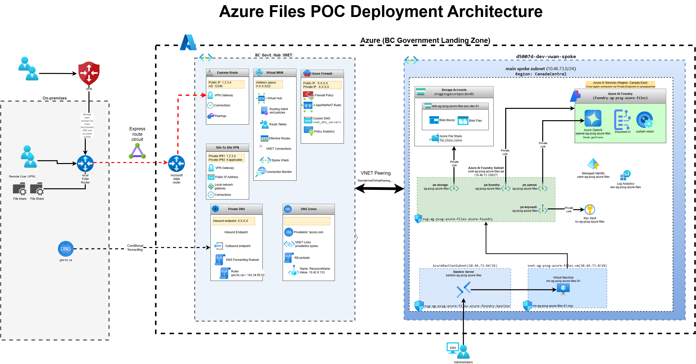

# Azure AI Foundry Landing Zone (Azure Files PoC)

This repository deploys a secure Azure landing zone for **Azure AI Foundry** and **Azure Files** evaluation. The infrastructure enables secure AI model consumption via private endpoints, with no public internet exposure.

> **Current Status:** All infrastructure deployed using Bicep scripts. See [Deployment Status](#deployment-status) for details.

## Quick Links

| What you need | Where to go |
|---------------|-------------|
| **Deploy infrastructure** | [Deployment Guide](docs/guides/deployment-guide.md) |
| **Test AI models** | [AI Model Testing Guide](docs/guides/ai-model-testing.md) |
| **Connect to VM** | [Bastion Connection](docs/runbooks/bastion-connection.md) |
| **SCP File Transfer** | [SCP File Transfer Guide](docs/runbooks/scp-file-transfer.md) |
| **Daily Startup** | [Daily Startup Runbook](docs/runbooks/daily-startup.md) |
| **Daily Shutdown** | [Daily Shutdown Runbook](docs/runbooks/daily-shutdown.md) |
| **Understand the architecture** | [Architecture Overview](docs/architecture/overview.md) |
| **All documentation** | [Documentation Index](docs/README.md) |

## Deployment Status

| Phase | Status | Description |
|-------|--------|-------------|
| **Phase 1** | ✅ Complete | Foundation (NSGs, Subnets) |
| **Phase 2** | ✅ Complete | Storage, Key Vault, UAMI, Log Analytics |
| **Phase 3** | ✅ Complete | VM + Bastion |
| **Phase 4** | ✅ Complete | AI Foundry Hub + Project |
| **Phase 4.5** | ✅ Complete | Azure OpenAI + Private Endpoint |
| **Phase 5** | ✅ Complete | All Private Endpoints |

**Current Architecture:**
- Zero-trust networking with 4 private endpoints
- Cross-region deployment (canadacentral infrastructure → canadaeast AI services)
- Secure access via Bastion (no public IPs on VMs)
- gpt-5-nano model deployed and tested ✅

## Infrastructure Deployment

### Primary Approach: Bicep + Azure CLI

All infrastructure is deployed using modular Bicep templates:

```powershell
cd scripts\bicep

# Deploy all phases
.\deploy-subnet-all.ps1      # Phase 1: Network
.\deploy-nsgs.ps1
.\deploy-storage.ps1         # Phase 2: Storage & Security  
.\deploy-keyvault.ps1
.\deploy-uami.ps1
.\deploy-law.ps1
.\deploy-vm-lz.ps1           # Phase 3: Compute
.\deploy-bastion.ps1
.\deploy-foundry.ps1         # Phase 4: AI Foundry
.\deploy-foundry-project.ps1
.\deploy-openai.ps1          # Phase 4.5: Azure OpenAI
.\deploy-private-endpoints.ps1  # Phase 5: Private Connectivity
```

See [Deployment Guide](docs/guides/deployment-guide.md) for complete instructions.

### Alternative Approach: Terraform + GitHub Actions (Archived)

This project originally used Terraform with GitHub Actions CI/CD. That approach is valid and the code is preserved in `scripts/ARCHIVE/terraform/` for reference. The Bicep approach was chosen for:
- Simpler Azure-native deployment
- Faster iteration during PoC development
- Direct Azure CLI integration

The lessons learned from Bicep deployment can be applied to Terraform if CI/CD automation is needed later.

## Project Background

The BC Government is building an Azure AI Foundry landing zone to enable secure AI model consumption. This project also evaluates Azure Files as a solution for on-premises storage challenges:

### AI Foundry Use Case (Current Focus)
- **Secure AI Access**: VM-based script execution for AI model APIs
- **Private Connectivity**: Zero-trust networking with private endpoints
- **Bastion Access**: Secure SSH to VMs without public IPs
- **Managed Identity**: Passwordless authentication to Azure services

### Azure Files Use Case (Original Scope)
- **Cost Reduction**: Replacing expensive on-premises storage
- **Automated Tiering**: Hot → Cool → Archive lifecycle management
- **Media Management**: Large video/audio file handling
- **Compliance**: BC Gov security requirements

For detailed evaluation criteria, see [PoC Plan](docs/reference/poc-plan.md).

## Repository Structure

```
├── docs/                    # 📚 All documentation (reorganized)
│   ├── README.md            # Documentation index
│   ├── guides/              # Step-by-step guides
│   ├── runbooks/            # Operational procedures
│   ├── architecture/        # Design documents & diagrams
│   └── reference/           # Background information
├── bicep/                   # 🏗️ Bicep templates
├── scripts/
│   ├── bicep/               # ✅ Active deployment scripts
│   ├── azure-inventory.ps1  # Resource inventory tool
│   └── ARCHIVE/             # 📦 Archived CI/CD code
│       ├── terraform/       # Terraform modules
│       ├── OneTimeActivities/  # OIDC & runner setup
│       └── github-workflows/   # GitHub Actions
├── Resources/               # BC Gov reference materials
└── .github/workflows/       # (Empty - workflows archived)
```

### Key Locations

| Purpose | Location |
|---------|----------|
| **Deploy infrastructure** | `scripts/bicep/` |
| **Bicep templates** | `bicep/` |
| **Documentation** | `docs/` |
| **Archived Terraform** | `scripts/ARCHIVE/terraform/` |
| **BC Gov resources** | `Resources/` |

## Resource Inventory

After deployment, gather a comprehensive inventory of all deployed Azure resources:

```powershell
cd scripts
.\azure-inventory.ps1
```

This creates:
- `azure-inventory/` - Detailed raw data (JSON)
- `azure-inventory-summary.md` - Human-readable summary tables

## Architecture

The architecture supports both AI Foundry and Azure Files workloads:



See [Architecture Overview](docs/architecture/overview.md) for details on:
- Hub-spoke network topology
- Private endpoint configuration
- Cross-region AI services deployment

## Getting Started

1. **Review documentation**: Start with [docs/README.md](docs/README.md)
2. **Configure environment**: Copy `azure.env.template` to `azure.env`
3. **Deploy**: Follow [Deployment Guide](docs/guides/deployment-guide.md)
4. **Test AI models**: Use [AI Model Testing Guide](docs/guides/ai-model-testing.md)
5. **Run inventory**: `scripts\azure-inventory.ps1`

## Important Notes

### Resource Group Scoping
Subnets deploy to the VNet's resource group (`RG_NETWORKING`), not the PoC resource group. See [Subnet/NSG Scoping](docs/reference/subnet-nsg-scoping.md).

### Network Connectivity
- ExpressRoute is required for on-premises connectivity (VPN not permitted in BC Gov Landing Zone)
- All Azure resources accessed via private endpoints

## Governance

This repository follows BC Government requirements:

- `LICENSE` — Apache License 2.0
- `CONTRIBUTING.md` — Contribution guidelines
- `CODE_OF_CONDUCT.md` — Expected behavior

## Terraform / CI/CD (Archived)

The original Terraform + GitHub Actions CI/CD approach is preserved in `scripts/ARCHIVE/`:

```
scripts/ARCHIVE/
├── README.md                # Archive documentation
├── terraform/               # Terraform modules and configs
├── OneTimeActivities/       # OIDC, GitHub Actions, runner setup
└── github-workflows/        # GitHub Actions workflow files
```

This code demonstrates how to deploy a self-hosted GitHub runner inside the VNet to bypass Azure Policy restrictions on public network access. The approach is fully functional if CI/CD automation is needed. See [CI/CD Runner Setup](docs/guides/cicd-runner-setup.md) for details.

---

## License

Copyright 2025 British Columbia — Licensed under the Apache License, Version 2.0: http://www.apache.org/licenses/LICENSE-2.0
