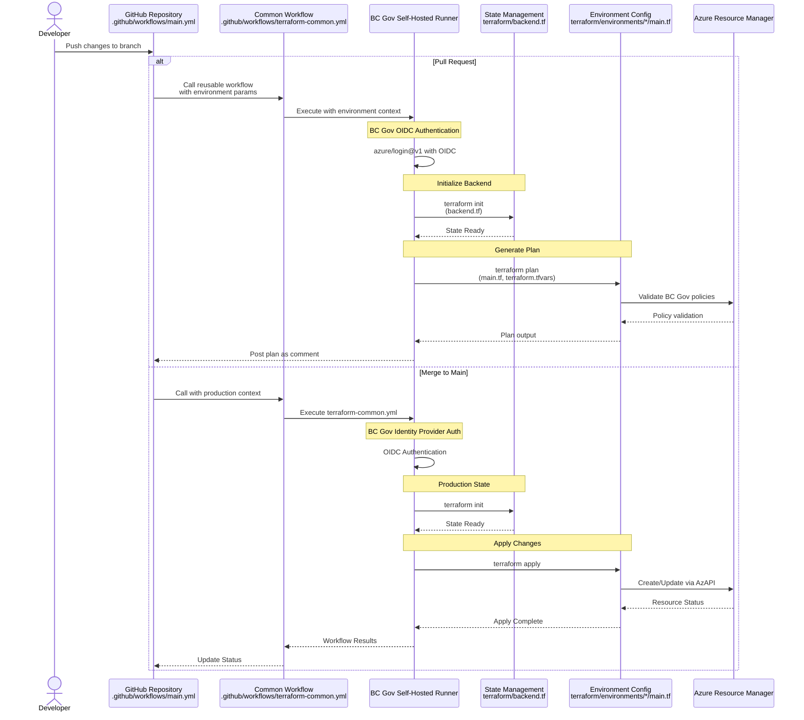

# Azure Files Proof of Concept

This repository contains documentation and resources for evaluating Azure Files as a cost-effective, performant, and secure replacement for on-premises file storage infrastructure in a government context.

## Project Overview

The BC Government is exploring Azure Files as a solution to address several challenges with current on-premises file storage:

- **Rising Infrastructure Costs**: Reducing operational expenditures for storage hardware
- **Storage Optimization**: Implementing automated tiering strategies for cost-effective data lifecycle management
- **Administrative Efficiency**: Decreasing technical overhead while maintaining or improving service levels
- **Media File Management**: Better handling of large video/audio files with appropriate archiving capabilities
- **Resource Stewardship**: Demonstrating responsible use of taxpayer resources

## Repository Structure and Key Resources

### Documentation
- **[ProofOfConceptPlan.md](ProofOfConceptPlan.md)**: Comprehensive plan outlining objectives, evaluation criteria, and timeline
- **[ArchitectureOverview.md](ArchitectureOverview.md)**: Detailed architecture design for Azure Files implementation

### Infrastructure as Code
- **[terraform/](terraform/)**: Infrastructure code and deployment configurations
  - **[README.md](terraform/README.md)**: Setup, usage instructions, and module documentation
  - **[environments/](terraform/environments/)**: Environment-specific configurations
    - `dev/`: Development environment resources and variables
    - `test/`: Test environment resources and variables
    - `prod/`: Production environment resources and variables
  - **[modules/](terraform/modules/)**: Reusable BC Gov-compliant Terraform modules
    - `networking/`: Network components (VNet, Subnet, NSG)
    - `storage/`: Storage resources (Account, File Share, Blob)
    - `security/`: Security components (NSG, Firewall)
    - `dns/`: DNS configuration (Private DNS, Resolver)

### GitHub Actions Workflows
- **[.github/workflows/](.github/workflows/)**:
  - **[terraform-common.yml](.github/workflows/terraform-common.yml)**: Reusable Terraform workflow with OIDC auth
  - **[main.yml](.github/workflows/main.yml)**: Environment-specific deployment workflow

### Resources and Best Practices
- **[Resources/](Resources/)**:
  - **[TerraformResourcesForAzurePoC.md](Resources/TerraformResourcesForAzurePoC.md)**: BC Government-specific Terraform guidance
  - **[TerraformWithGithubActionsProcess.md](Resources/TerraformWithGithubActionsProcess.md)**: Detailed workflow implementation guide
  - **[GitHubActionsResourcesForAzureFilesPoC.md](Resources/GitHubActionsResourcesForAzureFilesPoC.md)**: GitHub Actions setup and OIDC authentication
  - **[AzurePipelinesResources.md](Resources/AzurePipelinesResources.md)**: Azure Pipelines integration guide
  - **[TerraformModuleStructure.md](Resources/TerraformModuleStructure.md)**: Module design and BC Gov requirements

### Architecture Diagrams
- **[azure files express route.drawio](azure%20files%20express%20route.drawio)**: Source diagram (draw.io)
- **[azure files express route.drawio.png](azure%20files%20express%20route.drawio.png)**: Rendered diagram

## Key Evaluation Areas

1. **File Access & Management**: Ensuring compatibility with existing workflows, including folder operations and metadata preservation
2. **Performance & Latency**: Validating speed for large file transfers and real-time playback scenarios
3. **Security & Compliance**: Testing AD integration, permission enforcement, and security controls
4. **Backup & Recovery**: Evaluating snapshot capabilities and integration with Azure Backup
5. **Tiering & Lifecycle Management**: Testing cost optimization through automated movement between storage tiers
6. **Reporting & Monitoring**: Assessing visibility into storage utilization and costs
7. **Cost Analysis**: Developing a framework for comprehensive TCO comparison

## Architecture at a Glance

This PoC implements a hybrid connectivity model with Azure Files accessed via Private Endpoint and optional integration with Azure Blob Storage for tiering:


## Getting Started

Review the [Proof of Concept Plan](ProofOfConceptPlan.md) for an understanding of project objectives and evaluation criteria.

For detailed technical architecture, see the [Architecture Overview](./Architecture/ArchitectureOverview.md).

## Important Rule for Resource Creation

**CRITICAL: DO NOT CREATE ANY RESOURCES IN AZURE WITHOUT EXPLICIT CONSENT AND REVIEW.**

All infrastructure code, scripts, and templates must undergo thorough review and documentation before any resources are deployed to Azure. This ensures:
- Compliance with BC Government guidelines and security requirements
- Cost control and proper resource allocation
- Appropriate documentation of all deployed components
- Alignment with the project's objectives and architectural design

## Network Connectivity Options

Multiple connectivity approaches are being evaluated, including:
- VPN + Private Endpoint (short-term)
- ExpressRoute + Private Endpoint (long-term)
- Azure File Sync (hybrid model)

Details on these options are available in the [Network Connectivity Options Analysis](./Architecture//OptionsAnalysis/AzureFilesNetworkConnectivityOptionsAnalysis.md).

## Development Process

This project implements a secure, compliant infrastructure development process using GitHub Actions and Terraform:

### Local Development
1. Clone repository and set up local environment
2. Use Azure CLI authentication for development
3. Create feature branch for changes
4. Test changes locally with `terraform plan`

### Automated Validation
1. Push changes to GitHub
2. Create Pull Request
3. Automated workflows run:
   - Terraform validation
   - BC Gov policy compliance checks
   - Security scanning
   - Cost estimation

### Deployment Process
1. Pull Request review and approval
2. Merge to main branch
3. Automated deployment:
   - OIDC authentication
   - Resource creation/update
   - Validation checks

> **Important**: All deployments must follow BC Government security requirements and use approved runners.

For detailed implementation guidance, see:
- [Terraform Resources Guide](Resources/TerraformResourcesForAzurePoC.md)
- [GitHub Actions Process](Resources/TerraformWithGithubActionsProcess.md)
- [BC Gov GitHub Actions Setup](Resources/GitHubActionsResourcesForAzureFilesPoC.md)

## Terraform Development

See the [terraform](./terraform/) directory for infrastructure code. Key aspects:

- We use Azure CLI authentication for local development (`az login`)
- No resources are created until explicit `terraform apply` commands are executed
- All sensitive variables are parameterized in accordance with security best practices
- A detailed [Deployment Checklist](DEPLOYMENT_CHECKLIST.md) must be completed before any resource creation

For more information on working with Terraform in this project, see the [Terraform README](terraform/README.md).

## Deployment Workflow

The following diagram illustrates the GitHub Actions and Terraform deployment process in the BC Government context:



### Workflow Steps

1. **Development**:
   - Create feature branch from `main`
   - Make changes in `terraform/environments/<env>/`
   - Push changes to GitHub

2. **Pull Request**:
   - `.github/workflows/main.yml` triggers
   - Calls `terraform-common.yml` with environment context
   - OIDC authentication via `azure/login@v1`
   - Terraform plan with BC Gov policy validation
   - Plan posted to PR for review

3. **Deployment**:
   - Merge to `main` branch
   - Production workflow triggered
   - OIDC authentication with BC Gov Identity Provider
   - Terraform apply with AzAPI provider
   - Resources created/updated with BC Gov compliance
   - Status verification and environment update

## Modular Terraform Structure

The infrastructure code is organized into reusable modules that implement BC Government compliance requirements:

### Module Organization
```
terraform/
├── environments/           # Environment-specific configurations
│   ├── dev/              
│   │   ├── main.tf        # References shared modules
│   │   ├── variables.tf    # Variable declarations
│   │   └── terraform.tfvars# Environment values
│   ├── test/
│   └── prod/
├── modules/               # Shared, compliant components
│   ├── networking/        # Network resources
│   │   ├── vnet/         # Virtual Network config
│   │   ├── subnet/       # BC Gov-compliant subnets
│   │   └── private-endpoint/ # Secure endpoints
│   ├── storage/          # Storage resources
│   │   ├── account/      # Storage account config
│   │   ├── file-share/   # Azure Files setup
│   │   └── blob/         # Optional Blob storage
│   ├── security/         # Security components
│   │   ├── nsg/          # Network Security Groups
│   │   └── firewall/     # Azure Firewall rules
│   └── dns/              # DNS configuration
│       ├── private-dns/  # Private DNS zones
│       └── resolver/     # DNS resolvers
```

### Key Module Features
1. **Policy Compliance**:
   - Uses AzAPI provider for policy-compliant resources
   - Implements required NSG associations
   - Follows BC Gov naming conventions

2. **Security Integration**:
   - Private endpoint configuration
   - NSG rule management
   - RBAC role assignments

3. **State Management**:
   - Remote state with encryption
   - State locking implementation
   - Environment separation

For detailed module documentation, see [TerraformModuleStructure.md](Resources/TerraformModuleStructure.md).
