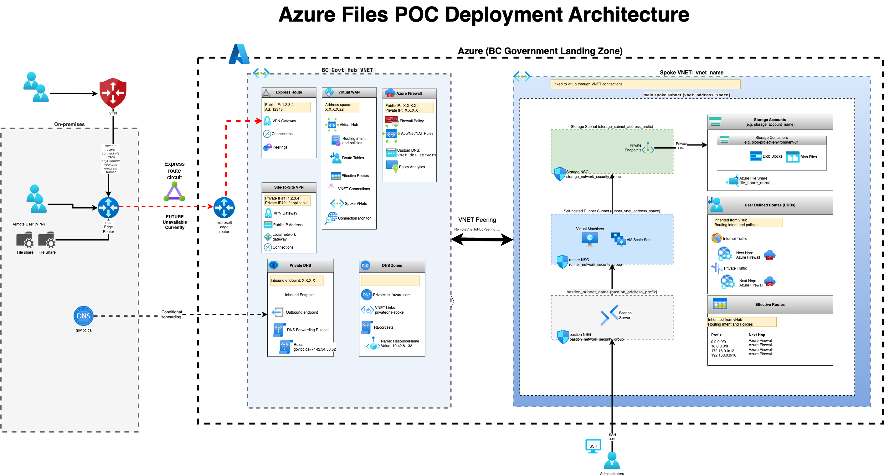

# IMPORTANT: Subnet and NSG Deployment Scoping

* Always deploy subnet Bicep modules at the VNet's resource group scope (e.g., RG_NETWORKING), not the PoC RG.
* The vnetResourceGroup parameter and --resource-group argument must match the VNet's actual resource group.
* NSGs are created in the PoC RG (RG_AZURE_FILES), but subnets must be created in the VNet's RG (RG_NETWORKING).
* All subnet-related az commands (existence checks, creation, confirmation) must use RG_NETWORKING. All NSG-related commands must use RG_AZURE_FILES.

# Azure AI Foundry Landing Zone (Azure Files PoC)

This repository deploys Azure infrastructure to support **Azure AI Foundry** services with secure access via Bastion. The goal is to run AI model consumption scripts from a VM that securely connects to AI Foundry APIs through private endpoints.

> **Current Status:** All 5 phases deployed successfully using Bicep scripts. Optional Phase 2: Convert to CI/CD pipeline with self-hosted GitHub runner. See [`task-tracker.md`](task-tracker.md) for deployment status and next steps.

## Primary Deployment Approach: Azure CLI + Bicep Scripts

**This is the KEY FIRST PHASE** - All infrastructure is deployed using modular Bicep templates and PowerShell scripts via Azure CLI.

- **Location:** `bicep/`, `scripts/bicep/`
- **Status:** ✅ **COMPLETE** - All 5 phases deployed successfully
- **Best for:** Direct deployment, validation, and operational use
- **See:** [scripts/bicep/](scripts/bicep/) and [task-tracker.md](task-tracker.md)

### Quick Start with Bicep Scripts
```powershell
cd scripts\bicep

# Phase 1: Foundation
.\deploy-subnet-all.ps1
.\deploy-nsgs.ps1

# Phase 2: Storage & Security
.\deploy-storage.ps1
.\deploy-keyvault.ps1
.\deploy-uami.ps1
.\deploy-law.ps1

# Phase 3: Compute
.\deploy-vm-lz.ps1
.\deploy-bastion.ps1

# Phase 4: AI Foundry
.\deploy-foundry.ps1
.\deploy-foundry-project.ps1

# Phase 5: Private Endpoints
.\deploy-private-endpoints.ps1
```

## Optional Phase 2: CI/CD Pipeline with Self-Hosted GitHub Runner

**LATER OPTIONAL PHASE** - Convert the working Bicep deployments into an automated CI/CD pipeline.

This repository also supports a Terraform + GitHub Actions deployment strategy for automated CI/CD:

- **Location:** `terraform/`, `.github/workflows/`
- **Status:** 🔄 **OPTIONAL** - Working CI/CD infrastructure exists but not currently used (pivoted to Bicep for primary deployment)
- **Best for:** Automated CI/CD after manual Bicep validation is complete
- **See:** [terraform/README.md](terraform/README.md)

**Note:** The CI/CD approach was initially developed but the project pivoted to Bicep scripts for the primary deployment path. The CI/CD infrastructure remains available for future automation.

This repository contains documentation and resources for evaluating Azure Files as a cost-effective, performant, and secure replacement for on-premises file storage infrastructure in a government context, specifically for the **BC Government**.

## Project Status (as of December 1, 2025)

- **✅ All 5 Phases Complete**: Full Azure AI Foundry landing zone deployed using Bicep scripts
- **✅ Private Endpoints Operational**: Zero-trust networking with cross-region Foundry connectivity
- **✅ VM & Bastion Working**: Secure access to private resources without public IPs
- **🔄 Optional Phase 2**: CI/CD pipeline conversion (existing Terraform/GHA code available but not currently used)
- **📋 Scripts Enhanced**: All PowerShell scripts include filename comments and comprehensive verification
- **📊 Task Tracker Updated**: Complete deployment status and teardown procedures documented

**Current Architecture:**
- **VM** in private subnet with managed identity
- **Bastion** for secure SSH access (no public IPs)
- **Private Endpoints** for Storage, Key Vault, and AI Foundry
- **Cross-region connectivity** (infrastructure in canadacentral, Foundry in canadaeast)
- **Zero-trust security** with passwordless authentication

## Project Overview

The BC Government is building an Azure AI Foundry landing zone to enable secure AI model consumption while also exploring Azure Files as a solution to address several challenges with current on-premises file storage:

### AI Foundry Use Case
-   **Secure AI Access**: VM-based script execution environment for AI model APIs
-   **Private Connectivity**: Zero-trust networking with private endpoints (no public internet)
-   **Bastion Access**: Secure RDP/SSH to VMs without public IPs
-   **Managed Identity**: Passwordless authentication to Azure services

### Azure Files Use Case
-   **Rising Infrastructure Costs**: Reducing operational expenditures for storage hardware
-   **Storage Optimization**: Implementing automated tiering strategies for cost-effective data lifecycle management
-   **Administrative Efficiency**: Decreasing technical overhead while maintaining or improving service levels
-   **Media File Management**: Better handling of large video/audio files with appropriate archiving capabilities
-   **Resource Stewardship**: Demonstrating responsible use of taxpayer resources

## Repository Structure and Key Resources

### Documentation
-   **[task-tracker.md](task-tracker.md)**: **START HERE** - Complete deployment status, phase-by-phase commands, and teardown procedures
-   **[docs/azure-ai-foundry-deployment-guide.md](docs/azure-ai-foundry-deployment-guide.md)**: Comprehensive deployment manual
-   **[ProofOfConceptPlan.md](ProofOfConceptPlan.md)**: Project objectives and evaluation criteria
-   **[ArchitectureOverview.md](Architecture/ArchitectureOverview.md)**: Technical architecture design

### Primary Deployment: Bicep Scripts
-   **[scripts/bicep/](scripts/bicep/)**: **MAIN DEPLOYMENT SCRIPTS** - All 25+ PowerShell scripts for phased deployment
-   **[bicep/](bicep/)**: Modular Bicep templates for each resource type
-   **Status:** ✅ **COMPLETE** - All infrastructure deployed and operational

### Optional CI/CD Pipeline (Phase 2)
-   **[terraform/](terraform/)**: Infrastructure code for automated CI/CD deployment
-   **[.github/workflows/](.github/workflows/)**: GitHub Actions workflows
-   **Status:** 🔄 **OPTIONAL** - Working code exists but not currently used (pivoted to Bicep for primary deployment)

### Resources and Best Practices
-   **[Resources/](Resources/)**:
    -   **[AzureLandingZone_Guardrails_Summary.md](Resources/AzureLandingZone_Guardrails_Summary.md)**: Summary of BC Gov Azure Landing Zone guardrails and compliance policies.
    -   **[BCGov-IaC_CICD_BestPractices_Summary.md](Resources/BCGov-IaC_CICD_BestPractices_Summary.md)**: Infrastructure-as-Code and CI/CD best practices for BC Gov Azure.
    -   **[BCGov-PrivateDNSandEndpoints.md](Resources/BCGov-PrivateDNSandEndpoints.md)**: Private DNS and Private Endpoint integration guidance.
    -   **[BcGov-AzurePolicyTerraformNotes.md](Resources/BcGov-AzurePolicyTerraformNotes.md)**: Policy compliance notes and Terraform workarounds.
    -   **[BCGov-TerraformResourcesForAzurePoC.md](Resources/BCGov-TerraformResourcesForAzurePoC.md)**: BC Government-specific Terraform guidance.
    -   **[BCGov-TerraformWithGithubActionsProcess.md](Resources/BCGov-TerraformWithGithubActionsProcess.md)**: Detailed workflow implementation guide.
    -   **[BCGov-GitHubActionsResourcesForAzureFilesPoC.md](Resources/BCGov-GitHubActionsResourcesForAzureFilesPoC.md)**: GitHub Actions setup and OIDC authentication.
    -   **[BCGov-AzurePipelinesResources.md](Resources/BCGov-AzurePipelinesResources.md)**: Azure Pipelines integration guide (if applicable).
    -   **[BCGov-TerraformModuleStructure.md](Resources/BCGov-TerraformModuleStructure.md)**: Module design and BC Gov requirements.
    -   **[AzureResourceNamingConventions.md](Resources/AzureResourceNamingConventions.md)**: Naming conventions for Azure resources.

### Architecture Diagrams
-   **[azure_files_poc_architecture_diagram_sanitized.drawio](Architecture/azure_files_poc_architecture_diagram_sanitized.drawio)**: Sanitized source diagram (draw.io).
-   **[azure_files_poc_architecture_diagram_sanitized.drawio.png](Architecture/azure_files_poc_architecture_diagram_sanitized.drawio.png)**: Rendered sanitized diagram.

## Key Evaluation Areas

1.  **File Access & Management**: Ensuring compatibility with existing workflows, including folder operations and metadata preservation.
2.  **Performance & Latency**: Validating speed for large file transfers and real-time playback scenarios.
3.  **Security & Compliance**: Testing AD integration, permission enforcement, and security controls.
4.  **Backup & Recovery**: Evaluating snapshot capabilities and integration with Azure Backup.
5.  **Tiering & Lifecycle Management**: Testing cost optimization through automated movement between storage tiers.
6.  **Reporting & Monitoring**: Assessing visibility into storage utilization and costs.
7.  **Cost Analysis**: Developing a framework for comprehensive TCO comparison.

## Architecture at a Glance

This PoC implements a hybrid connectivity model with Azure Files accessed via Private Endpoint and optional integration with Azure Blob Storage for tiering:


## Getting Started

**START HERE:** Review the [task-tracker.md](task-tracker.md) for current deployment status and next steps.

### Primary Path: Deploy with Bicep Scripts
1. **Check Status**: See [task-tracker.md](task-tracker.md) - all 5 phases are complete
2. **Environment Setup**: Copy `azure.env.template` to `azure.env` and configure
3. **Deploy**: Use the PowerShell scripts in `scripts/bicep/` for each phase
4. **Validate**: Run `scripts\azure-inventory.ps1` to verify all resources

### Optional Path: Convert to CI/CD Pipeline
After Bicep deployment is validated, optionally convert to automated CI/CD:
1. **Review Existing Code**: Terraform modules in `terraform/` are ready to use
2. **Deploy CI/CD Infra**: Use `terraform/environments/cicd/` for self-hosted runner
3. **Convert Workflows**: Adapt existing GitHub Actions workflows
4. **Automate**: Move from manual Bicep scripts to automated pipeline

For detailed technical architecture, see the [Architecture Overview](./Architecture/ArchitectureOverview.md).

## Important Rule for Resource Creation

All infrastructure code, scripts, and templates must undergo thorough review and documentation before any resources are deployed to Azure. This ensures:
-   Compliance with BC Government guidelines and security requirements.
-   Cost control and proper resource allocation.
-   Appropriate documentation of all deployed components.
-   Alignment with the project's objectives and architectural design.

## Network Connectivity Options

Multiple connectivity approaches are being evaluated, including:
-   ExpressRoute + Private Endpoint (pending platform team provisioning).
-   VPN connectivity is not permitted in our Landing Zone; all on-premises access will be via ExpressRoute once available.

Details on these options are available in the [Network Connectivity Options Analysis](./Architecture/OptionsAnalysis/AzureFilesNetworkConnectivityOptionsAnalysis.md).

## Development Process

### Primary: Manual Bicep Deployment
1. **Environment Setup**: Configure `azure.env` with your values
2. **Phased Deployment**: Use PowerShell scripts in `scripts/bicep/` 
3. **Validation**: Test each phase before proceeding
4. **Documentation**: All steps tracked in `task-tracker.md`

### Optional: Automated CI/CD Pipeline
After manual validation, convert to automated deployment:
1. **CI/CD Infrastructure**: Deploy self-hosted runner using `terraform/environments/cicd/`
2. **Pipeline Conversion**: Adapt working Bicep scripts to GitHub Actions workflows
3. **Automated Validation**: Implement automated testing and compliance checks
4. **Production Deployment**: Use approved pipelines for production environments

> **Current Status**: All infrastructure deployed manually with Bicep. CI/CD pipeline code exists but is not currently active.

For detailed implementation guidance, see:
-   [Terraform Resources Guide](Resources/TerraformResourcesForAzurePoC.md)
-   [GitHub Actions Process](Resources/TerraformWithGithubActionsProcess.md)
-   [BC Gov GitHub Actions Setup](Resources/GitHubActionsResourcesForAzureFilesPoC.md)

## Governance & mandatory repository files

This repository follows BC Government requirements for public GitHub repositories. The repository includes the mandatory governance files and guidance contributors must follow:

- `LICENSE` — project is licensed under the Apache License 2.0 (see `./LICENSE`).
- `CONTRIBUTING.md` — contribution rules, formatting and verification guidance (see `./CONTRIBUTING.md`).
- `CODE_OF_CONDUCT.md` — expected behaviour for contributors (see `./CODE_OF_CONDUCT.md`).

File header and footer guidance:

- Documentation (including `README.md`) must include a short Apache footer that points to the `LICENSE` file. Example (bottom of this file):

    > Copyright 2025 British Columbia — Licensed under the Apache License, Version 2.0: http://www.apache.org/licenses/LICENSE-2.0

- Source code files should include a short header comment with copyright and license reference. Example header (use the appropriate comment syntax for the file type):

    /*
     Copyright 2025 British Columbia
     Licensed under the Apache License, Version 2.0 (the "License");
     you may not use this file except in compliance with the License.
     See the LICENSE file in the repository root for full license text.
    */

If you need a template for specific languages, see the `CONTRIBUTING.md` or ask the maintainers for a small header template to copy into new source files.

## Repository verification & test scripts

Instead of generic test instructions, prefer the repository-specific verification scripts and guides that are maintained here. Key locations:

- One-time onboarding and OIDC/registration scripts: `OneTimeActivities/RegisterApplicationInAzureAndOIDC/scripts/` (both `unix/` and `windows/` subfolders). These automate app registration, OIDC federation, TF state storage setup and validation steps referenced by the onboarding docs in `OneTimeActivities/`.
- CI/CD and self-hosted runner setup: `SelfHostedRunnerSetup/` (installer scripts and documentation) and `terraform/environments/cicd/README.md` for deploying the private runner infra.
- Terraform verification and environment scripts: see `terraform/README.md` and `terraform/environments/*` for environment-specific guidance and validation steps.

Suggested local verification steps (Windows PowerShell):

1. Review the onboarding and environment scripts you plan to run (see `OneTimeActivities/RegisterApplicationInAzureAndOIDC/` and `terraform/environments/cicd/`).
2. For Terraform changes, run:

```powershell
cd terraform/environments/<env>
terraform init
terraform validate
terraform plan
```

3. To validate self-hosted runner and OIDC, follow the explicit scripts in `OneTimeActivities/RegisterApplicationInAzureAndOIDC/scripts/` (see README in that folder for exact commands for Windows vs Unix).

4. For additional repository verification and developer-level checks, see `CONTRIBUTING.md` — it lists project-specific verification scripts maintained for this repo.

If you maintain or add automated tests (unit/integration), indicate them in `CONTRIBUTING.md` and wire them into GitHub Actions workflows under `.github/workflows/`.

## Terraform Development

See the [terraform](./terraform/) directory for infrastructure code. Key aspects:

-   We use Azure CLI authentication for local development (`az login`).
-   No resources are created until explicit `terraform apply` commands are executed (via the pipeline or locally for testing).
-   All sensitive variables are parameterized in accordance with security best practices.
-   A detailed [Deployment Checklist](DEPLOYMENT_CHECKLIST.md) must be completed before any resource creation.

For more information on working with Terraform in this project, see the [Terraform README](terraform/README.md).

## Optional Phase 2: CI/CD Deployment Workflow Summary (Dev Environment)

The following diagram illustrates the GitHub Actions and Terraform deployment process specifically for the **development environment** in the BC Government context (Optional Phase 2):

```mermaid
sequenceDiagram
    actor Dev as Developer
    participant Git as GitHub Repository<br/>.github/workflows/main.yml
    participant Runner as BC Gov Self-Hosted Runner
    participant AzureAD as Azure Active Directory (Microsoft Entra ID)
    participant KeyVault as Azure Key Vault
    participant TFState as State Management<br/>terraform/backend.tf
    participant TFConfig as Environment Config<br/>terraform/environments/dev/main.tf
    participant Azure as Azure Resource Manager

    Dev->>Git: Push changes to 'dev' branch / Create Pull Request (targeting 'dev')

    Git->>Runner: Execute with 'dev' environment context

    Note over Runner,AzureAD: GitHub Actions OIDC Authentication
    Runner->>AzureAD: 1. Request OIDC Token (via GitHub's OIDC Provider)
    AzureAD-->>Runner: 2. Issue Short-Lived OIDC JWT
    Runner->>AzureAD: 3. Use azure/login@v1 action:<br/>Exchange OIDC JWT for Azure AD Access Token<br/>(using client-id, tenant-id, subscription-id from GitHub Secrets)
    AzureAD-->>Runner: 4. Provide Azure AD Access Token<br/>(authenticated as Service Principal for Dev)

    opt Optional: Retrieve secrets from Key Vault
        Note over Runner,KeyVault: Retrieve Sensitive Configuration (if any)
        Runner->>KeyVault: 5. Authenticate with Azure AD Access Token<br/>and fetch secrets/variables (e.g., API keys, DB connection strings)
        KeyVault-->>Runner: 6. Provide fetched secrets
    end

    Note over Runner,TFState: Initialize Terraform Backend
    Runner->>TFState: 7. terraform init<br/>(backend.tf - uses authenticated Azure identity for storage access)
    TFState-->>Runner: 8. State Backend Ready

    alt Pull Request (Plan Only)
        Note over Runner,TFConfig: Generate Terraform Plan
        Runner->>TFConfig: 9. terraform plan<br/>(main.tf, terraform.tfvars - uses authenticated Azure identity and retrieved secrets)
        TFConfig->>Azure: 10. Validate against BC Gov policies / Check Azure resources
        Azure-->>TFConfig: 11. Policy validation / Resource status
        TFConfig-->>Runner: 12. Plan output (proposed changes)
        Runner-->>Git: 13. Post plan as PR comment
    else Push to 'dev' (Apply Changes)
        Note over Runner,TFConfig: Apply Terraform Changes
        Runner->>TFConfig: 9. terraform apply<br/>(main.tf, terraform.tfvars - uses authenticated Azure identity and retrieved secrets)
        TFConfig->>Azure: 10. Create/Update Azure Resources via Azure ARM API
        Azure-->>TFConfig: 11. Resource Status / API Response
        TFConfig-->>Runner: 12. Apply Complete (resources provisioned/updated)
        Runner-->>CommonFlow: 13. Workflow Results / Success/Failure
        CommonFlow-->>Git: 14. Update branch status (e.g., green checkmark)
    end
````

## Optional Phase 2: CI/CD Infrastructure (Self-Hosted GitHub Actions Runner)

**STATUS: OPTIONAL - Complete infrastructure deployed manually with Bicep. This section describes how to optionally convert to automated CI/CD.**

BC Government Azure environments implement strict security policies that forbid creating resources with public network access enabled. This creates challenges for CI/CD:

- **Standard GitHub-hosted runners** operate from the public internet
- When Terraform tries to create storage accounts or file shares, it requires network access
- If public access is disabled (per policy), the firewall blocks the runner → 403 Forbidden errors
- If we try to enable public access, **Azure Policy blocks the action**

### The Solution: Private Network Runner

The **self-hosted GitHub Actions runner VM** is deployed **inside the private Azure Spoke VNet**:

- **Network Location**: Runner operates from a private IP address within your VNet
- **Policy Compliance**: Communicates with Azure resources over private network, bypassing public firewall
- **Security**: Uses Azure Bastion for secure SSH access without public IPs
- **Automation**: Fully automated deployment via Terraform in `terraform/environments/cicd/`

### Key Components

1. **Runner VM** (`Standard_D2s_v4`): Lightweight Ubuntu VM for CI/CD workloads
2. **Azure Bastion** (`Standard` SKU): Secure SSH/RDP access with native client support
3. **Network Security Groups**: Policy-compliant subnet creation with required firewall rules
4. **Private Networking**: Runner communicates with storage accounts via private endpoints

### When to Use This (Optional Phase 2)

After validating your Bicep deployment works correctly:

1. **Deploy the CI/CD infrastructure:**
   ```bash
   cd terraform/environments/cicd
   terraform init && terraform apply
   ```

2. **Convert manual scripts to automated workflows:**
   - Adapt the working Bicep scripts to GitHub Actions
   - Implement automated validation and testing
   - Set up approval gates for production deployments

**See:** [Azure AI Foundry Deployment Guide](docs/azure-ai-foundry-deployment-guide.md) for detailed CI/CD conversion procedures.

> **Note**: This CI/CD infrastructure was initially developed but the project pivoted to Bicep scripts for primary deployment. The Terraform code remains available for future automation needs.

---

## Current Project Status Summary

- **✅ Bicep Deployment Complete**: All 5 phases successfully deployed using PowerShell scripts
- **✅ Private Endpoints Operational**: Zero-trust networking working across regions
- **✅ Infrastructure Validated**: All resources verified and documented in task tracker
- **🔄 Optional CI/CD**: Terraform and GitHub Actions code exists for future automation
- **📋 Well-Documented**: Comprehensive guides and teardown procedures available

**Next Steps:**
1. Use the deployed infrastructure for AI model consumption
2. Optionally convert to CI/CD pipeline using existing Terraform code
3. Monitor and maintain using Log Analytics and Azure Monitor

For immediate use, see [task-tracker.md](task-tracker.md) for operational status and access procedures.
