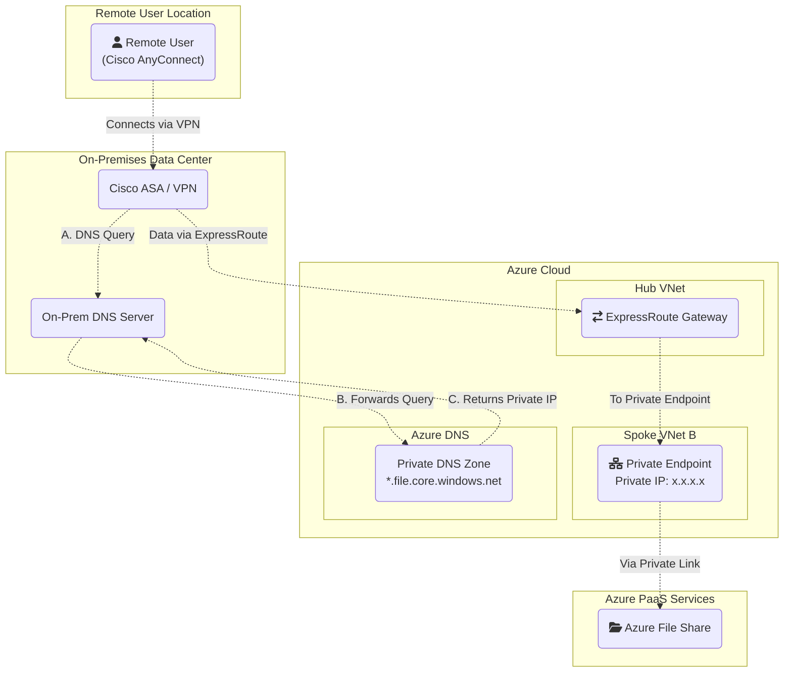

# Connecting Remote VPN Users to Azure via ExpressRoute and Gateway Transit

This document outlines the architecture and traffic flow for allowing remote users, connected to a corporate network via a client VPN (like Cisco AnyConnect), to access resources within a peered Azure Spoke VNet.

This pattern leverages an existing ExpressRoute connection and the **Gateway Transit** feature in Azure VNet Peering.

## The Scenario

-   **Remote User**: A developer or employee working from home using the **Cisco AnyConnect** client to connect to the corporate office.
-   **On-Premises Network**: The corporate headquarters with a Cisco ASA (or similar) VPN concentrator, on-prem DNS server, and an active **ExpressRoute** circuit.
-   **Azure Network**: A standard **Hub-and-Spoke** topology.
    -   The **Hub VNet** contains the ExpressRoute Gateway.
    -   The **Spoke VNet** contains a Private Endpoint for Azure File Share (or VM) with a private IP address.
    -   Azure DNS Private Zone resolves storage endpoints (e.g., `*.file.core.windows.net`).
    -   VNet Peering is configured between the Hub and Spoke with **Gateway Transit** enabled.
    -   Azure File Share is accessed via Private Link.

**Note:** The ExpressRoute connectivity described in this document is implemented using an Azure ExpressRoute circuit resource, which provides a dedicated private connection between the on-premises network and Azure.

## Architecture Diagram

The following diagram illustrates the end-to-end traffic path.

### Explanation of Diagram Arrows

**Arrow 1 (User to VPN):** The remote user establishes a VPN tunnel to the on-premises Cisco ASA.

**Arrow 2 (Router to Gateway):** The on-premises router receives traffic destined for Azure and forwards it over the ExpressRoute circuit.

**Dotted Arrows (Gateway to Spoke):** The connection from the Hub to the Spoke is enabled by the VNet Peering settings, allowing traffic to transit to the final destination VM.

## Step-by-Step Traffic Flow

### 1. User Connects to Corporate VPN
- The user initiates a connection using their Cisco AnyConnect client.
- A secure tunnel is established to the on-premises Cisco ASA. The user's laptop is now logically on the corporate network and receives an IP address from the corporate VPN pool (e.g., `x.x.x.x`).

### 2. DNS Resolution for Azure File Share
- The user (or application) initiates a DNS query for the Azure File Share endpoint (e.g., `myshare.file.core.windows.net`).
- The query is sent to the on-prem DNS server, which forwards it to Azure DNS Private Zone via ExpressRoute.
- Azure DNS returns the private IP address of the Private Endpoint to the on-prem DNS server, which relays it to the client.

### 3. Data Path to Azure File Share
- The user attempts to access the Azure File Share using the resolved private IP.
- The traffic travels through the AnyConnect tunnel to the on-premises network.
- The on-premises router inspects the destination IP. Because it matches the Private Endpoint in Azure, the router forwards the packet over the ExpressRoute Circuit.
- The traffic arrives at the ExpressRoute Gateway in the Azure Hub VNet.
- The **Gateway Transit** feature, enabled on the peering link, allows the Hub VNet to act as a gateway for the Spoke VNet.
- Azure's internal routing automatically forwards the packet from the gateway, across the peering link, to the Private Endpoint in Spoke VNet B, which connects to Azure File Share via Private Link.
- Return traffic follows the same path in reverse.

## Key Configuration Requirements

For this architecture to function, two critical routing configurations are necessary:

*   **Route Advertisement *to* Azure**: The on-premises network router must advertise the corporate VPN client address pool (e.g., `x.x.x.x/24`) to Azure over the ExpressRoute connection. This ensures Azure knows how to send return traffic back to the user.

*   **Internal Routing *from* On-Premises**: The on-premises router must have a route for the Azure VNet address spaces (e.g., `x.x.x.x/16`) and Private Endpoint IPs that point to the ExpressRoute circuit as the next hop.

*   **DNS Forwarding**: The on-prem DNS server must be configured to forward queries for Azure storage endpoints (e.g., `*.file.core.windows.net`) to the Azure DNS Private Zone via ExpressRoute.

## Summary

This architecture provides a seamless experience for remote users, allowing them to use a single corporate VPN connection to securely access Azure File Shares and other resources via Private Endpoint and Private Link. DNS resolution is handled by forwarding queries to Azure DNS Private Zone, ensuring the correct private IP is used. All connectivity is centralized through the established ExpressRoute circuit, leveraging existing network infrastructure and complying with BC Gov Landing Zone requirements.