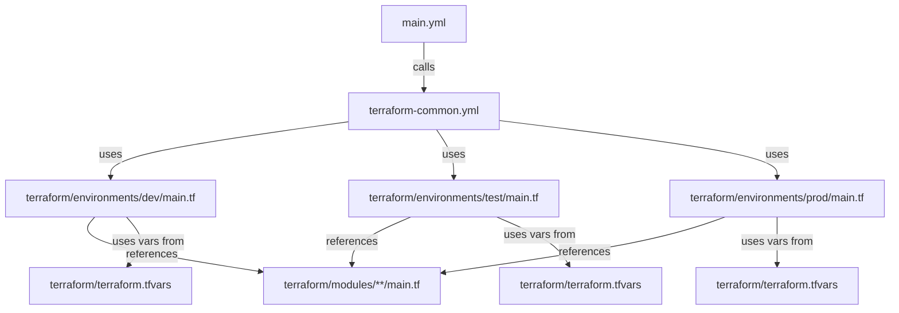
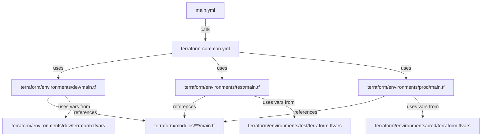
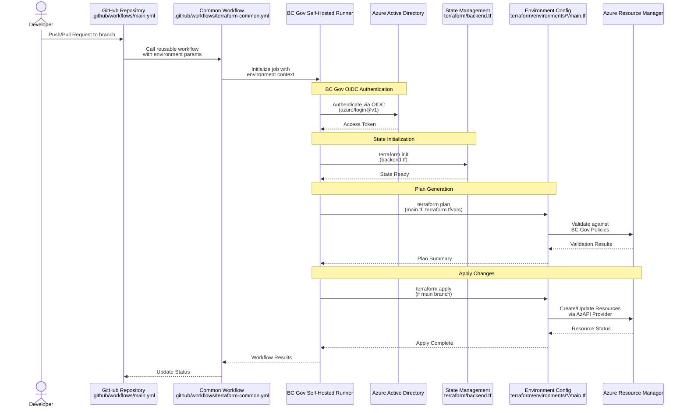

# Terraform with GitHub Actions Process in BC Government Context

## Summary
This document outlines the BC Government-specific implementation of GitHub Actions workflows for Terraform automation in Azure. The process follows BC Government security requirements and best practices for managing Azure resources through Infrastructure as Code (IaC), with particular attention to Landing Zone policies and security requirements.

## Key BC Government Requirements
1. **Self-Hosted Runners**: Required for accessing Azure data storage and database services
2. **OIDC Authentication**: Mandatory for secure access to Azure subscriptions
3. **Azure Policy Compliance**: Special considerations for subnet creation and private endpoints
4. **Cross-Subscription Access**: Additional firewall configurations needed for tools subscription scenarios

## Dependencies and Technologies
The following components are required for BC Government GitHub Actions workflows:

### GitHub Actions Components
- **GitHub Actions Workflow**: 
  - Defined in `.github/workflows/*.yml` files
  - Must follow BC Government security practices
  - Should implement proper environment protection rules

- **Self-Hosted Runners**: 
  - Must use approved Microsoft AVM for CICD Agents and Runners
  - Sample implementation available in [azure-lz-samples](https://github.com/bcgov/azure-lz-samples) repository
  - Located in `/tools/cicd_self_hosted_agents/` directory
  - Required for accessing Azure data storage and database services

### Authentication Requirements
- **OIDC Setup** (Mandatory):
  - GitHub Identity Provider pre-configured in Azure Project Set subscriptions
  - Create Entra ID Application and Service Principal
  - Configure federated credentials
  - No client secrets should be used

### Required Secrets
Configure in **Settings > Secrets and variables > Actions > Secrets**:
- `AZURE_CLIENT_ID`: Entra ID Application client ID
- `AZURE_TENANT_ID`: BC Government Azure AD tenant ID
- `AZURE_SUBSCRIPTION_ID`: Target subscription ID
Note: `AZURE_CLIENT_SECRET` not needed with mandatory OIDC authentication

### BC Government-Specific Components
1. **Azure Landing Zone Compliance**:
   - NSG association required for all subnets
   - Use AzAPI provider for subnet creation
   - Private Endpoint DNS zone integration handled by Azure Policy

2. **Cross-Subscription Access**:
   - Firewall request required for cross-subscription resource access
   - Must specify self-hosted runners' access requirements

### Required Tools and Providers
- **Terraform CLI**: Pre-installed on self-hosted runners
- **Azure Providers**:
  - Standard Azure Provider (`azurerm`)
  - AzAPI Provider (`azapi`) for policy-compliant resource creation
  - Both configured to use OIDC authentication

## Process Overview and File Relationships

The GitHub Actions and Terraform workflow involves several key files that work together:

### 1. GitHub Actions Workflow Files
- `.github/workflows/main.yml`: Entry point workflow that triggers for pull requests and pushes
  - Calls the reusable common workflow
  - Specifies environment-specific variables and secrets
  - References environment-specific Terraform directories

- `.github/workflows/terraform-common.yml`: Reusable workflow containing core Terraform logic
  - Handles OIDC authentication to Azure
  - Executes Terraform init/plan/apply steps
  - Manages workspace selection and state handling

### 2. Terraform Configuration Files
- `terraform/environments/<env>/main.tf`: Environment-specific configuration
  - References shared modules
  - Sets environment-specific variables
  - Configures provider and backend settings

- `terraform/environments/<env>/terraform.tfvars`: Environment variables
  - Contains environment-specific values
  - Overrides default module variables
  - Sets resource naming and tagging

- `terraform/modules/*/main.tf`: Shared resource modules
  - Implements BC Gov-compliant resources
  - Uses AzAPI provider where required
  - Follows Landing Zone patterns

### 3. Resource Dependencies

#### Future after have multiple environments in azure


## Workflow Sequence


## Implementation Guide

## 1. Workflow Setup
The workflow implementation uses a two-file approach for maximum reusability:

### Main Workflow (`.github/workflows/main.yml`)
This is the entry point workflow that handles environment selection:
```yaml
name: Deploy BC Gov Infrastructure
on:
  push:
    branches: [ main ]
  pull_request:
    branches: [ main ]

jobs:
  deploy:
    uses: ./.github/workflows/terraform-common.yml  # ← References common workflow
    with:
      terraform_dir: terraform/environments/dev     # ← Points to environment directory
      environment: dev                             # ← Sets deployment environment
    secrets: inherit                               # ← Passes through OIDC credentials
```

### Common Workflow (`.github/workflows/terraform-common.yml`)
Implements the reusable Terraform process:
1. Authenticates with Azure via OIDC
2. Initializes Terraform with backend configuration
3. Creates and applies environment-specific plans
4. Handles state management and locking

The workflow references files in this order:
1. `terraform/environments/<env>/main.tf` - Environment config
2. `terraform/backend.tf` - State management settings
3. `terraform/environments/<env>/terraform.tfvars` - Environment variables
4. `terraform/modules/**/main.tf` - Shared resource definitions

## 2. Environment Configuration
Each environment (`dev`, `test`, `prod`) follows this structure:

```
terraform/environments/<env>/
├── main.tf           # Main configuration
├── variables.tf      # Variable declarations
├── terraform.tfvars  # Environment values
└── backend.tf        # State configuration
```

### Environment Main Configuration (`main.tf`)
```hcl
# Reference to sequence diagram step: Plan Generation
terraform {
  required_providers {
    azurerm = {
      source = "hashicorp/azurerm"
    }
    azapi = {
      source = "azure/azapi"  # Required for BC Gov policy compliance
    }
  }
}

# Module references with environment-specific values
module "networking" {
  source = "../../modules/networking"
  # Environment-specific variables from terraform.tfvars
}
```

## 3. Module Structure
Modules implement BC Government-compliant resources:

```
terraform/modules/
├── networking/           # Network resources
│   ├── main.tf          # AzAPI provider for subnets
│   └── nsg.tf           # Required NSG associations
├── storage/             # Storage resources
│   ├── main.tf          # Storage account config
│   └── private-endpoint.tf  # Required private endpoints
└── dns/                 # Private DNS configuration
    └── main.tf          # Landing Zone DNS integration
```

### Example Module Implementation
```hcl
# terraform/modules/networking/main.tf
# Reference to sequence diagram step: Apply Changes
resource "azapi_resource" "subnet" {
  type      = "Microsoft.Network/virtualNetworks/subnets@2021-05-01"
  name      = var.subnet_name
  parent_id = azurerm_virtual_network.vnet.id

  body = jsonencode({
    properties = {
      # BC Gov-compliant subnet configuration
      networkSecurityGroup = {
        id = azurerm_network_security_group.nsg.id
      }
    }
  })
}
```

## 4. State Management
State management follows BC Government security requirements:

1. **Remote State Storage**
```hcl
# terraform/backend.tf
# Reference to sequence diagram step: State Initialization
terraform {
  backend "azurerm" {
    resource_group_name  = "terraform-state-rg"
    storage_account_name = "bcgovtfstate"
    container_name       = "tfstate"
    key                 = "env/${var.environment}/terraform.tfstate"
  }
}
```

2. **Access Control**
- OIDC authentication required for state access
- State encryption at rest
- Soft delete and versioning enabled

## ⚠️ Private Endpoints & DNS Automation (Important)

When using Terraform with GitHub Actions to deploy Azure Private Endpoints, be aware that Azure Policy will automatically manage Private DNS Zone associations. You **must** add a `lifecycle { ignore_changes = [private_dns_zone_group] }` block to your `azurerm_private_endpoint` resources. This prevents Terraform from removing DNS associations created by policy automation.

For more information and code examples, see [NotesAboutPrivateEndPoints.md](../modules/networking/private-endpoint/NotesAboutPrivateEndPoints.md).

## Best Practices for BC Government Context

1. **Resource Management**:
   - Use AzAPI provider for policy-compliant resource creation
   - Implement proper tagging for BC Government resource tracking
   - Follow BC Government naming conventions

2. **Security**:
   - Always use OIDC authentication
   - Implement least-privilege access principles
   - Use self-hosted runners for sensitive operations

3. **Compliance**:
   - Include lifecycle blocks for policy-managed resources
   - Implement required NSG associations
   - Follow BC Government networking patterns

## Best Practices for Reusable Workflows

1. **Environment Separation**:
   - Use separate Terraform state files per environment
   - Implement appropriate approval gates for production
   - Follow BC Government environment naming conventions

2. **Module Design**:
   - Create reusable modules for BC Government-compliant resources
   - Include proper NSG associations in subnet modules
   - Implement standard tagging in all modules

3. **Security Controls**:
   - Enforce OIDC authentication across all workflows
   - Implement environment-specific access controls
   - Use BC Government-approved runners for all environments

4. **State Management**:
   - Use remote state storage with proper access controls
   - Implement state locking for concurrent execution
   - Follow BC Government naming conventions for state resources

## Reference Resources
- [BC Government Public Cloud Tech Docs](https://developer.gov.bc.ca/docs/default/component/public-cloud-techdocs/azure/best-practices/iac-and-ci-cd/)
- [Azure Landing Zone Samples](https://github.com/bcgov/azure-lz-samples)
- [GitHub Actions OIDC Authentication Guide](https://developer.gov.bc.ca/docs/default/component/public-cloud-techdocs/azure/best-practices/iac-and-ci-cd/)