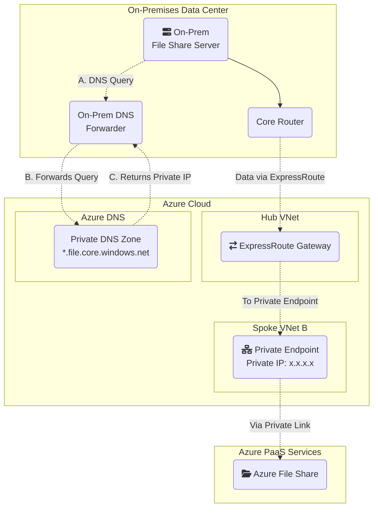

# Connecting On-Premises Data Center Resources to Azure via ExpressRoute and Gateway Transit

This document outlines the architecture and traffic flow for enabling on-premises data center resources—such as file share servers—to securely access Azure resources within a peered Spoke VNet using ExpressRoute and Gateway Transit.

This pattern leverages an existing ExpressRoute connection and the **Gateway Transit** feature in Azure VNet Peering.

## The Scenario

-   **On-Premises File Share Server**: A Windows or Linux server located in the corporate data center, providing file shares to users and applications.
-   **On-Premises Network**: The corporate headquarters with a core router, on-prem DNS forwarder, and an active **ExpressRoute** circuit.
-   **Azure Network**: A standard **Hub-and-Spoke** topology.
    -   The **Hub VNet** contains the ExpressRoute Gateway.
    -   The **Spoke VNet** contains a Private Endpoint for Azure File Share (or VM) with a private IP address.
    -   Azure DNS Private Zone resolves storage endpoints (e.g., `*.file.core.windows.net`).
    -   VNet Peering is configured between the Hub and Spoke with **Gateway Transit** enabled.
    -   Azure File Share is accessed via Private Link.

**Note:** The ExpressRoute connectivity described in this document is implemented using an Azure ExpressRoute circuit resource, which provides a dedicated private connection between the on-premises network and Azure.

## Architecture Diagram

The following diagram illustrates the end-to-end traffic path.

### Explanation of Diagram Arrows

**Arrow 1 (FileServer to CoreRouter):** The on-premises file share server sends traffic to the core router in the data center.

**Arrow 2 (CoreRouter to Gateway):** The core router receives traffic destined for Azure and forwards it over the ExpressRoute circuit.

**Dotted Arrows (Gateway to Spoke):** The connection from the Hub to the Spoke is enabled by the VNet Peering settings, allowing traffic to transit to the final destination Azure resource (VM or storage account).

## Step-by-Step Traffic Flow

### 1. File Share Server Initiates Connection
- The file share server attempts to access an Azure File Share (or VM) in the Spoke VNet using its private endpoint IP (e.g., `x.x.x.x`).
- The traffic is sent to the core router in the on-premises network.

### 2. DNS Resolution for Azure File Share
- The file share server (or application) initiates a DNS query for the Azure File Share endpoint (e.g., `myshare.file.core.windows.net`).
- The query is sent to the on-prem DNS forwarder, which forwards it to Azure DNS Private Zone via ExpressRoute.
- Azure DNS returns the private IP address of the Private Endpoint to the on-prem DNS forwarder, which relays it to the server.

### 3. Data Path to Azure File Share
- The core router inspects the destination IP. If it matches the Private Endpoint in Azure, the router forwards the packet over the ExpressRoute Circuit.
- The traffic arrives at the ExpressRoute Gateway in the Azure Hub VNet.
- The **Gateway Transit** feature, enabled on the peering link, allows the Hub VNet to act as a gateway for the Spoke VNet.
- Azure's internal routing automatically forwards the packet from the gateway, across the peering link, to the Private Endpoint in Spoke VNet B, which connects to Azure File Share via Private Link.
- Return traffic follows the same path in reverse.

## Key Configuration Requirements

For this architecture to function, two critical routing configurations are necessary:

*   **Route Advertisement *to* Azure**: The on-premises network router must advertise the data center subnets (e.g., `x.x.x.x/24`) to Azure over the ExpressRoute connection. This ensures Azure knows how to send return traffic back to the file share server.

*   **Internal Routing *from* On-Premises**: The on-premises router must have a route for the Azure VNet address spaces (e.g., `x.x.x.x/16`) and Private Endpoint IPs that point to the ExpressRoute circuit as the next hop.

*   **DNS Forwarding**: The on-prem DNS forwarder must be configured to forward queries for Azure storage endpoints (e.g., `*.file.core.windows.net`) to the Azure DNS Private Zone via ExpressRoute.

## Summary

This architecture enables on-premises data center resources, such as file share servers, to securely and efficiently access Azure File Shares and other resources via Private Endpoint and Private Link. DNS resolution is handled by forwarding queries to Azure DNS Private Zone, ensuring the correct private IP is used. All connectivity is centralized through the established ExpressRoute circuit, leveraging existing network infrastructure and complying with BC Gov Landing Zone requirements.
