# Azure AI Foundry Landing Zone - Complete Deployment Guide

This comprehensive guide walks through the complete deployment of an Azure AI Foundry landing zone with secure private connectivity. The end result is a VM that can securely consume AI models through Azure AI Foundry APIs without internet exposure.

## Table of Contents

1. [Prerequisites](#prerequisites)
2. [Environment Setup](#environment-setup)
3. [SSH Key Creation](#ssh-key-creation)
4. [Phase 1: Foundation (Network & Security)](#phase-1-foundation-network--security)
5. [Phase 2: Storage, Security & Monitoring](#phase-2-storage-security--monitoring)
6. [Phase 3: Compute Resources](#phase-3-compute-resources)
7. [Phase 4: AI Services (Azure AI Foundry)](#phase-4-ai-services-azure-ai-foundry)
8. [Phase 4.5: Azure OpenAI Resource](#phase-45-azure-openai-resource)
9. [Phase 5: Private Connectivity](#phase-5-private-connectivity)
10. [Validation & Testing](#validation--testing)
11. [Troubleshooting](#troubleshooting)
12. [Teardown & Cleanup](#teardown--cleanup)
13. [Architecture Overview](#architecture-overview)

## Prerequisites

### Required Software
- **Azure CLI** (latest version)
- **PowerShell 5.1+** (Windows) or PowerShell Core (cross-platform)
- **Git** for repository cloning
- **SSH client** for VM access

### Azure Permissions
- **Subscription Contributor** role (or equivalent)
- **User Access Administrator** role (for managed identity assignments)
- Access to **Azure landing zone** resources (VNets, resource groups)

### Azure Landing Zone Resources
Your organization must provide these pre-existing resources:
- Azure subscription
- Virtual network (VNet) in canadacentral
- Networking resource group (RG_NETWORKING)
- Network security policies allowing private endpoints

## Environment Setup

### 1. Clone Repository
```bash
git clone https://github.com/bcgov/AzureFilesPoC.git
cd AzureFilesPoC
```

### 2. Configure Environment Variables
```bash
# Copy template and edit
cp azure.env.template azure.env

# Edit azure.env with your values (this file is gitignored)
notepad azure.env  # or your preferred editor
```

**Required Variables:**
```bash
# Subscription and regions
AZURE_SUBSCRIPTION_ID="your-subscription-id"
AZURE_LOCATION="canadacentral"
TARGET_AZURE_FOUNDRY_REGION="canadaeast"

# Landing zone resources (provided by your org)
RG_NETWORKING="your-networking-rg"
VNET_SPOKE="your-vnet-name"

# PoC resource group (will be created)
RG_AZURE_FILES="rg-ag-pssg-azure-files-azure-foundry"

# Resource names (customize as needed)
STORAGE_ACCOUNT="stagpssgazurepocdev01"
KEYVAULT_NAME="kv-ag-pssg-azure-files"
FOUNDRY_NAME="foundry-ag-pssg-azure-files"
VM_NAME="vm-ag-pssg-azure-files-01"
```

### 3. Azure CLI Setup
```bash
# Login to Azure
az login

# Set subscription
az account set --subscription $AZURE_SUBSCRIPTION_ID

# Verify login
az account show --output table
```

## SSH Key Creation

**BC Gov Policy:** SSH keys must have passphrases for security.

### Option 1: Create New SSH Key
```powershell
# Create SSH key with passphrase
ssh-keygen -t rsa -b 4096 -C "azure-vm" -f "$env:USERPROFILE\.ssh\id_rsa_azure"

# When prompted:
# - Enter passphrase (required by BC Gov policy)
# - Confirm passphrase
```

### Option 2: Use Existing Key
If you already have an SSH key, ensure it has a passphrase:
```powershell
# Check if key exists
Test-Path "$env:USERPROFILE\.ssh\id_rsa.pub"

# If needed, add/change passphrase
ssh-keygen -p -f "$env:USERPROFILE\.ssh\id_rsa"
```

### Copy Public Key for VM Deployment
```powershell
# Display public key (copy this output)
Get-Content "$env:USERPROFILE\.ssh\id_rsa.pub"
```

## Phase 1: Foundation (Network & Security)

Deploy network security groups and subnets in the landing zone VNet.

### Deploy Network Security Groups
```powershell
cd scripts\bicep

# Deploy all NSGs at once
.\deploy-nsgs.ps1

# Or deploy individually:
.\deploy-nsg-vm.ps1
.\deploy-nsg-bastion.ps1
# PE NSG deployed manually via az command
```

### Deploy Subnets
```powershell
# Deploy all subnets
.\deploy-subnet-all.ps1

# Or deploy individually:
.\deploy-subnet-vm.ps1
.\deploy-subnet-bastion.ps1
.\deploy-subnet-pe.ps1
```

### Validation
```powershell
# Check subnets exist
az network vnet subnet list --resource-group $RG_NETWORKING --vnet-name $VNET_SPOKE --output table

# Check NSGs exist
az network nsg list --resource-group $RG_AZURE_FILES --output table
```

## Phase 2: Storage, Security & Monitoring

Deploy core infrastructure services.

### Storage Account
```powershell
.\deploy-storage.ps1
```
**Purpose:** Stores AI model artifacts, scripts, datasets
**Network Access:** Configured for VPN/private access only

### Key Vault
```powershell
.\deploy-keyvault.ps1
```
**Purpose:** Manages secrets, API keys, connection strings
**Security:** Public network access disabled (BC Gov policy)

### User Assigned Managed Identity
```powershell
.\deploy-uami.ps1
```
**Purpose:** Enables passwordless authentication from VM to services
**Permissions:** Will be assigned RBAC roles to Storage, Key Vault, Foundry

### Log Analytics Workspace
```powershell
.\deploy-law.ps1
```
**Purpose:** Centralized logging and monitoring
**Retention:** 30 days configured

### Validation
```powershell
# Check all resources exist
az storage account show --name $STORAGE_ACCOUNT --resource-group $RG_AZURE_FILES
az keyvault show --name $KEYVAULT_NAME --resource-group $RG_AZURE_FILES
az identity show --name $UAMI_NAME --resource-group $RG_AZURE_FILES
az monitor workspace show --name $LAW_NAME --resource-group $RG_AZURE_FILES
```

## Phase 3: Compute Resources

Deploy the VM and Bastion for secure access.

### Virtual Machine
```powershell
.\deploy-vm-lz.ps1
```
**Requirements:**
- SSH public key (from earlier step)
- User Assigned Managed Identity (from Phase 2)
- Ubuntu 24.04 LTS with Azure extensions

### Bastion Host
```powershell
.\deploy-bastion.ps1
```
**Purpose:** Secure RDP/SSH access to VM without public IPs
**Access:** Via Azure Portal or Azure CLI

### Validation
```powershell
# Check VM status
az vm show --name $VM_NAME --resource-group $RG_AZURE_FILES --query "provisioningState"

# Check Bastion status
az network bastion show --name $BASTION_NAME --resource-group $RG_AZURE_FILES --query "provisioningState"

# Get Bastion public IP and DNS
az network bastion show --name $BASTION_NAME --resource-group $RG_AZURE_FILES --query "{dns:dnsName, ip:ipConfigurations[0].publicIpAddress.id}"
```

## Phase 4: AI Services (Azure AI Foundry)

Deploy Azure AI Foundry workspace and project.

### AI Foundry Workspace (Hub)
```powershell
.\deploy-foundry.ps1
```
**Region:** canadaeast (for LLM availability)
**Requirements:** Storage Account (from Phase 2)
**Optional:** Key Vault, User Assigned Managed Identity

### AI Foundry Project
```powershell
.\deploy-foundry-project.ps1
```
**Purpose:** Container for AI models and endpoints
**Parent:** References the Foundry Hub workspace

### Validation
```powershell
# Check Foundry workspace
az ml workspace show --name $FOUNDRY_NAME --resource-group $RG_AZURE_FILES

# Check Foundry project
az ml workspace list --resource-group $RG_AZURE_FILES --query "[?kind=='Project']"

# Get Azure AI Studio URL
Write-Host "Azure AI Studio: https://ai.azure.com/"
```

## Phase 4.5: Azure OpenAI Resource

Deploy Azure OpenAI Cognitive Services resource with private network access. **This is required before deploying AI models** - Azure Policy blocks public IP creation on PaaS services, so models cannot be deployed through the Azure AI Studio wizard without a pre-existing Azure OpenAI resource.

### Why This Step is Critical

When you try to deploy a model (e.g., GPT-5-nano) in Azure AI Studio using "Create resource and deploy", the wizard attempts to create a new Azure OpenAI resource with a public endpoint. Azure Policy blocks this with:

```
RequestDisallowedByPolicy: Resource was disallowed by policy.
Reasons: 'A policy is in place to prevent public IP addresses on the target Azure PaaS service(s).'
```

**Solution:** Pre-create the Azure OpenAI resource with `publicNetworkAccess: Disabled` and a private endpoint.

### Deploy Azure OpenAI
```powershell
.\deploy-openai.ps1
```

**Creates:**
1. **Azure OpenAI Resource** (Cognitive Services account) - canadaeast region
   - Public network access disabled
   - System-assigned managed identity enabled
2. **Private Endpoint** for Azure OpenAI - canadacentral subnet (cross-region)

**Region:** canadaeast (same as AI Foundry for model availability)

### Validation
```powershell
# Check Azure OpenAI resource
az cognitiveservices account show --name $OPENAI_NAME --resource-group $RG_AZURE_FILES --query "{Name:name, State:properties.provisioningState, PublicAccess:properties.publicNetworkAccess}"

# Check private endpoint
az network private-endpoint show --name pe-$OPENAI_NAME --resource-group $RG_AZURE_FILES --query "{Name:name, State:provisioningState}"

# List all OpenAI resources (verify deployment)
az cognitiveservices account list --resource-group $RG_AZURE_FILES --query "[?kind=='OpenAI'].{Name:name, Region:location, State:properties.provisioningState}" -o table
```

### Connect Azure OpenAI to Foundry Project

After deployment, connect the Azure OpenAI resource to your AI Foundry project:

1. Open [Azure AI Studio](https://ai.azure.com/)
2. Navigate to your **project** (foundry-project-ag-pssg)
3. Go to **Management** → **Connected resources**
4. Click **+ New connection**
5. Select **Azure OpenAI**
6. Choose the pre-created resource: `openai-ag-pssg-azure-files`
7. Click **Add connection**

Now when you deploy models, select **Use existing Azure OpenAI resource** instead of "Create resource and deploy".

### Teardown (if needed)
```powershell
.\teardown-openai.ps1
```

## Phase 5: Private Connectivity

Deploy private endpoints for secure, private access to all services.

### Deploy All Private Endpoints
```powershell
.\deploy-private-endpoints.ps1
```

**Private Endpoints Created:**
1. **Storage Account** (blob subresource) - canadacentral
2. **Key Vault** (vault subresource) - canadacentral
3. **Azure AI Foundry** (amlworkspace subresource) - Cross-region (canadacentral → canadaeast)
4. **Azure OpenAI** (account subresource) - Cross-region (canadacentral → canadaeast) - *Deployed in Phase 4.5*

### Skip Individual Endpoints (if needed)
```powershell
# Skip storage PE
.\deploy-private-endpoints.ps1 -SkipStorage

# Skip Key Vault PE
.\deploy-private-endpoints.ps1 -SkipKeyVault

# Skip Foundry PE
.\deploy-private-endpoints.ps1 -SkipFoundry
```

### Validation
```powershell
# List all private endpoints
az network private-endpoint list --resource-group $RG_AZURE_FILES --query "[].{Name:name, Type:type, State:properties.provisioningState}" -o table

# Check provisioning states (should be 'Succeeded')
az network private-endpoint list --resource-group $RG_AZURE_FILES --query "[].properties.provisioningState" -o tsv
```

### Verify Private DNS Resolution (from local machine)

Run `nslookup` to verify the privatelink CNAME aliases are configured. From your **corporate network** (outside the VNet), you should see the privatelink alias in the chain, but the final IP will be public:

```powershell
# OpenAI - should show privatelink.openai.azure.com alias
nslookup openai-ag-pssg-azure-files.openai.azure.com

# Storage - should show privatelink.blob.core.windows.net alias
nslookup stagpssgazurepocdev01.blob.core.windows.net

# Key Vault - should show privatelink.vaultcore.azure.net alias
nslookup kv-ag-pssg-azure-files.vault.azure.net
```

**Expected Output (from corporate network):**
```
Name:    vnetproxyv3-cae-prod.canadaeast.cloudapp.azure.com
Address:  52.x.x.x  <-- Public IP (expected outside VNet)
Aliases:  openai-ag-pssg-azure-files.openai.azure.com
          openai-ag-pssg-azure-files.privatelink.openai.azure.com  <-- ✅ Privatelink alias present
```

The presence of the `.privatelink.` alias confirms DNS is configured correctly. From **inside the VNet** (your VM), the same command will resolve to a private IP (10.x.x.x).

## Validation & Testing

### 1. Connect to VM via Bastion
```powershell
# SSH to VM using Bastion
az network bastion ssh `
  --name $BASTION_NAME `
  --resource-group $RG_AZURE_FILES `
  --target-resource-id $(az vm show --name $VM_NAME --resource-group $RG_AZURE_FILES --query id -o tsv) `
  --auth-type ssh-key `
  --username azureuser `
  --ssh-key "$env:USERPROFILE\.ssh\id_rsa"
```

### 2. Test DNS Resolution (from VM)
From VM, verify private DNS resolution returns **private IPs** (10.x.x.x):
```bash
# Storage (should return 10.x.x.x)
nslookup stagpssgazurepocdev01.blob.core.windows.net

# Key Vault (should return 10.x.x.x)
nslookup kv-ag-pssg-azure-files.vault.azure.net

# OpenAI (should return 10.x.x.x)
nslookup openai-ag-pssg-azure-files.openai.azure.com

# Foundry (should return 10.x.x.x)
nslookup canadaeast.api.azureml.ms
```

**Expected Output (from VM inside VNet):**
```
Name:    openai-ag-pssg-azure-files.privatelink.openai.azure.com
Address:  10.46.x.x  <-- ✅ Private IP (traffic stays in VNet)
```

### 3. Test Service Access
From VM, test access to services:
```bash
# Storage access (should work without internet)
az storage blob list --account-name stagpssgazurepocdev01 --container-name test

# Key Vault access
az keyvault secret list --vault-name kv-ag-pssg-azure-files

# Foundry API access
curl -H "Authorization: Bearer $(az account get-access-token --resource https://management.azure.com --query accessToken -o tsv)" \
  https://canadaeast.api.azureml.ms/subscriptions/$(az account show --query id -o tsv)/resourceGroups/$RG_AZURE_FILES/providers/Microsoft.MachineLearningServices/workspaces/$FOUNDRY_NAME?api-version=2023-10-01
```

### 4. Azure AI Studio Access
1. Open https://ai.azure.com/
2. Select your Foundry workspace
3. Deploy AI models to your project
4. Test model consumption from VM

## Troubleshooting

### Common Issues

#### 1. Azure Policy Blocks Model Deployment (Public IP)
**Error:** "RequestDisallowedByPolicy: Resource was disallowed by policy. Reasons: 'A policy is in place to prevent public IP addresses on the target Azure PaaS service(s).'"

**Context:** This occurs when trying to deploy a model in Azure AI Studio using "Create resource and deploy" - the wizard tries to create a new Azure OpenAI resource with public endpoint.

**Solution:** 
1. Deploy Azure OpenAI with private endpoint first (Phase 4.5): `.\deploy-openai.ps1`
2. Connect the pre-created Azure OpenAI resource to your Foundry project
3. Deploy models using "Use existing Azure OpenAI resource" option

#### 2. Azure Policy Blocks Private DNS Zones
**Error:** "Resource 'privatelink.*' was disallowed by policy"
**Solution:** Private DNS zones are managed centrally. The Bicep templates reference existing zones.

#### 3. SSH Connection Fails
**Error:** "Permission denied" or connection timeout
**Solutions:**
- Verify SSH key is correct: `az vm show --name $VM_NAME --resource-group $RG_AZURE_FILES --query "osProfile.linuxConfiguration.ssh.publicKeys[].keyData"`
- Update SSH key if needed: `az vm user update --resource-group $RG_AZURE_FILES --name $VM_NAME --username azureuser --ssh-key-value "$(Get-Content ~/.ssh/id_rsa.pub)"`

#### 4. Private Endpoint Provisioning Stuck
**Error:** Private endpoint shows "Updating" indefinitely
**Solution:** Check Azure Policy compliance and network security rules

#### 5. DNS Resolution Fails
**Error:** nslookup returns public IPs instead of private
**Solutions:**
- Verify private DNS zone links exist
- Check VNet DNS configuration
- Wait 10-15 minutes for DNS propagation

#### 6. Azure CLI Extension Issues
**Error:** "az ml: command not found"
**Solution:**
```bash
# Clear and reinstall ML extension
az extension remove -n ml
az extension add -n ml --debug
```

#### 7. Managed Identity Login Fails on VM
**Error:** "No managed identity found" or "DefaultAzureCredential failed"

**Context:** When running `az login --identity` on the VM, it may fail if RBAC roles aren't configured for the VM's system-assigned managed identity.

**Solution:** Use device code login instead:
```bash
az login
# Follow browser authentication flow with the code displayed
```

#### 8. AI Studio Playground Shows 403 Error
**Error:** "403: Public access is disabled. Please configure private endpoint."

**This is expected behavior.** The Azure OpenAI resource has `publicNetworkAccess: Disabled`. You must test from the VM via private endpoint, not from the browser-based playground. See [AI Model Testing Guide](./ai-model-testing.md#model-testing).

#### 9. Reasoning Model API Parameter Error
**Error:** "Unsupported parameter: 'max_tokens' is not supported with this model"

**Context:** Reasoning models like gpt-5-nano use a different parameter name.

**Solution:** Use `max_completion_tokens` instead of `max_tokens`:
```bash
# Correct for reasoning models
-d '{"messages": [...], "max_completion_tokens": 500}'
```

#### 10. Reasoning Model Returns Empty Content
**Error:** API response has `"content": ""` with high `reasoning_tokens` count

**Context:** Reasoning models reserve tokens for internal reasoning before generating output.

**Solution:** Increase `max_completion_tokens` to allow room for both reasoning and response:
```bash
# 100 tokens may all be consumed by reasoning
"max_completion_tokens": 100  # Often results in empty content

# 500+ tokens allows space for response after reasoning
"max_completion_tokens": 500  # Recommended minimum
```

### Resource Inventory Script
Run the inventory script to verify all resources:
```powershell
cd scripts
.\azure-inventory.ps1
```

## Teardown & Cleanup

**Important:** Teardown in reverse order of deployment (Phase 5 → 4.5 → 4 → 3 → 2 → 1)

### Phase 5 Teardown
```powershell
# Remove private endpoints
.\teardown-private-endpoints.ps1
```

### Phase 4.5 Teardown
```powershell
# Remove Azure OpenAI resource and private endpoint
.\teardown-openai.ps1
```

### Phase 4 Teardown
```powershell
# Remove AI services
.\teardown-foundry-project.ps1
.\teardown-foundry.ps1
```

### Phase 3 Teardown
```powershell
# Remove compute resources
.\teardown-bastion.ps1
.\teardown-vm-lz.ps1
```

### Phase 2 Teardown
```powershell
# Remove storage and security
.\teardown-law.ps1
.\teardown-uami.ps1
.\teardown-keyvault.ps1
.\teardown-storage.ps1
```

### Phase 1 Teardown
```powershell
# Remove network resources
.\teardown-subnet-pe.ps1
.\teardown-subnet-bastion.ps1
.\teardown-subnet-vm.ps1
.\teardown-nsgs.ps1
```

### Master Teardown (Alternative)
```powershell
# Orchestrated teardown (when available)
.\teardown-all.ps1
```

## Architecture Overview

```mermaid
flowchart TB
    subgraph LZ["Azure Landing Zone"]
        subgraph CC["canadacentral Region"]
            subgraph VNET["VNet (10.46.73.0/24)"]
                subgraph VMSubnet["VM Subnet (10.46.73.0/28)"]
                    VM["🖥️ Virtual Machine<br/>• Ubuntu 24.04 LTS<br/>• Managed Identity<br/>• AI consumption scripts"]
                end
                subgraph BastionSubnet["Bastion Subnet (10.46.73.64/26)"]
                    Bastion["🔐 Bastion Host<br/>• Secure SSH/RDP<br/>• No public IPs on VM"]
                end
                subgraph PESubnet["Private Endpoints Subnet (10.46.73.128/27)"]
                    PE1["pe-storage (blob)"]
                    PE2["pe-keyvault (vault)"]
                    PE3["pe-foundry (amlworkspace)"]
                    PE4["pe-openai (account)"]
                end
            end
            Storage["📦 Storage Account"]
            KV["🔑 Key Vault"]
            LAW["📊 Log Analytics"]
            UAMI["🪪 Managed Identity"]
        end
        
        subgraph CE["canadaeast Region"]
            Foundry["🤖 Azure AI Foundry<br/>• Hub workspace<br/>• Project for models<br/>• Public access: Disabled"]
            OpenAI["🧠 Azure OpenAI<br/>• GPT models<br/>• Public access: Disabled"]
        end
    end
    
    %% Connections
    Bastion -->|SSH| VM
    VM -->|Private DNS| PE1 & PE2 & PE3 & PE4
    PE1 -.->|privatelink| Storage
    PE2 -.->|privatelink| KV
    PE3 -.->|cross-region| Foundry
    PE4 -.->|cross-region| OpenAI
    Foundry <-->|Connected| OpenAI
    
    %% Styling
    classDef region fill:#e1f5fe,stroke:#01579b
    classDef subnet fill:#fff3e0,stroke:#e65100
    classDef resource fill:#e8f5e9,stroke:#2e7d32
    classDef pe fill:#fce4ec,stroke:#880e4f
    
    class CC,CE region
    class VMSubnet,BastionSubnet,PESubnet subnet
    class VM,Bastion,Storage,KV,LAW,UAMI,Foundry,OpenAI resource
    class PE1,PE2,PE3,PE4 pe
```



### Resource Summary

| Phase | Resources | Region |
|-------|-----------|--------|
| **Phase 1** | NSGs, Subnets (VM, Bastion, PE) | canadacentral |
| **Phase 2** | Storage, Key Vault, UAMI, Log Analytics | canadacentral |
| **Phase 3** | VM, Bastion Host | canadacentral |
| **Phase 4** | AI Foundry Hub + Project | canadaeast |
| **Phase 4.5** | Azure OpenAI + PE | canadaeast |
| **Phase 5** | Private Endpoints (4 total) | canadacentral → cross-region |

## Key Benefits

1. **Zero-Trust Security:** All access is private, no internet exposure
2. **Scalable Architecture:** Follows Azure landing zone best practices
3. **Cost Optimization:** Pay only for consumed AI resources
4. **Compliance:** Meets BC Gov security and networking requirements
5. **Maintainable:** Infrastructure as Code with Bicep templates

## Next Steps

1. **Deploy AI Models:** Use Azure AI Studio to deploy models to your Foundry project
2. **Develop Scripts:** Create AI consumption scripts on the VM
3. **Monitor Usage:** Set up alerts and monitoring in Log Analytics
4. **Scale Resources:** Adjust VM size, storage, or add more projects as needed

For questions or issues, refer to the troubleshooting section or check the Azure documentation links throughout this guide.