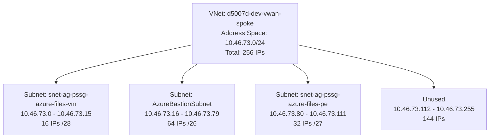
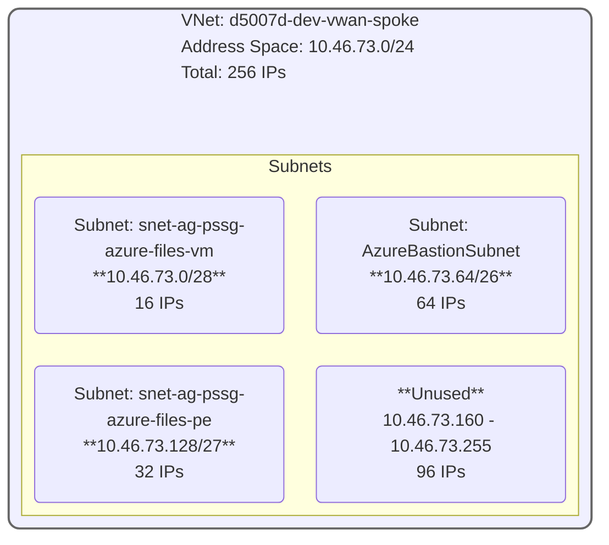

# IP Address Range Diagram for VNet Spoke

## Flowchart Diagram

## Block Diagram (Hierarchical View)
This uses a Mermaid block diagram to show the VNet encompassing the subnets and unused space.

