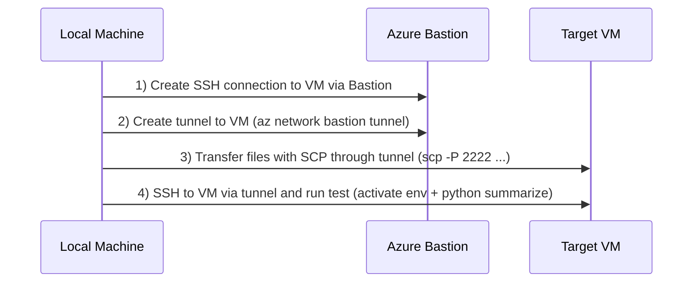

# SCP File Transfer via Bastion Tunnel

Transfer files to/from the VM using SCP through Azure Bastion tunnel. This is the most efficient method for ad-hoc file transfers.



## Quick Start

```powershell
# Terminal 1: Create tunnel (keep running)
az network bastion tunnel --name bastion-ag-pssg-azure-files --resource-group rg-ag-pssg-azure-files-azure-foundry --target-resource-id "/subscriptions/d321bcbe-c5e8-4830-901c-dab5fab3a834/resourceGroups/rg-ag-pssg-azure-files-azure-foundry/providers/Microsoft.Compute/virtualMachines/vm-ag-pssg-azure-files-01" --resource-port 22 --port 2222

# Terminal 2: SCP files through tunnel
scp -P 2222 -i ~/.ssh/id_rsa_azure .\examples\sample-document.txt azureuser@127.0.0.1:~/examples/
```

---

## Prerequisites

- VM and Bastion are running ([Daily Startup](./daily-startup.md))
- SSH key exists at `~/.ssh/id_rsa_azure`
- Azure CLI logged in (`az login`)

**Verify VM is running:**
```powershell
az vm get-instance-view --name vm-ag-pssg-azure-files-01 --resource-group rg-ag-pssg-azure-files-azure-foundry --query "instanceView.statuses[1].displayStatus" -o tsv
```
Expected output: `VM running`

---

## Step 1: Create the Bastion Tunnel

Open a PowerShell terminal (**Terminal 1**) and create a tunnel to the VM:

```powershell
az network bastion tunnel `
  --name bastion-ag-pssg-azure-files `
  --resource-group rg-ag-pssg-azure-files-azure-foundry `
  --target-resource-id "/subscriptions/d321bcbe-c5e8-4830-901c-dab5fab3a834/resourceGroups/rg-ag-pssg-azure-files-azure-foundry/providers/Microsoft.Compute/virtualMachines/vm-ag-pssg-azure-files-01" `
  --resource-port 22 `
  --port 2222
```

**One-liner:**
```powershell
az network bastion tunnel --name bastion-ag-pssg-azure-files --resource-group rg-ag-pssg-azure-files-azure-foundry --target-resource-id "/subscriptions/d321bcbe-c5e8-4830-901c-dab5fab3a834/resourceGroups/rg-ag-pssg-azure-files-azure-foundry/providers/Microsoft.Compute/virtualMachines/vm-ag-pssg-azure-files-01" --resource-port 22 --port 2222
```

**Expected output:**
```
Opening tunnel on port: 2222
Tunnel is ready, connect on port 2222
Ctrl + C to close
```

> ⚠️ **IMPORTANT: KEEP THIS TERMINAL OPEN!**
> 
> The tunnel runs in the foreground. If you close this terminal or press Ctrl+C, the tunnel will disconnect and SCP/SSH will fail.
> 
> **DO NOT** run any other commands in this terminal - open a NEW terminal for the next steps.

---

## Step 2: Open a New Terminal for File Transfer

**Open a NEW PowerShell terminal (Terminal 2)** - do not use the tunnel terminal!

Use SCP through the tunnel (port 2222 on localhost):

### Upload a Single File
```powershell
scp -P 2222 -i ~/.ssh/id_rsa_azure .\examples\sample-document.txt azureuser@127.0.0.1:~/examples/
```

### Upload Multiple Files
```powershell
# All shell scripts
scp -P 2222 -i ~/.ssh/id_rsa_azure .\examples\*.sh azureuser@127.0.0.1:~/examples/

# All Python scripts
scp -P 2222 -i ~/.ssh/id_rsa_azure .\examples\*.py azureuser@127.0.0.1:~/examples/

# All text files
scp -P 2222 -i ~/.ssh/id_rsa_azure .\examples\*.txt azureuser@127.0.0.1:~/examples/
```

### Upload Entire Directory
```powershell
scp -r -P 2222 -i ~/.ssh/id_rsa_azure .\examples\ azureuser@127.0.0.1:~/
```

### Download Files from VM
```powershell
# Download single file
scp -P 2222 -i ~/.ssh/id_rsa_azure azureuser@127.0.0.1:~/examples/output.txt .\downloads\

# Download directory
scp -r -P 2222 -i ~/.ssh/id_rsa_azure azureuser@127.0.0.1:~/examples\ .\downloads\
```

---

## Step 3: SSH Through the Tunnel (Optional)

You can also SSH through the tunnel instead of using Bastion SSH:

```powershell
ssh -p 2222 -i ~/.ssh/id_rsa_azure azureuser@127.0.0.1
```

This can be faster for interactive sessions since the tunnel is already established.

---

## Common SCP Options

| Option | Description |
|--------|-------------|
| `-P 2222` | Connect to port 2222 (the tunnel) |
| `-i ~/.ssh/id_rsa_azure` | Use your SSH private key |
| `-r` | Recursive (for directories) |
| `-v` | Verbose output (for debugging) |
| `-C` | Enable compression (faster for text files) |

---

## Example: Upload and Process a Document

**Step 1:** Create tunnel (Terminal 1)
```powershell
az network bastion tunnel --name bastion-ag-pssg-azure-files --resource-group rg-ag-pssg-azure-files-azure-foundry --target-resource-id "/subscriptions/d321bcbe-c5e8-4830-901c-dab5fab3a834/resourceGroups/rg-ag-pssg-azure-files-azure-foundry/providers/Microsoft.Compute/virtualMachines/vm-ag-pssg-azure-files-01" --resource-port 22 --port 2222
```

**Step 2:** Upload file (Terminal 2)
```powershell
scp -P 2222 -i ~/.ssh/id_rsa_azure .\examples\sample-meeting-notes.txt azureuser@127.0.0.1:~/examples/
```

**Step 3:** SSH to VM and process (Terminal 2)
```powershell
ssh -p 2222 -i ~/.ssh/id_rsa_azure azureuser@127.0.0.1
```

**Step 4:** On VM, run AI summarization
```bash
source ~/examples/activate-ai-env.sh
python summarize-document.py sample-meeting-notes.txt
```

---

## Troubleshooting

### "Connection refused" on port 2222
- Make sure the tunnel is still running in Terminal 1
- Check that you specified `-P 2222` (uppercase P for port)

### "Permission denied (publickey)"
- Verify SSH key path: `Test-Path ~/.ssh/id_rsa_azure`
- Check key permissions (Windows may need adjustment)

### Tunnel closes unexpectedly
- Check your Azure CLI session: `az account show`
- Re-authenticate if needed: `az login`

### Slow transfer speeds
- Add `-C` flag to enable compression
- For large files, consider using blob storage instead

---

## Alternative Methods

| Method | Best For | Pros | Cons |
|--------|----------|------|------|
| **SCP via Tunnel** | Ad-hoc transfers, scripts | Fast, direct, familiar | Need to manage tunnel |
| **Blob Storage** | Large files, automation | Scalable, auditable | More setup steps |
| **Git Clone** | Repo files only | Version controlled | Can't transfer arbitrary files |

---

## Related Runbooks

- [Daily Startup Runbook](./daily-startup.md) - Start VM and Bastion
- [Daily Shutdown Runbook](./daily-shutdown.md) - Stop resources
- [Bastion Connection Guide](./bastion-connection.md) - SSH connection details
- [AI Model Testing Guide](../guides/ai-model-testing.md) - Full testing workflow
