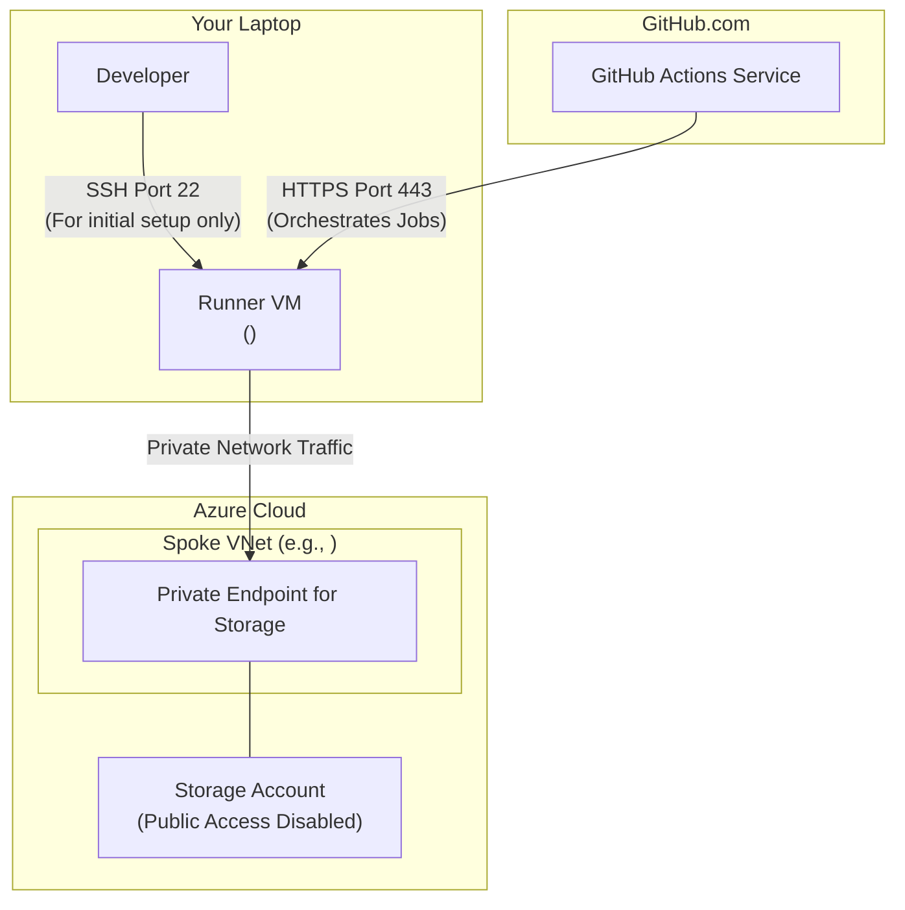
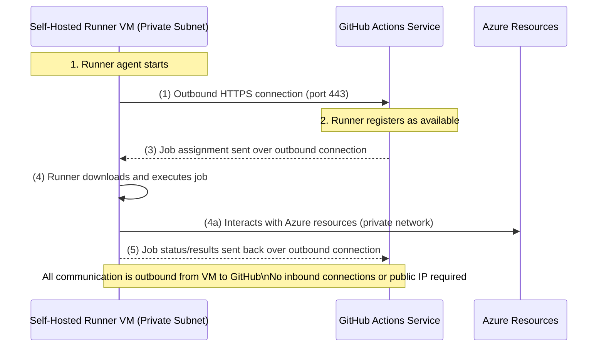

# CI/CD Bootstrap: Self-Hosted GitHub Actions Runner

## 1. Overview and Purpose

This Terraform configuration bootstraps the necessary Azure infrastructure to host a **self-hosted GitHub Actions runner**.

Its primary purpose is to solve the `RequestDisallowedByPolicy` error encountered when deploying Azure resources from a standard GitHub-hosted runner.

### The Problem This Solves

Our Azure environment is governed by a security policy that **forbids creating resources (like Storage Accounts) with public network access enabled**.

*   Standard GitHub runners operate from the public internet.
*   When Terraform, running on a public runner, tries to create a storage account and then a file share inside it, it requires a network path.
*   If public access is disabled, the firewall blocks the runner, causing a `403 Forbidden` error.
*   If we try to enable public access, the Azure Policy blocks the action.

### The Solution: The Self-Hosted Runner

By deploying a Virtual Machine (VM) **inside our private Azure Spoke VNet**, we create a trusted "beachhead" for our CI/CD pipeline.

*   This VM is our **self-hosted runner**.
*   When a pipeline job runs on this VM, its network traffic originates from a **private IP address** within our VNet.
*   This allows Terraform to communicate with other Azure resources (like a storage account's private endpoint) over the private network, completely bypassing the public firewall and complying with Azure Policy.

This configuration creates the runner VM and all its dependencies.

> **Security Note:** After initial setup, consider removing the public IP from the VM or using Azure Bastion for secure access. Restrict SSH access as much as possible.

> **Cost Warning:** Running a VM and associated resources in Azure will incur costs. Remember to destroy resources when not needed.

---

## 2. Architecture Diagram




---

## 2.1. How the Self-Hosted Runner Connects to GitHub

The self-hosted runner VM communicates with GitHub Actions using a secure, outbound-only connection:

1. The GitHub Actions runner agent, installed on the VM, initiates an outbound HTTPS (port 443) connection to GitHub's servers.
2. The runner registers itself as available for jobs with GitHub.
3. When a workflow is triggered, GitHub sends a job assignment over the existing outbound connection.
4. The runner downloads the job instructions and executes them locally on the VM.
5. All job orchestration and communication are handled over this outbound connection.
6. **No inbound connections from GitHub to your VM are required.**
7. The VM does **not** need a public IP address; it only needs outbound internet access (e.g., via NAT, Azure Firewall, or default subnet access).
8. This design is secure and works in private subnets, as long as outbound HTTPS is allowed by your NSG/firewall.
9. If outbound internet is restricted, you must allow access to GitHub's endpoints (see [GitHub's documentation](https://docs.github.com/en/actions/hosting-your-own-runners) for required domains/IPs).

> **Summary:** The runner VM connects out to GitHub, so you do not need to open any inbound firewall ports or assign a public IP for CI/CD jobs to work.

---

### Sequence Diagram: Outbound-Only GitHub Actions Runner Communication



---
## 3. Azure Resources Created

This Terraform configuration will create the following objects in Azure:

*   **Resource Group (`azurerm_resource_group`):** A dedicated resource group (e.g., `rg-<project-name>-cicd-tools-dev`) to contain all the runner's infrastructure, keeping it isolated and easy to manage.
*   **Public IP Address (`azurerm_public_ip`):** A static public IP address assigned to the VM. **Purpose:** To allow you to SSH into the VM from your local machine for initial setup or troubleshooting. This can be removed later for enhanced security if you have a VPN or Bastion host.
*   **Network Security Group (NSG) (`azurerm_network_security_group`):** A firewall for the VM's subnet. **Purpose:** It is configured with a rule to allow inbound SSH (port 22) traffic **only** from your specified home/office IP address. All other traffic is blocked.
*   **Linux Virtual Machine (`azurerm_linux_virtual_machine`):** The core resource. An Ubuntu VM that will be configured to run the GitHub Actions runner agent.
*   **Network Interface (NIC) (`azurerm_network_interface`):** The VM's virtual network card that connects it to the specified subnet in your Spoke VNet.

---

## 4. Prerequisites

Before running this configuration, you must have the following in place:

1.  **An Existing Spoke VNet and Subnet:** This configuration looks up an existing network. You must ensure the Spoke VNet and a dedicated subnet for the runner (e.g., `snet-<project-name>-runners`) have been created in Azure.
2.  **Tools Installed:** Azure CLI and Terraform must be installed on your local machine.
3.  **Azure Authentication:** You must be logged into the correct Azure subscription via `az login`.
4.  **SSH Key Pair:** You need an SSH key pair. The path to your public key (e.g., `~/.ssh/id_rsa.pub`) is required.
5.  **GitHub Personal Access Token (PAT):** If using the automated setup script (`runner_setup.sh`), you need a GitHub PAT with the `repo` scope. This is used by the script to register the new runner with your repository.

---

## One-Time Onboarding & Prerequisites

Before using this CI/CD environment, you must complete the following one-time onboarding and setup activities. These steps ensure your Azure and GitHub environments are secure, policy-compliant, and ready for automation:

1. **Run the Onboarding Scripts (in order):**
   - See `OneTimeActivities/README.md` for full details and context.
   - Scripts are located in `OneTimeActivities/RegisterApplicationInAzureAndOIDC/scripts/unix/`.
   - Steps include:
     1. Register Azure AD application and service principal (`step1_register_app.sh`)
     2. Assign least-privilege roles (`step2_grant_subscription_level_permissions.sh`)
     3. Configure OIDC for GitHub Actions (`step3_configure_github_oidc_federation.sh`)
     4. Prepare and add GitHub secrets (`step4_prepare_github_secrets.sh`, `step5_add_github_secrets_cli.sh`)
     5. Create the required resource group (`step6_create_resource_group.sh`)
     6. Create the Terraform state storage account and container (`step7_create_tfstate_storage_account.sh`)
     7. Assign storage roles (`step8_assign_storage_roles.sh`)
     8. Validate OIDC login and backend (`step9_validate_oidc_login.sh`, `step10_validate_terraform_backend.sh`)
     9. Generate and register SSH key for VM admin access (`step11_create_ssh_key.sh`)
     10. **Import any pre-existing Azure resources into Terraform state** (`step12_import_existing_resources.sh`)

2. **Populate `terraform.tfvars` and `secrets.tfvars`:**
   - Use the inventory and automation scripts in `OneTimeActivities/GetAzureExistingResources/unix/` to generate these files with the correct values for your environment.

3. **Set Required GitHub Secrets:**
   - Copy the generated values (e.g., service principal ID, SSH public key) into your repository secrets as described in the onboarding documentation.

4. **Validate Your Setup:**
   - Complete the validation steps in `OneTimeActivities/ValidationProcess.md` and run the validation workflows to ensure OIDC and Terraform backend are working.

> **Note:**
> All onboarding scripts are idempotent and safe to re-run. The import script (`step12_import_existing_resources.sh`) should be run once per environment for any Azure resources that were created outside of Terraform but must now be managed by Terraform (such as subnet/NSG associations).

---

## 5. How to Use

This configuration follows a **Local Validation → GitHub Plan → GitHub Apply** workflow for safety and consistency.

### 5.0. Deployment Workflow Overview

```mermaid
graph TD
    A[👩‍💻 Developer<br/>Local Machine] --> B[📁 Navigate to cicd directory]
    B --> C[🔧 terraform init<br/>with backend config]
    C --> D[✅ terraform validate]
    D --> E[📋 terraform plan<br/>-var-file tfvars]
    E --> F{🤔 Plan looks good?}
    F -->|No| G[🔄 Fix issues locally]
    G --> D
    F -->|Yes| H[📤 git commit & push]
    
    H --> I[🔄 GitHub Actions<br/>Plan Workflow]
    I --> J[🔐 OIDC Azure Login]
    J --> K[📝 Generate terraform.tfvars<br/>from GitHub vars/secrets]
    K --> L[🔧 terraform init<br/>with CLI backend config]
    L --> M[✅ terraform validate]
    M --> N[📋 terraform plan<br/>-var-file tfvars]
    N --> O{🤔 GitHub plan matches<br/>local plan?}
    O -->|No| P[🚨 Investigation needed<br/>Check OIDC/vars/secrets]
    O -->|Yes| Q[✅ Ready for Apply]
    
    Q --> R[🚀 GitHub Actions<br/>Apply Workflow]
    R --> S[🔐 OIDC Azure Login]
    S --> T[📝 Generate terraform.tfvars<br/>from GitHub vars/secrets]
    T --> U[🔧 terraform init<br/>with CLI backend config]
    U --> V[📋 terraform plan<br/>-var-file tfvars]
    V --> W[🏗️ terraform apply<br/>Create Azure resources]
    W --> X[🎉 CI/CD Infrastructure<br/>Ready!]
    
    style A fill:#e1f5fe
    style I fill:#f3e5f5
    style R fill:#e8f5e8
    style X fill:#fff3e0
```



### 5.1. Step 1: Local Validation (Required)

**Navigate to the Directory:**
```bash
cd terraform/environments/cicd
```

**Initialize, Validate, and Plan Locally:**
```bash
# Initialize Terraform with backend configuration
terraform init -backend-config="resource_group_name=<your-tfstate-rg>" -backend-config="storage_account_name=<your-tfstate-sa>" -backend-config="container_name=<your-tfstate-container>"

# Validate configuration syntax and structure  
terraform validate

# Create plan using terraform.tfvars from parent directory
terraform plan -var-file="../../terraform.tfvars" -out=tfplan
```

> **Purpose:** This ensures your configuration is syntactically correct and will produce the expected resources before running in GitHub Actions.

### 5.2. Step 2: GitHub Actions Plan (Verification)

Once local validation passes, test the same commands in GitHub Actions:

1. **Commit and push your changes:**
   ```bash
   git add .
   git commit -m "Update CI/CD infrastructure configuration"
   git push origin main
   ```

2. **Or trigger workflow manually:**
   - Go to GitHub Actions → "Deploy CI/CD Self-Hosted Runner Infrastructure" 
   - Click "Run workflow"
   - Set `plan_only: true`
   - Click "Run workflow"

> **Purpose:** This verifies that GitHub Actions can successfully generate the same plan using OIDC authentication and GitHub variables/secrets.

### 5.3. Step 3: GitHub Actions Apply (Deployment)

After confirming the GitHub Actions plan matches your local plan:

1. **Trigger apply workflow:**
   - Go to GitHub Actions → "Deploy CI/CD Self-Hosted Runner Infrastructure"
   - Click "Run workflow" 
   - Set `plan_only: false`
   - Click "Run workflow"

2. **Or push to main branch:**
   - Any push to main branch will automatically trigger apply (if configured)

> **Purpose:** This creates the actual Azure resources using the verified plan.

### 5.4. Optional: Local Apply for Testing

For rapid iteration during development, you can also apply locally:
```bash
terraform apply tfplan
```

> **Warning:** Local apply bypasses GitHub Actions logging and audit trails. Use GitHub Actions apply for production deployments.

---

## 6. Post-Deployment Steps

### 6.0. Expected Deployment Timeline

**Total deployment time: ~45 minutes** (this is normal for BC Gov environments)

- **Infrastructure creation**: ~5 minutes (NSGs, subnets, Bastion, VM provisioning)
- **Extension installation**: ~40 minutes (BC Gov policy-mandated security extensions)

### 6.1. Monitor Deployment Progress

Use the provided readiness check script to monitor your VM status:

```bash
# Check if VM is ready for GitHub Actions runner setup
cd terraform/environments/cicd
./check-vm-ready.sh <resource-group> <vm-name> <bastion-name> <subscription-id>
```

**Expected Extension Installation:**
- `AzureMonitorLinuxAgent`: ✅ Succeeded (Azure Monitor data collection)
- `AzurePolicyforLinux`: ✅ Succeeded (Policy compliance monitoring)  
- `ChangeTracking-Linux`: ✅ Succeeded (Change tracking and inventory)
- `MDE.Linux`: ✅ Succeeded (Microsoft Defender for Endpoints)
- `DependencyAgentLinux`: ⚠️ May fail on Ubuntu 22.04 (expected, non-critical)

> **Note:** The `DependencyAgentLinux` extension failure is expected on Ubuntu 22.04.5 LTS and does not affect VM functionality. All other critical extensions should succeed.

### 6.2. Verify Infrastructure Readiness

1.  **Check VM Status:**
    ```bash
    # Quick status check
    ./check-vm-ready.sh <resource-group> <vm-name>
    
    # Full status with connection instructions
    ./check-vm-ready.sh <resource-group> <vm-name> <bastion-name> <subscription-id>
    ```

2.  **Verify the Runner in GitHub:**
    *   Navigate to your GitHub repository's **Settings > Actions > Runners**.
    *   You should see your new runner (e.g., `<runner-vm-name>`) in the list with an "Idle" status.

3.  **Update Your Application Workflow:**
    *   In your main application deployment workflow file (e.g., `.github/workflows/deploy-dev.yml`), change the `runs-on` property for your jobs from `ubuntu-latest` to `self-hosted`.
    ```yaml
    jobs:
      terraform-deploy:
        runs-on: self-hosted
        # ... rest of your job steps
    ```

4.  **Commit and Push:**
    Commit the changes to your workflow file. The next time the pipeline runs, it will execute on your new, secure, self-hosted runner.

---

## 6.1. Connecting to the Runner VM via Azure Bastion (SSH from Terminal)

To securely connect to your self-hosted runner VM using Azure Bastion from your terminal, you must ensure the following dependencies and extensions are installed:

### Prerequisites
- **Azure CLI** installed (`az`).
- **SSH client** (standard on macOS/Linux, or use [OpenSSH](https://docs.microsoft.com/en-us/windows-server/administration/openssh/openssh_install_firstuse) on Windows).
- **Azure CLI extensions:**
  - `bastion` extension
  - `ssh` extension

#### Install Required Azure CLI Extensions
If not already installed, run:
```sh
az extension add -n bastion
az extension add -n ssh
```
You can check if they are installed with:
```sh
az extension list
```

#### Keep Azure CLI and Extensions Updated
To avoid bugs (such as the `enableTunneling` error), always keep your CLI and extensions up to date:
```sh
az upgrade
az extension update --name bastion
az extension update --name ssh
```

#### Enable Bastion Native Client Support (Tunneling)
- In the Azure Portal, navigate to your Bastion resource.
- Go to **Configuration** and enable **Native client support (SSH, RDP)** or **Tunneling**.
- This is required for `az network bastion ssh` to work from your terminal.

### 2. Connect to the VM via Bastion from Your Terminal

**Option 1: Use the readiness check script (recommended)**
```bash
# Script will provide the exact connection command
./check-vm-ready.sh <resource-group> <vm-name> <bastion-name> <subscription-id>
```

**Option 2: Manual connection**
Replace the SSH key path if you use a different private key file.
```sh
az network bastion ssh \
  --name <bastion-name> \
  --resource-group <cicd-resource-group-name> \
  --target-resource-id <VM resource ID> \
  --auth-type "SSHKey" \
  --username <vm-admin-username> \
  --ssh-key ~/.ssh/id_rsa
```
- If you see a prompt to install an extension, answer `y` or follow the instructions.
- If you see an error about the `ssh` extension, run `az extension add -n ssh` and try again.
- If you see an error about `enableTunneling`, update your CLI/extensions and enable tunneling as described above.

**Note:** This method does not require a public IP on the VM and is the recommended secure access method for private subnets.

---

## 7. Cleanup

To remove all resources created by this configuration:
```bash
terraform destroy -var-file=terraform.tfvars
```

---

## 7.1. Azure Bastion Cleanup: Removing NSG and Subnet Associations

If you need to delete the Bastion NSG or subnet (for example, to allow Terraform to recreate them), follow these steps:

1. **Disassociate the NSG from the Bastion subnet:**

   ```sh
   az network vnet subnet update \
     --name AzureBastionSubnet \
     --vnet-name <spoke-vnet-name> \
     --resource-group <spoke-vnet-resource-group> \
     --network-security-group ""
   ```

2. **Delete the Bastion NSG:**

   ```sh
   az network nsg delete \
     --name <bastion-nsg-name> \
     --resource-group <cicd-resource-group-name>
   ```

3. **(Optional) Delete the Bastion subnet:**

   ```sh
   az network vnet subnet delete \
     --name AzureBastionSubnet \
     --vnet-name <spoke-vnet-name> \
     --resource-group <spoke-vnet-resource-group>
   ```

> **Note:** You must remove the NSG association before deleting the NSG. If you see an error that the NSG is in use, ensure it is not associated with any subnet.

---

## 8. Troubleshooting

### 8.1. VM Readiness Check Script

Use the provided script to diagnose VM status and readiness:

```bash
# Basic readiness check
./check-vm-ready.sh <resource-group> <vm-name>

# Full check with connection instructions
./check-vm-ready.sh <resource-group> <vm-name> <bastion-name> <subscription-id>

# Example for this environment
./check-vm-ready.sh <resource-group> <vm-name> <bastion-name> <subscription-id>
```

### 8.2. Common Issues and Expected Behavior

- **Deployment takes ~45 minutes:** This is normal for BC Gov environments due to policy-mandated extension installation
- **DependencyAgentLinux fails:** Expected on Ubuntu 22.04.5 LTS, does not affect functionality
- **Extensions show "Updating" for 30+ minutes:** Normal behavior, wait for completion
- **Runner not appearing in GitHub:** Ensure the registration script ran successfully and the VM has outbound internet access.
- **SSH not working:** Double-check your NSG rules and that your public IP is correct in `terraform.tfvars`.
- **Policy errors:** Confirm the VM is in the correct subnet and that public network access is disabled on the storage account.
- **VM not starting:** Check Azure quotas and available resources in your region.

### 8.3. Detailed Troubleshooting

For comprehensive troubleshooting commands and diagnostic procedures, see:
- **[`TROUBLESHOOTING.md`](./TROUBLESHOOTING.md)** - Complete diagnostic guide with Azure CLI commands

---

## 9. References

- [GitHub Actions: Self-hosted runners](https://docs.github.com/en/actions/hosting-your-own-runners)
- [Azure Bastion](https://learn.microsoft.com/en-us/azure/bastion/bastion-overview)
- [Terraform Azure Provider Docs](https://registry.terraform.io/providers/hashicorp/azurerm/latest/docs)

> **Note on NSG and Subnet Creation:**
> - **NSGs** and **subnets** (including the Bastion subnet) can now be created and managed by Terraform using the AzAPI provider in a GitHub Actions or Azure Pipelines CI/CD workflow, as long as your service principal has the Network Contributor role on the resource group. This has been fully tested and proven in this environment.
> - The onboarding scripts (`step9_create_subnet.sh` and `step10_create_nsg.sh`) are only required if policy or permissions prevent you from using Terraform automation. See script comments for details and examples.
> - **Preferred approach:** Use Terraform automation for all NSG and subnet creation for full auditability, automation, and policy compliance.

## ✅ SUCCESSFUL DEPLOYMENT VERIFICATION (July 4, 2025)

**Infrastructure Status:** All components deployed and operational

**Successful Bastion SSH Connection:**
```bash
az network bastion ssh --name "<bastion-name>" \
  --resource-group "<resource-group>" \
  --target-resource-id "/subscriptions/YOUR-SUBSCRIPTION-ID/resourceGroups/<resource-group>/providers/Microsoft.Compute/virtualMachines/<vm-name>" \
  --auth-type ssh-key --username <admin-username> --ssh-key ~/.ssh/id_rsa
```

**VM Details:**
- **VM Name:** <vm-name>
- **Operating System:** Ubuntu 22.04.5 LTS
- **Private IP:** 10.46.73.20
- **Admin User:** <admin-username>
- **Authentication:** SSH public key

**Extensions Installed:**
- AzureMonitorLinuxAgent ✅
- AzurePolicyforLinux ✅
- ChangeTracking-Linux ✅
- MDE.Linux ✅
- DependencyAgentLinux ⚠️ (failed but non-critical)

**Deployment Time:** ~45 minutes (expected for BC Gov Azure Policy compliance)

## Current Status Summary