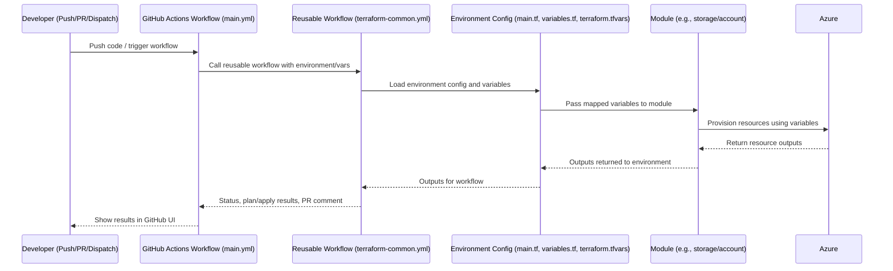
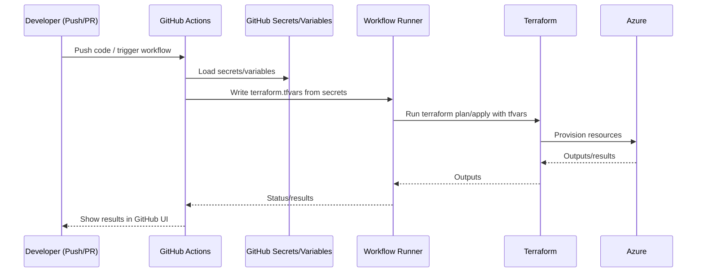

# Azure Files PoC Terraform Configuration

> **❗ CRITICAL RULE: DO NOT CREATE ANY RESOURCES IN AZURE WITHOUT EXPLICIT CONSENT AND REVIEW ❗**
>
> Always review configuration thoroughly and receive explicit approval before running `terraform apply` on production-related environments.

---

## Dependencies

- **Terraform:** v1.6.6 or newer (recommended: v1.9.8)
  - Homebrew users: Homebrew is locked to 1.5.7 due to license changes. To install the latest version manually:
    ```sh
    brew uninstall terraform
    curl -LO https://releases.hashicorp.com/terraform/1.9.8/terraform_1.9.8_darwin_arm64.zip
    unzip terraform_1.9.8_darwin_arm64.zip
    sudo mv terraform /usr/local/bin/
    terraform version
    ```
    *(For Intel Macs, use the `darwin_amd64.zip` build instead.)*
- **Azure CLI:** Latest version from https://docs.microsoft.com/en-us/cli/azure/install-azure-cli
- **jq:** For onboarding/automation scripts: `brew install jq`

---

## How to Remove Terraform State Locks in Azure

If you see an error like `Error acquiring the state lock` or `state blob is already locked`, you must manually remove the lock blob from your Azure Storage Account.

**Option 1: Azure CLI**
1. Find your backend details (from your workflow or backend config):
   - Storage account: e.g. `stagpssgtfstatedev01`
   - Container: e.g. `sc-ag-pssg-tfstate-dev`
   - Blob: e.g. `dev.terraform.tfstate.tflock`
2. Run:
   ```sh
   az storage blob delete \
     --account-name <storage_account> \
     --container-name <container> \
     --name <statefile>.tflock \
     --auth-mode login
   ```
   Example:
   ```sh
   az storage blob delete \
     --account-name stagpssgtfstatedev01 \
     --container-name sc-ag-pssg-tfstate-dev \
     --name dev.terraform.tfstate.tflock \
     --auth-mode login
   ```
3. RUN: 
Note: the ID to unlock is the ID in the error message for workflow run
│   ID:        <lock_id_from_error_message>
  ```sh
    terraform force-unlock <lock_id_from_error_message>
  ```

----

**Option 2: Azure Portal**
1. Go to your Storage Account in the Azure Portal.
2. Open the container (e.g., `sc-ag-pssg-tfstate-dev`).
3. Delete the blob ending with `.tflock` (e.g., `dev.terraform.tfstate.tflock`).

---

## Getting Started: The Project Workflow

This project follows a structured, validation-first workflow. Before developing any infrastructure, you must complete the onboarding and validation steps to ensure the entire system is configured correctly.

### Step 1: Complete One-Time Onboarding & OIDC Setup
This is the foundational step to connect GitHub and Azure securely.
- **Follow the step-by-step process in [`OneTimeActivities/RegisterApplicationInAzureAndOIDCInGithub.md`](../OneTimeActivities/RegisterApplicationInAzureAndOIDCInGithub.md).**
- This will configure the Azure AD application, the OIDC federated credential, and the necessary GitHub secrets for secure, passwordless authentication.
- **You must manually create the required Azure resource group as a one-time onboarding activity,** using the provided onboarding script (`step6_create_resource_group.sh` or its Windows equivalent). This is required because BC Government policy restricts resource group creation via Terraform when using OIDC.
- Reference the created resource group in your Terraform variables and module calls. Do not attempt to manage resource groups with Terraform in this project.
- For more details and troubleshooting, see the onboarding README and the [Validation Process](../OneTimeActivities/ValidationProcess.md).

> **Policy Note:**
> BC Government IaC/CI/CD policy requires that resource groups be created outside of Terraform when using OIDC. This ensures proper separation of duties and aligns with security best practices. See the onboarding documentation for rationale and links to official guidance.

### Step 2: Validate Your Setup Locally
Before testing the automated pipeline, verify your setup from your local machine.
- This ensures your Azure CLI, Terraform CLI, and local variables are all correct.
- See the detailed guide in [`validation/localhost/README.md`](./validation/localhost/README.md) for instructions on using the helper scripts.
- **Only proceed when all local validation steps pass.**

### Step 3: Validate the CI/CD Pipeline
This step confirms that the GitHub Actions workflow can authenticate and deploy resources.
- Make a small, safe change inside the `terraform/validation/` directory (e.g., add a comment to `main.tf`).
- **Commit and push** this change to the `main` branch.
- This will trigger the `azure-terraform-validation.yml` workflow, which will perform a full `plan` and `apply` of the test resources.
- A successful run of this workflow validates the entire end-to-end automation process.

### Step 4: Develop Real Infrastructure using Modules
Once the validation pipeline succeeds, you are ready to build the actual infrastructure for the Proof of Concept.
- Development shifts from the `validation` folder to the `environments/dev/` folder.
- Instead of writing `resource` blocks directly, you will **call reusable modules** from the `modules/` directory to compose your environment.
- This modular approach ensures consistency, reusability, and adherence to best practices.

---

## Directory Structure

This project uses a modular, service-oriented structure. Only key directories and files are shown below for clarity:

```
terraform/
├── environments/           # Environment-specific configurations (dev, prod, test)
│   └── dev/                # Example: main.tf, outputs.tf, variables.tf, terraform.tfvars
│   └── test/
│   └── prod/
├── modules/                    # Reusable infrastructure modules (dns, networking, security, storage, etc.)
│   ├── automation/             # Automation helpers (e.g., AzCopy)
│   │   └── azcopy/             # AzCopy automation module
│   ├── dns/                    # DNS zones and resolvers
│   │   ├── private-dns/        # Private DNS zone module
│   │   └── resolver/           # DNS resolver module
│   ├── identity/               # Azure AD and managed identities
│   │   ├── aad/                # Azure Active Directory app registration
│   │   └── managed-identity/   # Managed Identity module
│   ├── keyvault/               # Azure Key Vault module
│   ├── monitoring/             # Monitoring and logging
│   │   └── log-analytics/      # Log Analytics workspace
│   ├── networking/             # Virtual networks and related resources
│   │   ├── private-endpoint/   # Private Endpoint module
│   │   ├── subnet/             # Subnet module
│   │   └── vnet/               # Virtual Network module
│   ├── policies/               # Policy assignments and definitions
│   ├── rbac/                   # Role-Based Access Control assignments
│   ├── security/               # Network security modules
│   │   ├── firewall/           # Azure Firewall module
│   │   └── nsg/                # Network Security Group module
│   ├── storage/                # Storage account and related modules
│   │   ├── account/            # Storage Account module
│   │   ├── blob/               # Blob Storage module
│   │   ├── file-share/         # File Share module (see files below)
│   │   │   ├── main.tf
│   │   │   ├── outputs.tf
│   │   │   └── variables.tf
│   │   ├── lifecycle/          # Storage lifecycle management
│   │   ├── object-replication/ # Object Replication module
│   │   └── private-link-service/# Private Link Service module
│   ├── tags/                   # Tagging strategy module
│   └── vm/                     # Virtual Machine module
├── validation/             # Validation environment for onboarding and pipeline tests
│   ├── localhost/          # Local validation scripts and README
│   ├── main.tf             # Validation Terraform config
│   ├── secrets.tfvars*     # Secrets for validation (never commit real secrets)
│   ├── terraform.tfvars*   # Variable values for validation
│   └── ...
```

> **Note:**
> - The `core/resource-group` module has been removed. Resource groups must be created manually as part of onboarding, not managed by Terraform.
> - See onboarding documentation for scripts and instructions to create resource groups and set up OIDC.

---

## Key Reference Documentation

- [Onboarding & OIDC Setup Guide](../OneTimeActivities/RegisterApplicationInAzureAndOIDCInGithub.md)
- [Validation Process](../OneTimeActivities/ValidationProcess.md)
- [Terraform with GitHub Actions Process](../Resources/TerraformWithGithubActionsProcess.md)
- [Azure Resource Naming Conventions](../Resources/AzureResourceNamingConventions.md)

---

## Prerequisites

1. [Terraform](https://www.terraform.io/downloads.html) (v1.0.0 or newer)
2. [Azure CLI](https://docs.microsoft.com/en-us/cli/azure/install-azure-cli) (latest version recommended)
3. Completion of the Onboarding and OIDC setup (see Step 1 above).

---

## How to Populate `terraform.tfvars` (For Local Development)

For local development, your Terraform commands will need a `terraform.tfvars` file.

**Recommended: Use the automation scripts to generate this file.**
- **Unix/macOS (Bash):**
  ```bash
  /OneTimeActivities/GetAzureExistingResources/unix/PopulateTfvarsFromDiscoveredResources.sh
  ```
- **Windows (PowerShell):**
  ```powershell
  .\OneTimeActivities\GetAzureExistingResources\windows\PopulateTfvarsFromDiscoveredResources.ps1
  ```

These scripts read your environment's discovered state and credentials to automatically generate the `terraform.tfvars` and `secrets.tfvars` files with the correct values. This is the recommended, robust approach.

---

> **Note:**
> Resource groups are NOT managed by Terraform in this project due to policy requirements. You must create the required resource group(s) manually as part of onboarding, using the script:
>
> `OneTimeActivities/RegisterApplicationInAzureAndOIDC/scripts/unix/step6_create_resource_group.sh`
>
> Reference this resource group in your Terraform variables and module calls.

---

## How Environments, Modules, and CI/CD Work Together

This project uses a modular approach to infrastructure as code, making it easy to manage multiple environments (dev, test, prod) and automate deployments securely.

### How It Works

1. **Modules** (`modules/`):
   - Contain reusable Terraform code for specific Azure resources (e.g., storage account, subnet, private endpoint).
   - Use generic variable names (e.g., `resource_group_name`, `location`, `tags`) so they can be used in any environment.
   - Do **not** contain environment-specific logic or values.

2. **Environments** (`environments/dev/`, etc.):
   - Each environment has its own folder with a `main.tf`, `variables.tf`, and `terraform.tfvars`.
   - `main.tf` composes the environment by calling modules and mapping environment-specific variables (like `dev_storage_account_name`) to the module's generic variables.
   - `variables.tf` defines the required variables for the environment.
   - `terraform.tfvars` provides the actual values for those variables (for local development, these are generated or edited directly; in CI/CD, they come from secrets or environment variables).

3. **CI/CD (GitHub Actions):**
   - The workflow runs Terraform commands in the appropriate environment directory (e.g., `environments/dev`).
   - Environment-specific values are provided to Terraform via secrets or environment variables (e.g., `DEV_STORAGE_ACCOUNT_NAME`).
   - The workflow either passes these as `-var` flags or generates a `terraform.tfvars` file before running `terraform plan` and `terraform apply`.

### Example Flow

- You define your infrastructure in modules (generic, reusable).
- In `environments/dev/main.tf`, you call these modules and map environment variables to module variables.
- For local development, you populate `terraform.tfvars` with your environment's values (manually or using the provided scripts).
- In CI/CD, GitHub Actions injects secrets or environment variables, ensuring the correct values are used for each environment.
- Terraform uses these values to deploy resources as defined by the modules, but always within the constraints and policies set by onboarding (e.g., resource groups are created manually, not by Terraform).

**This approach ensures:**
- Consistency and reusability across environments
- Secure handling of secrets and environment-specific values
- Compliance with BC Gov policy (no resource group creation in Terraform)
- Easy onboarding for new environments or team members

For more details, see the onboarding and validation documentation referenced above.

---

### Example Flow (GitHub Actions Use Case)

This project is designed for both local and CI/CD (GitHub Actions) workflows. Below is an example flow for the GitHub Actions use case, referencing the main workflow file: `.github/workflows/main.yml` (which uses `terraform-common.yml` and `reusable-terraform-workflow.yml`).

#### Example Flow

- A developer pushes code or triggers a workflow in GitHub.
- The workflow defined in `.github/workflows/main.yml` starts, using the selected environment (e.g., `dev`).
- The workflow calls the reusable workflow (`terraform-common.yml` or `reusable-terraform-workflow.yml`), which:
  - Logs into Azure using OIDC and GitHub secrets.
  - Sets up Terraform and quality gates (format, lint, security scan).
  - Loads environment-specific variables (from GitHub secrets, workflow inputs, or a generated `terraform.tfvars`).
  - Runs `terraform init`, `plan`, and (optionally) `apply` in the correct environment directory (e.g., `environments/dev`).
  - Passes mapped variables to the modules.
  - Provisions resources in Azure using the module code.
  - Returns outputs and results to the workflow for review, PR comments, or further automation.

#### Visual Sequence Diagram



> **Reference:**
> - Main workflow: `.github/workflows/main.yml`
> - Reusable workflow: `.github/workflows/terraform-common.yml` or `.github/workflows/reusable-terraform-workflow.yml`
> - Validation workflow: `.github/workflows/terraform-validation.yml`

This diagram and flow show how GitHub Actions, environment configuration, and modules work together to automate secure, policy-compliant Azure deployments.

---

## Secure Handling of Terraform Variables and Secrets in CI/CD

### Best Practice Overview
- **Never commit real `terraform.tfvars` or `secrets.tfvars` files to git.** Only commit templates or examples (with no real values).
- **Store all sensitive values and environment-specific configuration in GitHub Secrets and Variables.**
- **In CI/CD workflows (GitHub Actions), generate the required tfvars files at runtime** using the secrets/variables before running Terraform. These files are temporary and only exist for the duration of the workflow run.
- **Locally, use your own `terraform.tfvars` for testing and development.** This file is ignored by git and only exists on your machine.

### Why Generate tfvars Files at Runtime?
- **Terraform expects variables in files:** This is the standard way to provide many variables at once.
- **Consistency:** Keeps local and CI/CD workflows aligned.
- **Security:** Secrets are never committed to the repo and only exist on the runner during the workflow.

### Example: Writing a tfvars File in GitHub Actions
```yaml
- name: Generate terraform.tfvars
  run: |
    echo "dev_resource_group = \"${{ secrets.DEV_RESOURCE_GROUP_NAME }}\"" > terraform/environments/dev/terraform.tfvars
    echo "dev_vnet_name = \"${{ secrets.DEV_VNET_NAME }}\"" >> terraform/environments/dev/terraform.tfvars
    echo "dev_vnet_resource_group = \"${{ secrets.DEV_VNET_RESOURCE_GROUP }}\"" >> terraform/environments/dev/terraform.tfvars
    # ...add all other variables as needed
```
- The file is created on the runner, used by Terraform, and deleted with the runner after the workflow completes.

### Mermaid Diagram: Secure Variable Flow in CI/CD


### Summary
- Use GitHub Secrets/Variables for all sensitive and environment-specific values.
- Generate tfvars files at runtime in CI/CD workflows.
- Never commit real tfvars or secrets to git.
- This approach is secure, compliant, and industry best practice.