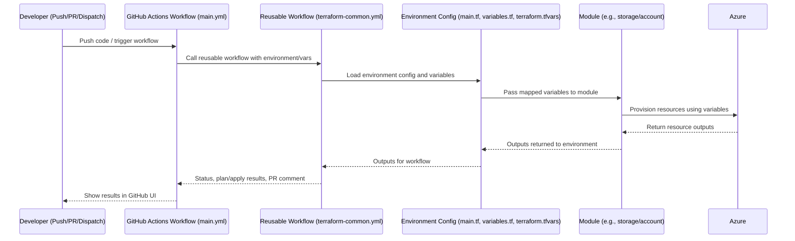
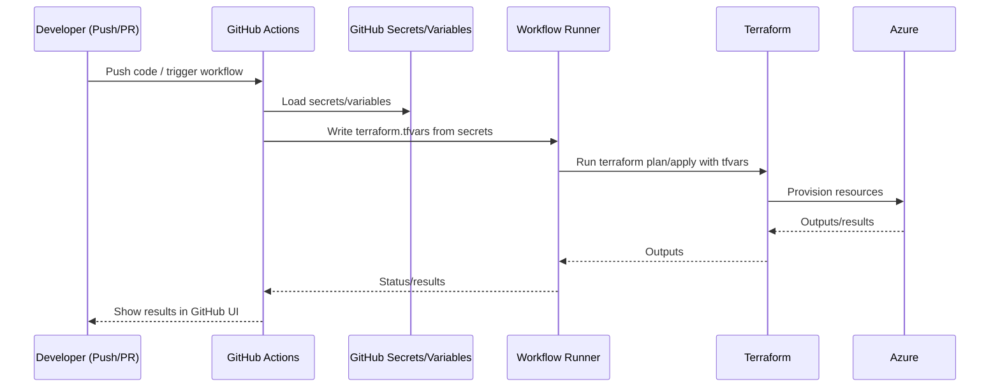

# Azure Files PoC Terraform Configuration

> **❗ CRITICAL RULE: DO NOT CREATE ANY RESOURCES IN AZURE WITHOUT EXPLICIT CONSENT AND REVIEW ❗**
>
> Always review configuration thoroughly and receive explicit approval before running `terraform apply` on production-related environments.

---

## Why a Self-Hosted GitHub Actions Runner May Be Required

> **Azure Policy and Network Restrictions:**
> In BC Gov and similar Azure environments, security policy often blocks the creation of resources (such as Storage Accounts) with public network access enabled. Standard GitHub-hosted runners operate from the public internet and cannot access private Azure resources if public access is disabled. This results in 403 Forbidden errors when trying to create or manage resources like Azure File Shares.

### Solution: Deploy a Self-Hosted Runner in Your Private VNet

- **A self-hosted GitHub Actions runner VM, deployed inside your private Azure Spoke VNet, allows CI/CD jobs to run from a trusted, private IP address.**
- This enables Terraform and other tools to communicate with Azure resources (e.g., storage accounts with private endpoints) over the private network, bypassing the public firewall and complying with Azure Policy.
- The runner VM is managed as part of the `terraform/environments/cicd` environment. See the `cicd/README.md` for full details and setup instructions.

#### Key Steps to Set Up a Self-Hosted Runner
1. **Pre-create the CICD resource group** using your user identity and the onboarding script:
   ```sh
   bash OneTimeActivities/RegisterApplicationInAzureAndOIDC/scripts/unix/step6_create_resource_group.sh --rgname "<cicd-resource-group-name>" --location "<location>"
   ```
2. **Deploy the runner VM** using the Terraform configuration in `terraform/environments/cicd/`. This will:
   - Look up the pre-existing resource group and subnet.
   - Create a Network Security Group (NSG) to allow SSH from your home IP.
   - Deploy the VM and associate it with the NSG and subnet.
3. **Register the runner with your GitHub repository** (see `cicd/README.md` for automation options).
4. **Update your GitHub Actions workflows** to use `runs-on: self-hosted` for jobs that require private network access.

> **Note:**
> - The resource group for the runner must be created manually (not by Terraform) due to policy. Use the onboarding script as described above.
> - The runner VM incurs Azure costs while running. Remove or deallocate it when not needed.
> - For troubleshooting persistent 403 errors, always verify the runner is operating from the correct private network and has the required RBAC/data plane permissions.

---

## Dependencies

- **Terraform:** v1.6.6 or newer (recommended: v1.9.8)
  - Homebrew users: Homebrew is locked to 1.5.7 due to license changes. To install the latest version manually:
    ```sh
    brew uninstall terraform
    curl -LO https://releases.hashicorp.com/terraform/1.9.8/terraform_1.9.8_darwin_arm64.zip
    unzip terraform_1.9.8_darwin_arm64.zip
    sudo mv terraform /usr/local/bin/
    terraform version
    ```
    *(For Intel Macs, use the `darwin_amd64.zip` build instead.)*
- **Azure CLI:** Latest version from https://docs.microsoft.com/en-us/cli/azure/install-azure-cli
- **jq:** For onboarding/automation scripts: `brew install jq`

---

## How to Remove Terraform State Locks in Azure

If you see an error like `Error acquiring the state lock` or `state blob is already locked`, you must manually remove the lock blob or break the lease from your Azure Storage Account.

NOTE: run in your environment folder like terraform/environments/dev or terraform/environments/cicd

**If you see an error like:**
```
Error: Backend initialization required, please run "terraform init"
```
Or:
```
Error: Either an Access Key / SAS Token or the Resource Group for the Storage Account must be specified - or Azure AD Authentication must be enabled
```
You must re-initialize the backend with all required parameters:

```sh
terraform init -reconfigure \
  -backend-config="container_name=sc-<project-name>-tfstate-dev" \
  -backend-config="storage_account_name=stagpssgtfstatedev01" \
  -backend-config="resource_group_name=rg-<project-name>-tfstate-dev"
```

**Option 1: Azure CLI**
1. Find your backend details (from your workflow or backend config):
   - Storage account: e.g. `stagpssgtfstatedev01`
   - Container: e.g. `sc-<project-name>-tfstate-dev`
   - Blob: e.g. `dev.terraform.tfstate.tflock` or `cicd.terraform.tfstate.tflock`
2. Run:
   ```sh
   az storage blob delete \
     --account-name <storage_account> \
     --container-name <container> \
     --name <statefile>.tflock \
     --auth-mode login
   ```
   Example:
   ```sh
   az storage blob delete \
     --account-name stagpssgtfstatedev01 \
     --container-name sc-<project-name>-tfstate-dev \
     --name cicd.terraform.tfstate.tflock \
     --auth-mode login
   ```
   If the state file itself is marked as "Leased" (locked) and there is no `.tflock` blob, break the lease:
   ```sh
   az storage blob lease break \
     --account-name <storage_account> \
     --container-name <container> \
     --blob-name <statefile> \
     --auth-mode login
   ```
   Example:
   ```sh
   az storage blob lease break \
     --account-name stagpssgtfstatedev01 \
     --container-name sc-<project-name>-dev \
     --blob-name cicd.terraform.tfstate \
     --auth-mode login
   ```
3. RUN: 
Note: the ID to unlock is the ID in the error message for workflow run
│   ID:        <lock_id_from_error_message>
  ```sh
    terraform force-unlock <lock_id_from_error_message>
  ```

**If you have broken the lease and deleted any `.tflock` blob, but `terraform force-unlock` still fails with a 412 error:**
- Try running a plain `terraform plan` or `terraform apply` in your environment directory. After the lease is broken, Terraform may clear the lock automatically on the next operation.
- If you still get a lock error, check the state file in the Azure Portal for any lock metadata. As a last resort, you can download the state file, remove any lock-related metadata, and re-upload it (only if you are sure no one else is using the state).

----

**Option 2: Azure Portal (GUI)**
1. Go to your Storage Account in the Azure Portal.
2. Open the container (e.g., `sc-<project-name>-tfstate-dev`).
3. If you see a blob ending with `.tflock`, select it and click **Delete**.
4. If the state file (e.g., `dev.terraform.tfstate`) shows a status of **Leased**, select it, click **Break lease**, and confirm. This will release the lock and allow Terraform to proceed.

---

## Getting Started: The Project Workflow

This project follows a structured, validation-first workflow. Before developing any infrastructure, you must complete the onboarding and validation steps to ensure the entire system is configured correctly.

### Step 1: Complete One-Time Onboarding & OIDC Setup
This is the foundational step to connect GitHub and Azure securely.
- **Follow the step-by-step process in [`OneTimeActivities/RegisterApplicationInAzureAndOIDCInGithub.md`](../OneTimeActivities/RegisterApplicationInAzureAndOIDCInGithub.md).**
- This will configure the Azure AD application, the OIDC federated credential, and the necessary GitHub secrets for secure, passwordless authentication.
- **You must manually create the required Azure resource group as a one-time onboarding activity,** using the provided onboarding script (`step6_create_resource_group.sh` or its Windows equivalent). This is required because BC Government policy restricts resource group creation via Terraform when using OIDC.
- Reference the created resource group in your Terraform variables and module calls. Do not attempt to manage resource groups with Terraform in this project.
- For more details and troubleshooting, see the onboarding README and the [Validation Process](../OneTimeActivities/ValidationProcess.md).

> **Policy Note:**
> BC Government IaC/CI/CD policy requires that resource groups be created outside of Terraform when using OIDC. This ensures proper separation of duties and aligns with security best practices. See the onboarding documentation for rationale and links to official guidance.

### Step 2: Validate Your Setup Locally
Before testing the automated pipeline in github, verify your setup from your local machine.
- This ensures your Azure CLI, Terraform CLI, and local variables are all correct.

open the environment folder:
1. terraform init
2. terraform validate
3. terraform plan
I try to reserve apply for github because it uses different permissions, but you could do terraform apply and terraform destroy before trying in github. 

### Step 3: Validate the CI/CD Pipeline
This step confirms that the GitHub Actions workflow can authenticate and deploy resources.
- Make a small, safe change inside the `terraform/environments/dev/` directory (e.g., add a comment to `main.tf`). or uncomment just one resource creation.  
- **Commit and push** this change to the `main` branch.
- This will trigger the `azure-terraform-validation.yml` workflow, which will perform a full `plan` and `apply` of the test resources.
- A successful run of this workflow validates the entire end-to-end automation process.

### Step 4: Develop Real Infrastructure using Modules
Once the validation pipeline succeeds, you are ready to build the actual infrastructure for the Proof of Concept.
- Development shifts from the `validation` folder to the `environments/dev/` folder.
- Instead of writing `resource` blocks directly, you will **call reusable modules** from the `modules/` directory to compose your environment.
- This modular approach ensures consistency, reusability, and adherence to best practices.

### Step 5: Local Development and Validation Best Practices

When developing or updating Terraform scripts—whether in an environment folder (e.g., `environments/cicd/main.tf`) or in a module (e.g., `modules/bastion/main.tf`)—always validate your changes locally before pushing to GitHub. This helps catch errors early and ensures a smoother CI/CD process.

**Recommended Local Workflow:**

1. **Navigate to your environment directory:**
   ```sh
   cd terraform/environments/<your-environment>
   ```
2. **Initialize the working directory:**
   ```sh
   terraform init
   ```
   _Downloads required providers and modules, and configures the backend._
3. **Validate the configuration:**
   ```sh
   terraform validate
   ```
   _Checks the syntax and internal consistency of your Terraform files._
4. **Review the planned changes:**
   ```sh
   terraform plan
   ```
   _Shows what changes Terraform will make, without applying them._
5. **(Not Recommended) Apply the changes locally:**
   ```sh
   terraform apply
   ```
   _Not recommended for normal development. Applying locally can cause state drift and bypass CI/CD controls. For best practice, commit and push your changes, then let the GitHub Actions workflow perform the apply step. Only use local apply for isolated testing or troubleshooting, and never in shared or production environments._

**Why do this?**
- Catch syntax and logic errors before they reach CI/CD.
- See exactly what changes will be made to your infrastructure.
- Reduce failed runs and troubleshooting time in GitHub Actions.

**After local validation passes,** commit and push your changes to trigger the GitHub Actions workflow for automated deployment and further validation.


---


## Directory Structure

This project uses a modular, service-oriented structure. Only key directories and files are shown below for clarity:

```
terraform/
├── environments/           # Environment-specific configurations (dev, prod, test, cicd)
│   ├── cicd/               # CI/CD self-hosted runner infrastructure
│   │   ├── main.tf         # Bastion, runner VM, NSG/subnet modules
│   │   ├── outputs.tf      # Runner subnet address space outputs
│   │   ├── variables.tf    # Variable declarations
│   │   ├── terraform.tfvars # Variable values (auto-generated or manual)
│   │   └── README.md       # Self-hosted runner setup guide
│   ├── dev/                # Development environment
│   ├── test/               # Test environment
│   └── prod/               # Production environment
├── modules/                # Reusable infrastructure modules
│   ├── automation/         # Automation helpers (e.g., AzCopy)
│   │   └── azcopy/         # AzCopy automation module
│   ├── bastion/            # Azure Bastion host module
│   │   ├── main.tf         # Bastion host with tunneling support
│   │   ├── variables.tf    # Bastion variables
│   │   └── nsg/            # Bastion NSG and subnet creation (AzAPI)
│   │       └── main.tf     # Policy-compliant subnet with NSG association
│   ├── bc-gov-azure-files/ # BC Gov specific Azure Files configuration
│   ├── dns/                # DNS zones and resolvers
│   │   ├── private-dns/    # Private DNS zone module
│   │   └── resolver/       # DNS resolver module
│   ├── identity/           # Azure AD and managed identities
│   │   ├── aad/            # Azure Active Directory app registration
│   │   └── managed-identity/ # Managed Identity module
│   ├── keyvault/           # Azure Key Vault module
│   ├── monitoring/         # Monitoring and logging
│   │   ├── diagnostic-setting/ # Diagnostic settings
│   │   └── log-analytics/  # Log Analytics workspace
│   ├── networking/         # Virtual networks and related resources
│   │   ├── firewall/       # Azure Firewall module
│   │   ├── private-dns/    # Private DNS zone module
│   │   ├── private-endpoint/ # Private Endpoint module
│   │   ├── route-table/    # Route table module
│   │   ├── subnet/         # Subnet module
│   │   ├── vnet/           # Virtual Network module
│   │   └── vnet-gateway/   # VPN Gateway module
│   ├── policies/           # Policy assignments and definitions
│   ├── rbac/               # Role-Based Access Control assignments
│   ├── runner/             # GitHub Actions runner modules
│   │   └── nsg/            # Runner NSG and subnet creation (AzAPI)
│   │       └── main.tf     # Policy-compliant subnet with NSG association
│   ├── security/           # Network security modules
│   │   ├── firewall/       # Azure Firewall module
│   │   └── nsg/            # Network Security Group module
│   ├── storage/            # Storage account and related modules
│   │   ├── account/        # Storage Account module
│   │   ├── blob/           # Blob Storage module
│   │   ├── blob-container/ # Blob Container module
│   │   ├── file-share/     # File Share module
│   │   ├── file-sync/      # Azure File Sync module
│   │   ├── lifecycle/      # Storage lifecycle management
│   │   ├── management-policy/ # Storage management policy
│   │   ├── object-replication/ # Object Replication module
│   │   └── private-link-service/ # Private Link Service module
│   ├── tags/               # Tagging strategy module
│   └── vm/                 # Virtual Machine module (for self-hosted runners)
├── validation/             # Validation environment for onboarding and pipeline tests
│   ├── localhost/          # Local validation scripts and README
│   ├── github/             # GitHub validation
│   ├── main.tf             # Validation Terraform config
│   ├── secrets.tfvars*     # Secrets for validation (never commit real secrets)
│   ├── terraform.tfvars*   # Variable values for validation
│   └── README.md           # Validation documentation
```

> **Note:**
> - The `core/resource-group` module has been removed. Resource groups must be created manually as part of onboarding, not managed by Terraform.
> - See onboarding documentation for scripts and instructions to create resource groups and set up OIDC.

---

## Key Reference Documentation

- [Onboarding & OIDC Setup Guide](../OneTimeActivities/RegisterApplicationInAzureAndOIDCInGithub.md)
- [Validation Process](../OneTimeActivities/ValidationProcess.md)
- [Terraform with GitHub Actions Process](../Resources/TerraformWithGithubActionsProcess.md)
- [Azure Resource Naming Conventions](../Resources/AzureResourceNamingConventions.md)

---

## Prerequisites

1. [Terraform](https://www.terraform.io/downloads.html) (v1.0.0 or newer)
2. [Azure CLI](https://docs.microsoft.com/en-us/cli/azure/install-azure-cli) (latest version recommended)
3. Completion of the Onboarding and OIDC setup (see Step 1 above).

---

## How to Populate `terraform.tfvars` (For Local Development)

For local development, your Terraform commands will need a `terraform.tfvars` file.

**Recommended: Use the automation scripts to generate this file.**
- **Unix/macOS (Bash):**
  ```bash
  /OneTimeActivities/GetAzureExistingResources/unix/PopulateTfvarsFromDiscoveredResources.sh
  ```
- **Windows (PowerShell):**
  ```powershell
  .\OneTimeActivities\GetAzureExistingResources\windows\PopulateTfvarsFromDiscoveredResources.ps1
  ```

These scripts read your environment's discovered state and credentials to automatically generate the `terraform.tfvars` and `secrets.tfvars` files with the correct values. This is the recommended, robust approach.

---

> **Note:**
> Resource groups are NOT managed by Terraform in this project due to policy requirements. You must create the required resource group(s) manually as part of onboarding, using the script:
>
> `OneTimeActivities/RegisterApplicationInAzureAndOIDC/scripts/unix/step6_create_resource_group.sh`
>
> Reference this resource group in your Terraform variables and module calls.

---

## How Environments, Modules, and CI/CD Work Together

This project uses a modular approach to infrastructure as code, making it easy to manage multiple environments (dev, test, prod) and automate deployments securely.

### How It Works

1. **Modules** (`modules/`):
   - Contain reusable Terraform code for specific Azure resources (e.g., storage account, subnet, private endpoint).
   - Use generic variable names (e.g., `resource_group_name`, `location`, `tags`) so they can be used in any environment.
   - Do **not** contain environment-specific logic or values.

2. **Environments** (`environments/dev/`, etc.):
   - Each environment has its own folder with a `main.tf`, `variables.tf`, and `terraform.tfvars`.
   - `main.tf` composes the environment by calling modules and mapping environment-specific variables (like `storage_account_name`) to the module's generic variables.
   - `variables.tf` defines the required variables for the environment.
   - `terraform.tfvars` provides the actual values for those variables (for local development, these are generated or edited directly; in CI/CD, they come from secrets or environment variables).

3. **CI/CD (GitHub Actions):**
   - The workflow runs Terraform commands in the appropriate environment directory (e.g., `environments/dev`).
   - Environment-specific values are provided to Terraform via secrets or environment variables (e.g., `STORAGE_ACCOUNT_NAME`).
   - The workflow either passes these as `-var` flags or generates a `terraform.tfvars` file before running `terraform plan` and `terraform apply`.

### Example Flow

- You define your infrastructure in modules (generic, reusable).
- In `environments/dev/main.tf`, you call these modules and map environment variables to module variables.
- For local development, you populate `terraform.tfvars` with your environment's values (manually or using the provided scripts).
- In CI/CD, GitHub Actions injects secrets or environment variables, ensuring the correct values are used for each environment.
- Terraform uses these values to deploy resources as defined by the modules, but always within the constraints and policies set by onboarding (e.g., resource groups are created manually, not by Terraform).

**This approach ensures:**
- Consistency and reusability across environments
- Secure handling of secrets and environment-specific values
- Compliance with BC Gov policy (no resource group creation in Terraform)
- Easy onboarding for new environments or team members

For more details, see the onboarding and validation documentation referenced above.

---

### Example Flow (GitHub Actions Use Case)

This project is designed for both local and CI/CD (GitHub Actions) workflows. Below is an example flow for the GitHub Actions use case, referencing the main workflow file: `.github/workflows/main.yml` (which uses `terraform-common.yml` and `reusable-terraform-workflow.yml`).

#### Example Flow

- A developer pushes code or triggers a workflow in GitHub.
- The workflow defined in `.github/workflows/main.yml` starts, using the selected environment (e.g., `dev`).
- The workflow calls the reusable workflow (`terraform-common.yml` or `reusable-terraform-workflow.yml`), which:
  - Logs into Azure using OIDC and GitHub secrets.
  - Sets up Terraform and quality gates (format, lint, security scan).
  - Loads environment-specific variables (from GitHub secrets, workflow inputs, or a generated `terraform.tfvars`).
  - Runs `terraform init`, `plan`, and (optionally) `apply` in the correct environment directory (e.g., `environments/dev`).
  - Passes mapped variables to the modules.
  - Provisions resources in Azure using the module code.
  - Returns outputs and results to the workflow for review, PR comments, or further automation.

#### Visual Sequence Diagram



> **Reference:**
> - Main workflow: `.github/workflows/main.yml`
> - Reusable workflow: `.github/workflows/terraform-common.yml` or `.github/workflows/reusable-terraform-workflow.yml`
> - Validation workflow: `.github/workflows/terraform-validation.yml`

This diagram and flow show how GitHub Actions, environment configuration, and modules work together to automate secure, policy-compliant Azure deployments.

---

## Secure Handling of Terraform Variables and Secrets in CI/CD

### Best Practice Overview
- **Never commit real `terraform.tfvars` or `secrets.tfvars` files to git.** Only commit templates or examples (with no real values).
- **Store all sensitive values and environment-specific configuration in GitHub Secrets and Variables.**
- **In CI/CD workflows (GitHub Actions), generate the required tfvars files at runtime** using the secrets/variables before running Terraform. These files are temporary and only exist for the duration of the workflow run.
- **Locally, use your own `terraform.tfvars` for testing and development.** This file is ignored by git and only exists on your machine.

> **Note:**
> For now, use the root `terraform/terraform.tfvars` file as the single source of truth for all environments (dev, cicd, etc.). If you run Terraform from an environment folder (like `environments/dev` or `environments/cicd`), you must specify the root tfvars file with `-var-file=../../terraform.tfvars`. If you do not specify `-var-file`, Terraform will look for a `terraform.tfvars` file in the current directory. In the future, when you have separate test and prod environments, you can move to environment-specific tfvars files (e.g., `environments/dev/terraform.tfvars`). For now, avoid duplicating variable files in each environment folder.

### Example: Writing a tfvars File in GitHub Actions
```yaml
- name: Generate terraform.tfvars
  run: |
    echo "resource_group = \"${{ secrets.RESOURCE_GROUP_NAME }}\"" > terraform/terraform.tfvars
    echo "vnet_name = \"${{ secrets.VNET_NAME }}\"" >> terraform/terraform.tfvars
    echo "vnet_resource_group = \"${{ secrets.VNET_RESOURCE_GROUP }}\"" >> terraform/terraform.tfvars
    # ...add all other variables as needed
```
- The file is created on the runner, used by Terraform, and deleted with the runner after the workflow completes.

### Mermaid Diagram: Secure Variable Flow in CI/CD


### Summary
- Use GitHub Secrets/Variables for all sensitive and environment-specific values.
- Generate tfvars files at runtime in CI/CD workflows.
- Never commit real tfvars or secrets to git.
- This approach is secure, compliant, and industry best practice.

---

## Important Note on File Share Creation and GitHub Actions Runners

> **Azure File Share Creation and GitHub Actions Runners**
>
> **Update (July 2025): File share creation is now fully automated and unblocked.**
> All required data plane roles and propagation waits are handled in the pipeline. The previous issues with 403 errors and permission propagation are resolved with the current configuration and sequencing.
>
> When using OIDC and GitHub Actions to deploy Azure resources, the identity (service principal) used by the GitHub Actions runner must have the appropriate **data plane** roles (such as `Storage File Data SMB Share Contributor` or `Storage File Data Privileged Contributor`) on the storage account **before** attempting to create a file share. 
>
> **Key Points:**
> - Role assignments can take several minutes to propagate in Azure. Even if the assignment appears in the portal, it may not be effective immediately for data plane operations.
> - The pipeline now includes a propagation wait (`time_sleep` resource) to ensure permissions are active before file share creation.
> - The GitHub Actions runner must be able to authenticate to Azure and have the required permissions. If you are running into persistent 403 errors, consider testing with a self-hosted runner or running the apply step locally to isolate permission propagation issues.
> - For most scenarios, **the same principal that creates the storage account and assigns roles should also create the file share**. If you use a different principal, ensure it has the correct data plane roles.
>
> **Troubleshooting Steps (for future reference):**
> 1. Verify the role assignment for the GitHub Actions runner's identity on the storage account.
> 2. Check the effective permissions using Azure CLI or Portal.
> 3. If necessary, reassign the role or add the required roles to the identity.
> 4. Test the file share creation again after ensuring the correct permissions are in place.
>
> **Example Azure CLI Commands:**
> - To check role assignments:
>   ```sh
>   az role assignment list --assignee <runner-identity> --scope /subscriptions/<subscription-id>/resourceGroups/<resource-group>/providers/Microsoft.Storage/storageAccounts/<storage-account>
>   ```
> - To assign the required role:
>   ```sh
>   az role assignment create --assignee <runner-identity> --role "Storage File Data SMB Share Contributor" --scope /subscriptions/<subscription-id>/resourceGroups/<resource-group>/providers/Microsoft.Storage/storageAccounts/<storage-account>
>   ```
> - Replace placeholders with actual values from your Azure environment.
> - Ensure the GitHub Actions runner's identity is used in place of `<runner-identity>`.

---

## Private DNS and Private Endpoints in the Dev Environment

> **Important:** As of July 2025, DNS modules and direct DNS resource creation have been removed from the development environment for policy compliance and to align with BC Gov Azure Landing Zone best practices.

### How Private DNS is Handled
- **Centralized Management:** The Azure Landing Zone centrally manages Private DNS Zones for all supported PaaS services. You do not create or manage Private DNS Zones directly in your environment.
- **Private Endpoint Integration:** When you create a Private Endpoint for a resource (e.g., Storage Account), Azure Policy and automation will automatically associate the endpoint with the correct central Private DNS Zone and create the required DNS records.
- **No Custom DNS Zones:** You are prevented from creating your own Private DNS Zones for supported services. For third-party or unsupported services, contact the platform team for guidance.
- **No DNS Modules in dev/main.tf:** All DNS-related modules and resources have been removed from `environments/dev/main.tf`. Networking and private endpoint modules remain, but DNS is handled by the platform.

### What You Need to Do
- **Do NOT add DNS modules or resources** to your Terraform code for supported Azure services.
- **Always select 'No' for 'Integrate with private DNS zone'** when creating Private Endpoints via the portal (the platform will handle DNS integration automatically).
- **For custom DNS needs,** submit a support request to the Public Cloud team.
- **For more details,** see [BCGov-PrivateDNSandEndpoints.md](../Resources/BCGov-PrivateDNSandEndpoints.md).

### Example: Storage Account with Private Endpoint
- Reference the existing subnet and network resources.
- Do not attempt to create or link a Private DNS Zone.
- The DNS record will be created automatically by policy after the Private Endpoint is provisioned.

---

## Recent Changes to dev/main.tf
- **Removed:** All DNS modules and direct DNS resource creation.
- **Retained:** Networking, subnet, NSG, and private endpoint modules.
- **Updated:** Storage account and private endpoint configuration to rely on platform-managed DNS.
- **Rationale:** Aligns with BC Gov policy, reduces risk of non-compliance, and simplifies environment setup.

---