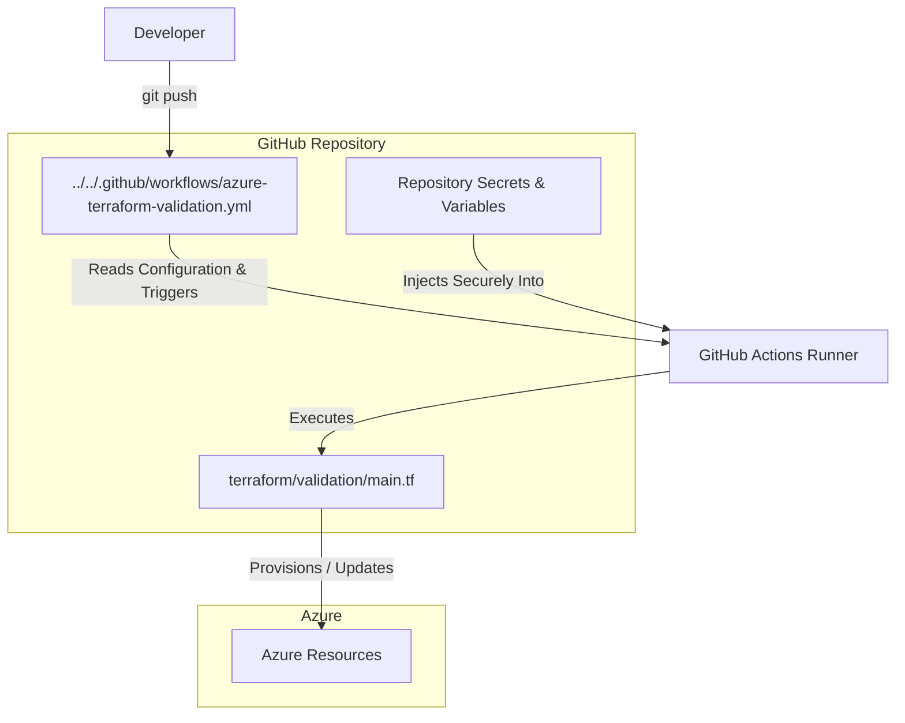
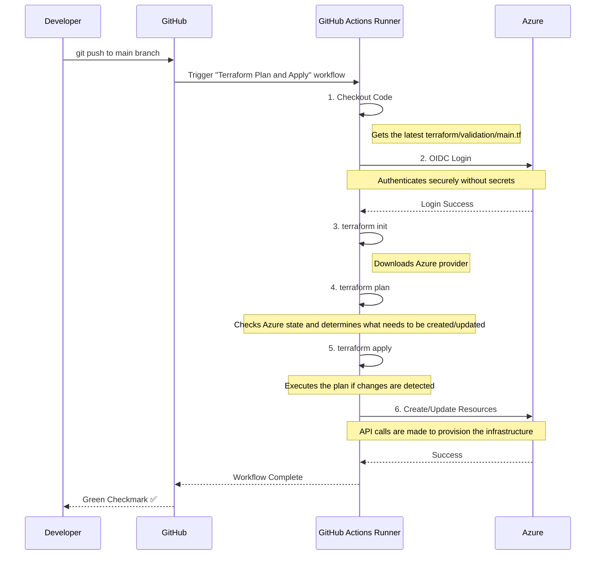

# Terraform Local and CI/CD Validation Module

## Purpose

This module provides a comprehensive Terraform configuration to validate the end-to-end setup for deploying Azure infrastructure. It is designed to be run in two distinct ways:

1.  **Locally (`localhost`):** For rapid development, debugging, and testing of Terraform scripts using your personal Azure CLI credentials.
2.  **Via CI/CD (`github`):** As a "smoke test" to confirm that the automated GitHub Actions pipeline, OIDC authentication, permissions, and variable injection are all working correctly.

> **Important**: This module is part of the validation process described in the comprehensive [ValidationProcess.md](../../OneTimeActivities/ValidationProcess.md) guide. Please refer to that document for the full end-to-end context.

## File & Directory Structure

This section describes the key files within the `terraform/validation` directory.

| File / Directory      | Description                                                                                             |
|-----------------------|---------------------------------------------------------------------------------------------------------|
| `README.md`           | **(This file)** The high-level overview of the validation module, its purpose, and how to use it.         |
| `main.tf`             | The core Terraform code that defines all the Azure resources to be created for this validation test.    |
| `localhost/`          | A directory containing a detailed "how-to" guide and helper scripts for running validation on your local machine. |

## How It Works: Visualized

These diagrams illustrate the components and the CI/CD process flow for this validation.

### Component Relationships

### CI/CD Sequence Diagram

## Azure Resources Created

The following resources will be created in your Azure subscription when this script is applied.

| Azure Resource Type          | Terraform Resource Name                 | Azure Resource Name (Pattern)                     |
|------------------------------|-----------------------------------------|---------------------------------------------------|
| Resource Group               | `azurerm_resource_group.validation`       | `rg-ag-pssg-azure-poc-dev`                          |
| Network Security Group       | `azurerm_network_security_group.validation` | `nsg-ag-pssg-azure-poc-dev-01`                      |
| Subnet                       | `azapi_resource.storage_pe_subnet`        | `snet-ag-pssg-azure-poc-dev-storage-pe`             |
| Storage Account              | `azurerm_storage_account.validation`      | `stagpssgazurepocdev01`                             |
| Private Endpoint             | `azurerm_private_endpoint.storage_pe`     | `pe-stagpssgazurepocdev01`                          |

## How to Use

This validation can be run via the automated GitHub Actions workflow or manually from your local machine for debugging.

### Method 1: GitHub Actions Validation (Primary)
The primary way to use this module is through the automated `azure-terraform-validation.yml` workflow:
1.  **Commit and push** a change to this directory (`terraform/validation/`).
2.  The workflow will automatically trigger, plan the changes, and apply them to your Azure environment.
3.  After the `Terraform Apply` step succeeds, log in to the Azure Portal to validate that the resources were created correctly.

### Method 2: Localhost Validation (For Debugging)
Use this method to test and debug Terraform changes on your local machine before committing.
> **For a detailed guide on using helper scripts for local validation, see the [Localhost Validation README](./localhost/README.md).**

## Troubleshooting

### Error: "A resource with the ID ... already exists"
You may encounter this error during the `terraform apply` step in the GitHub Actions workflow.

> `Error: A resource with the ID "/subscriptions/.../resourceGroups/rg-ag-pssg-azure-poc-dev" already exists - to be managed via Terraform this resource needs to be imported into the State.`

**Why this happens:** This error occurs when Terraform's "memory" (its state file) is out of sync with the reality in Azure. A previous workflow run likely failed after creating the resource group, leaving it as an "orphan" that the new workflow doesn't know it's supposed to be managing.

**Solution (for this PoC Environment):**
Since this is a non-production validation environment, the simplest solution is to perform a "clean slate" reset.

1.  **Navigate to the Azure Portal**.
2.  Find and click on **Resource groups**.
3.  In the filter box, search for the resource group named **`rg-ag-pssg-azure-poc-dev`**.
4.  Click on the resource group to open its overview page.
5.  Click the **"Delete resource group"** button.
6.  You will be prompted to type the name of the resource group to confirm. Enter `rg-ag-pssg-azure-poc-dev` and click **Delete**.
7.  Once the deletion is complete, **re-run the failed GitHub Actions workflow**. It will now succeed from a clean state.

> ⚠️ **Warning:** This deletion method should **only** be used in non-production environments like this one. In a live production environment, the correct (but more advanced) solution is to use the `terraform import` command to adopt the existing resource into the state.

## ⚠️ Important Note on Private Endpoints
If your Terraform configuration creates Azure Private Endpoints, you **must** account for any Azure Policy that manages Private DNS Zone associations. Always include a `lifecycle { ignore_changes = [private_dns_zone_group] }` block in your `azurerm_private_endpoint` resources to prevent Terraform from fighting with the policy automation.