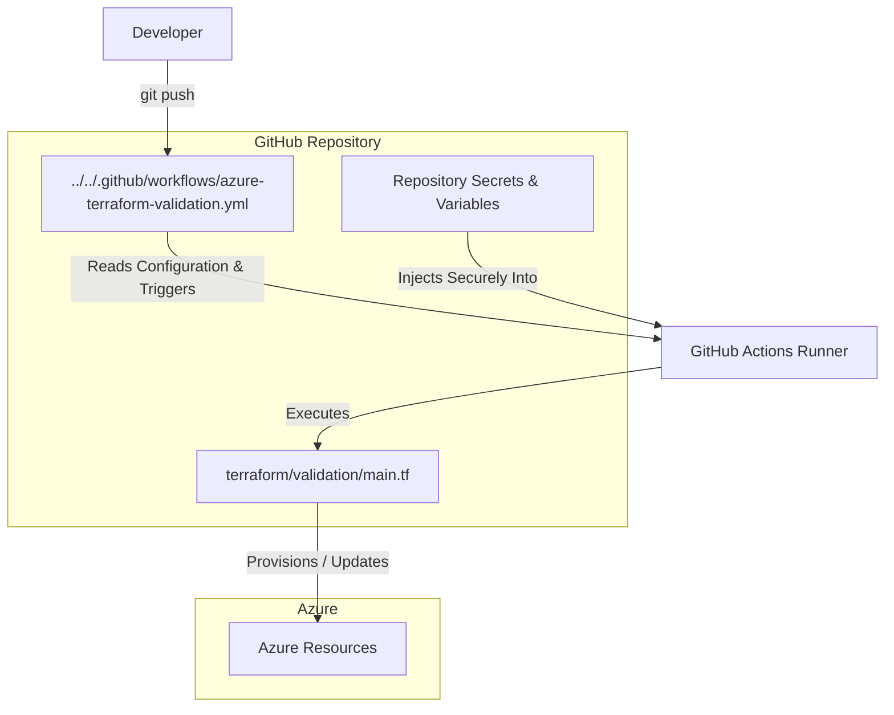
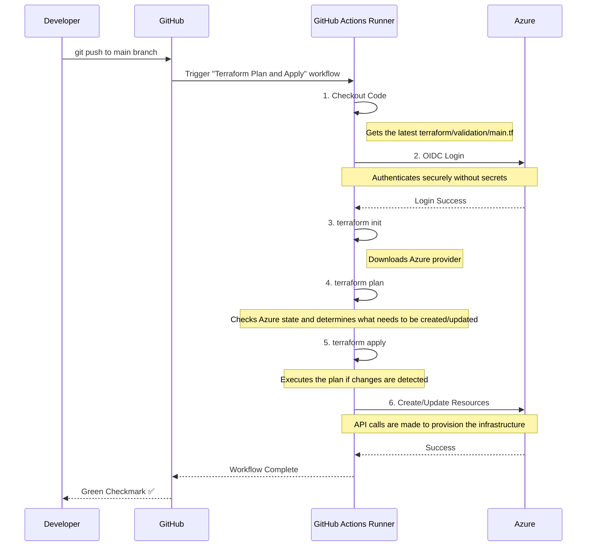

# Terraform Local and CI/CD Validation Module

## Purpose

This module provides a comprehensive Terraform configuration to validate the end-to-end setup for deploying Azure infrastructure. It is designed to be run in two distinct ways:

1.  **Locally (`localhost`):** For rapid development, debugging, and testing of Terraform scripts using your personal Azure CLI credentials.
2.  **Via CI/CD (`github`):** As a "smoke test" to confirm that the automated GitHub Actions pipeline, OIDC authentication, permissions, and variable injection are all working correctly.

> **Important**: This module is part of the validation process described in the comprehensive [ValidationProcess.md](../../OneTimeActivities/ValidationProcess.md) guide. Please refer to that document for the full end-to-end context.

## File & Directory Structure

This section describes the key files within the `terraform/validation` directory.

| File / Directory      | Description                                                                                             |
|-----------------------|---------------------------------------------------------------------------------------------------------|
| `README.md`           | **(This file)** The high-level overview of the validation module, its purpose, and how to use it.         |
| `main.tf`             | The core Terraform code that defines all the Azure resources to be created for this validation test.    |
| `localhost/`          | A directory containing a detailed "how-to" guide and helper scripts for running validation on your local machine. |

## How It Works: Visualized

These diagrams illustrate the components and the CI/CD process flow for this validation.

### Component Relationships



### CI/CD Sequence Diagram



## Azure Resources Created

The following resources will be created in your Azure subscription when this script is applied.

| Azure Resource Type          | Terraform Resource Name                 | Azure Resource Name (Pattern)                     |
|------------------------------|-----------------------------------------|---------------------------------------------------|
| Resource Group               | `azurerm_resource_group.validation`       | `rg-ag-pssg-azure-poc-dev`                          |
| Network Security Group       | `azurerm_network_security_group.validation` | `nsg-ag-pssg-azure-poc-dev-01`                      |
| Subnet                       | `azapi_resource.storage_pe_subnet`        | `snet-ag-pssg-azure-poc-dev-storage-pe`             |
| Storage Account              | `azurerm_storage_account.validation`      | `stagpssgazurepocdev01`                             |
| Private Endpoint             | `azurerm_private_endpoint.storage_pe`     | `pe-stagpssgazurepocdev01`                          |

## Prerequisites and Dependencies

### For Local Validation (localhost)
1.  **Required Tools:** You must have [Terraform CLI](https://developer.hashicorp.com/terraform/downloads) and [Azure CLI](https://docs.microsoft.com/en-us/cli/azure/install-azure-cli) installed.
2.  **Azure Authentication:** You must be logged in via `az login` and have selected the correct subscription.
3.  **Variables File:** A populated `terraform.tfvars` file must exist in the parent `terraform/` directory.

### For CI/CD Validation (GitHub Actions)
The automated pipeline requires the configuration detailed in [RegisterApplicationInAzureAndOIDCInGithub.md](../../OneTimeActivities/RegisterApplicationInAzureAndOIDCInGithub.md) and a complete set of repository secrets and variables under **Settings > Secrets and variables > Actions**.

## How to Use

### Method 1: GitHub Actions Validation (Primary)
The primary way to use this module is through the automated `azure-terraform-validation.yml` workflow:
1.  **Commit and push** a change to this directory (`terraform/validation/`).
2.  The workflow will automatically trigger, plan the changes, and apply them to your Azure environment.
3.  After the `Terraform Apply` step succeeds, log in to the Azure Portal to validate that the resources were created correctly.

### Method 2: Localhost Validation (For Debugging)
Use this method to test and debug Terraform changes on your local machine before committing.

#### A) Manual Terraform Commands
This approach is best for understanding the raw Terraform workflow.
```shell
# Navigate to this directory
cd terraform/validation

# Initialize, Plan, Apply, and Destroy using a variables file
terraform init
terraform plan -var-file=../terraform.tfvars
terraform apply -var-file=../terraform.tfvars
terraform destroy -var-file=../terraform.tfvars
```

#### B) Using Helper Scripts
For a more guided and repeatable local test, you can use the provided helper scripts.
> **For a detailed guide on this process, including prerequisites and troubleshooting, see the [Localhost Validation README](./localhost/README.md).**

## ⚠️ Important Note on Private Endpoints
If your Terraform configuration creates Azure Private Endpoints, you **must** account for any Azure Policy that manages Private DNS Zone associations. Always include a `lifecycle { ignore_changes = [private_dns_zone_group] }` block in your `azurerm_private_endpoint` resources to prevent Terraform from fighting with the policy automation.

See [NotesAboutPrivateEndPoints.md](../modules/networking/private-endpoint/NotesAboutPrivateEndPoints.md) for details and code examples.