# Terraform Local and CI/CD Validation Module

## Purpose

This module provides a comprehensive Terraform configuration to validate the end-to-end setup for deploying Azure infrastructure. It is designed to be run in two distinct ways:

1.  **Locally (`localhost`):** For rapid development, debugging, and testing of Terraform scripts using your personal Azure CLI credentials.
2.  **Via CI/CD (`github`):** As a "smoke test" to confirm that the automated GitHub Actions pipeline, OIDC authentication, permissions, and variable injection are all working correctly.

> **Important**: This module is part of the validation process described in the comprehensive [ValidationProcess.md](../../OneTimeActivities/ValidationProcess.md) guide. Please refer to that document for the full end-to-end context.

## File & Directory Structure

This section describes the key files within the `terraform/validation` directory.

| File / Directory      | Description                                                                                             |
|-----------------------|---------------------------------------------------------------------------------------------------------|
| `README.md`           | **(This file)** The high-level overview of the validation module, its purpose, and how to use it.         |
| `main.tf`             | The core Terraform code that defines all the Azure resources to be created for this validation test.    |
| `localhost/`          | A directory containing a detailed "how-to" guide and helper scripts for running validation on your local machine. |

## How It Works: Visualized

These diagrams illustrate the components and the CI/CD process flow for this validation.

### Component Relationships

### CI/CD Sequence Diagram

```mermaid
sequenceDiagram
    participant Developer
    participant GitHub
    participant Runner as GitHub Actions Runner
    participant Azure

    Developer->>GitHub: git push to main branch
    GitHub->>Runner: Trigger "Terraform Plan and Apply" workflow

    Runner->>Runner: 1. Checkout Code
    Note right of Runner: Gets the latest terraform/validation/main.tf

    Runner->>Azure: 2. OIDC Login
    note over Runner,Azure: Authenticates securely without secrets
    Azure-->>Runner: Login Success

    Runner->>Runner: 3. terraform init
    Note right of Runner: Downloads Azure provider

    Runner->>Runner: 4. terraform plan
    note over Runner: Checks Azure state and determines what needs to be created/updated

    Runner->>Runner: 5. terraform apply
    note over Runner: Executes the plan if changes are detected

    Runner->>Azure: 6. Create/Update Resources
    note over Runner,Azure: API calls are made to provision the infrastructure

    Azure-->>Runner: Success
    Runner-->>GitHub: Workflow Complete
    GitHub-->>Developer: Green Checkmark ✅
```

## Azure Resources Created

The following resources will be created in your Azure subscription when this script is applied. The names are based on the variables provided to the script.

| Azure Resource Type          | Terraform Resource Name                 | Example Azure Resource Name Pattern               |
|------------------------------|-----------------------------------------|---------------------------------------------------|
| Resource Group               | `azurerm_resource_group.validation`       | `rg-<project>-<env>`                              |
| Network Security Group       | `azurerm_network_security_group.validation` | `nsg-<project>-<env>-01`                          |
| Subnet                       | `azapi_resource.storage_pe_subnet`        | `snet-<project>-<env>-storage-pe`                 |
| Storage Account              | `azurerm_storage_account.validation`      | `<unique-storage-name>`                           |
| Private Endpoint             | `azurerm_private_endpoint.storage_pe`     | `pe-<unique-storage-name>`                        |

## How to Use

This validation can be run via the automated GitHub Actions workflow or manually from your local machine for debugging.

### Method 1: GitHub Actions Validation (Primary)
The primary way to use this module is through the automated `azure-terraform-validation.yml` workflow:
1.  **Commit and push** a change to this directory (`terraform/validation/`).
2.  The workflow will automatically trigger, plan the changes, and apply them to your Azure environment.
3.  After the `Terraform Apply` step succeeds, log in to the Azure Portal to validate that the resources were created correctly.

### Method 2: Localhost Validation (For Debugging)
Use this method to test and debug Terraform changes on your local machine before committing.
> **For a detailed guide on using helper scripts for local validation, see the [Localhost Validation README](./localhost/README.md).**

## Manual Resource Cleanup

The preferred method for cleanup is `terraform destroy`. However, if the environment is left in a broken state due to a failed pipeline run or if you are blocked by Azure Policy, you may need to delete resources manually from the Azure Portal. **You must delete resources in the correct order to resolve dependencies.**

**Required Deletion Order:**
1.  **Delete the Private Endpoint:** This unlocks the subnet.
    -   Navigate to the resource group created by this script (e.g., `rg-my-project-dev`).
    -   Find and delete the **Private Endpoint** resource (e.g., `pe-mystorageaccount`).
2.  **Delete the Storage Account:**
    -   In the same resource group, delete the **Storage Account** resource (e.g., `stmyprojectdev01`).
3.  **Disassociate the NSG from the Subnet:**
    -   **Note:** This step is often blocked by Azure Policy. If it fails, you must contact your Azure Platform team for a policy exemption or to perform this step for you.
    -   Navigate to your *existing* networking resource group and Virtual Network.
    -   Find the subnet created by this script (e.g., `snet-my-project-dev-pe`).
    -   In the subnet settings, change the "Network security group" dropdown to **None** and save.
4.  **Delete the Subnet:**
    -   While on the Subnets page of your VNet, you can now delete the subnet from the previous step.
5.  **Delete the Network Security Group:**
    -   Navigate back to the resource group created by this script.
    -   You can now successfully delete the **NSG** resource (e.g., `nsg-my-project-dev-01`).
6.  **Finally, delete the Resource Group:**
    -   The resource group created by this script should now be empty or only contain resources that can be deleted. You can now delete the resource group itself.

## Troubleshooting

### Error: "A resource with the ID ... already exists"
This error occurs when Terraform's state is out of sync with Azure. The solution is to manually clean up the resources (see section above) and re-run the workflow. The name of the resource group to delete will be explicitly mentioned in the error message.