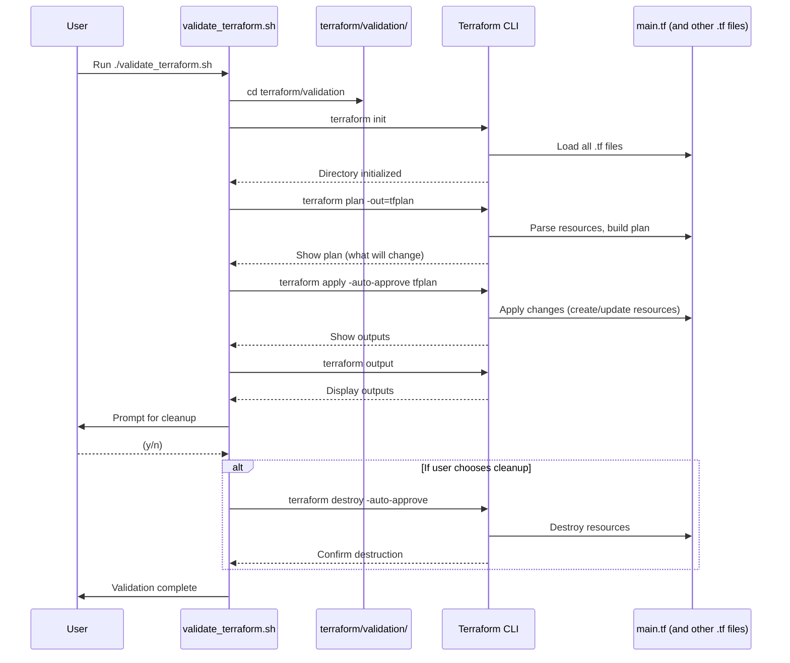

# Local Validation for Azure OIDC Setup

This folder contains scripts and instructions for validating your Azure AD application registration and OIDC setup locally before using GitHub Actions.

## Purpose

Local validation allows you to verify that:
1. Your Azure credentials are correctly configured
2. Your service principal has the necessary permissions
3. You can authenticate and create resources in Azure

This validation serves as a pre-check before running the GitHub Actions workflows to ensure everything is set up correctly.

**NOTE:**  
This approach validates and tests Terraform scripts locally using the Azure CLI and interactive `az login` authentication, rather than running them directly through GitHub Actions. By running scripts locally, you can debug and verify your Azure and Terraform setup before pushing changes to GitHub. This ensures that your Terraform scripts work as expected and that your Azure OIDC configuration is correct, reducing the risk of errors in CI/CD pipelines. Once local validation passes, you can confidently proceed to GitHub Actions-based workflows, which use OIDC for passwordless authentication.

## Prerequisites

Before running local validation:
1. Complete all steps in the [RegisterApplicationInAzureAndOIDC](../../OneTimeActivities/RegisterApplicationInAzureAndOIDC/README.md) process
2. Completed ## Step 1: Validate Azure Authentication in (../../OneTimeActivities/ValidationProcess.md)
2. Have the `.env/azure-credentials.json` file properly populated
3. Have Azure CLI installed locally

## Validation Scripts

### 1. Basic Authentication Validation

This script validates that you can authenticate to Azure using the credentials from your `.env/azure-credentials.json` file:

```bash
./validate_authentication.sh
```

If this script runs without errors, your local Azure authentication is set up correctly and you can proceed to the next step.

### 2. Terraform Validation

This script runs Terraform locally using your Azure credentials to ensure you can deploy resources as expected:

```bash
./validate_terraform.sh
```

If both scripts complete successfully, your local environment is ready for further testing or for running the GitHub Actions workflows.

This script runs Terraform locally using the same credentials that would be used by GitHub Actions:

```bash
./validate_terraform.sh
```

## How Local Validation Works

Unlike GitHub Actions which uses OIDC federation for passwordless authentication, local validation:
1. Reads credentials from your `.env/azure-credentials.json` file
2. Uses Azure CLI to authenticate with these credentials
3. Runs the shell script [`validate_terraform.sh`](./validate_terraform.sh), which:
   - Changes directory to `terraform/validation`
   - Sets environment variables for the Azure provider
   - Runs the following Terraform commands:
     - `terraform init`: Initializes the working directory, downloads providers, and prepares the environment
     - `terraform plan -out=tfplan`: Creates a speculative plan showing what changes will be made
     - `terraform apply -auto-approve tfplan`: Applies the planned changes to create/update resources
     - `terraform output`: Shows the outputs from the Terraform configuration
     - `terraform destroy -auto-approve`: (Optional) Destroys all resources created during validation
   - All `.tf` files in the directory (such as `main.tf`) are loaded and processed by Terraform automatically
4. Runs the same Terraform code used by the GitHub Actions workflow

### Local Validation Sequence Diagram



### Step-by-Step Details

1. **User runs `./validate_terraform.sh`**
   - Starts the local validation process.
2. **Script changes directory to `terraform/validation/`**
   - Ensures all Terraform commands run in the correct context.
3. **Script sets environment variables for Azure provider**
   - Ensures Terraform uses the right credentials and subscription.
4. **Script runs `terraform init`**
   - Downloads providers, prepares the directory, and loads all `.tf` files.
5. **Script runs `terraform plan -out=tfplan`**
   - Shows what changes will be made, without making any changes yet.
6. **Script runs `terraform apply -auto-approve tfplan`**
   - Applies the planned changes, creating/updating resources.
7. **Script runs `terraform output`**
   - Displays outputs defined in the Terraform configuration.
8. **Script prompts user for cleanup**
   - If user chooses yes, runs `terraform destroy -auto-approve` to remove all resources.
9. **Script completes**
   - Local validation is done; user can review results or proceed to CI/CD validation.

This sequence ensures you understand exactly how the shell script, directory, `.tf` files, and Terraform CLI interact during local validation.

## Running Local Validation

Follow these steps to validate your setup locally:

1. Make sure you're in the project root directory
2. Run the authentication validation script:
   ```
   ./terraform/validation/localhost/validate_authentication.sh
   ```
3. If successful, run the Terraform validation script:
   ```
   ./terraform/validation/localhost/validate_terraform.sh
   ```
4. Check the output to verify all components are working correctly

## Troubleshooting

If validation fails:
- Ensure all steps in the RegisterApplicationInAzureAndOIDC process were completed
- Verify the permissions assigned to your service principal
- Check that your `.env/azure-credentials.json` file contains the correct values
- Make sure you're authenticated to the right Azure subscription
