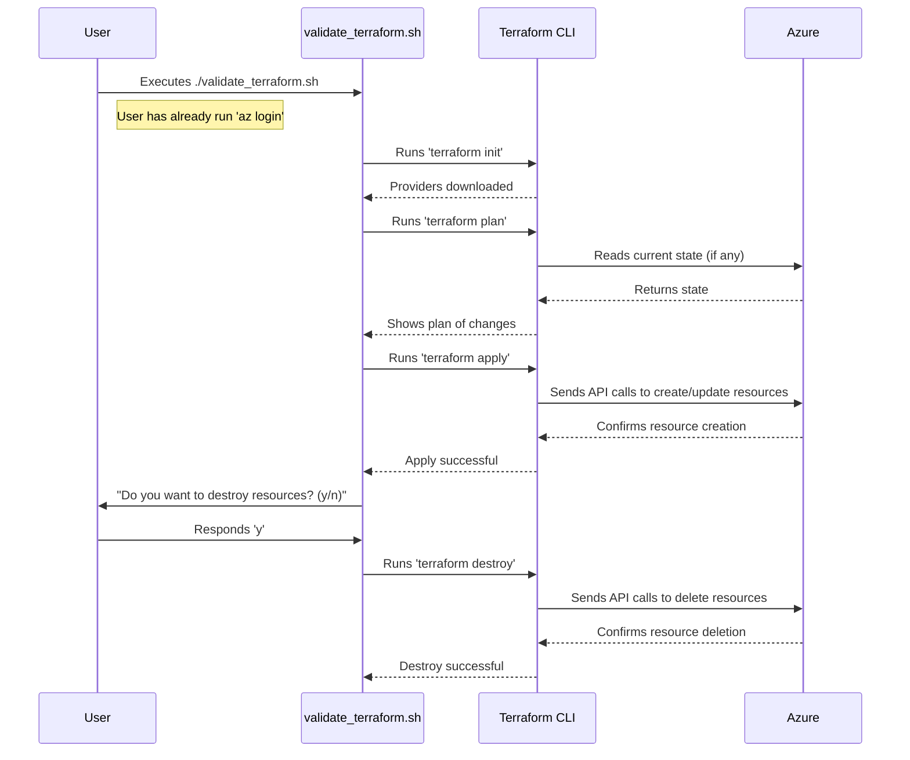

# Localhost Validation Guide

This document is the detailed "how-to" guide for running the validation module from your local machine. For a high-level overview of the module's purpose and the CI/CD process, please refer to the main [Validation README](../README.md).

## Purpose of Local Validation

Running Terraform locally is essential for rapid development and debugging. This process allows you to:
- **Test Changes Quickly:** Iterate on `.tf` files without waiting for a full CI/CD pipeline run.
- **Debug Interactively:** See detailed error messages and state changes directly in your terminal.
- **Validate Permissions:** Confirm your personal Azure account or a test service principal has the necessary permissions before configuring the pipeline.
- **Test Incrementally:** Safely enable one resource at a time to isolate issues, as described in the best practices section below.

## Prerequisites

Before running local validation, ensure you have completed the following setup:

1.  **Required Tools Installed:**
    - [Terraform CLI](https://developer.hashicorp.com/terraform/downloads)
    - [Azure CLI](https://docs.microsoft.com/en-us/cli/azure/install-azure-cli)

2.  **Authenticated to Azure:**
    - Run `az login` in your terminal and follow the prompts to sign in to your Azure account.
    - Ensure you have selected the correct subscription: `az account set --subscription "Your-Subscription-Name-or-ID"`

3.  **Configured Variables File:**
    - A `terraform.tfvars` file must exist in the parent `terraform/` directory.
    - If it doesn't exist, copy the template: `cp terraform/terraform.tfvars.template terraform/terraform.tfvars`.
    - Populate this file with the required values for your development environment.

## How to Run Validation Locally

The validation process is managed by helper scripts for consistency and ease of use.

1.  **Navigate to this directory** from the repository root:
    ```bash
    cd terraform/validation/localhost
    ```

2.  **(Optional First Run) Validate Authentication:**
    This script simply confirms your Azure CLI can authenticate successfully.
    ```bash
    ./validate_authentication.sh
    ```

3.  **Run the Full Terraform Validation:**
    This script will initialize, plan, and apply the Terraform configuration.
    ```bash
    ./validate_terraform.sh
    ```
    The script will create all the resources defined in `main.tf` and then prompt you if you want to destroy them upon completion.

## The Local Validation Process

This diagram shows the sequence of events when you run the `validate_terraform.sh` script.



## Best Practice: Incremental Local Validation

The most effective way to debug and build infrastructure is to enable one logical group of resources at a time. This isolates errors and helps you understand dependencies.

1.  **Start Simple:** In `main.tf`, comment out all `resource` blocks except for the most basic one (e.g., `azurerm_resource_group.validation`).
2.  **Run Validation:** Execute `./validate_terraform.sh`. Confirm it creates and destroys the resource group successfully. This validates your core permissions.
3.  **Add the Next Resource:** Uncomment the next resource (e.g., `azurerm_network_security_group.validation`).
4.  **Repeat:** Run the validation script again. Continue this process, adding one resource at a time until your entire configuration is enabled and validated.

This incremental approach is invaluable for quickly identifying permission issues and configuration errors with minimal blast radius.

## Troubleshooting

If validation fails, check the following:
- Are you logged into the correct Azure account and subscription? Run `az account show`.
- Does your `terraform/terraform.tfvars` file contain correct and complete values?
- Does your user account have the necessary RBAC permissions (e.g., "Contributor") on the target subscription?
- Review the detailed error message from Terraform for specific clues.